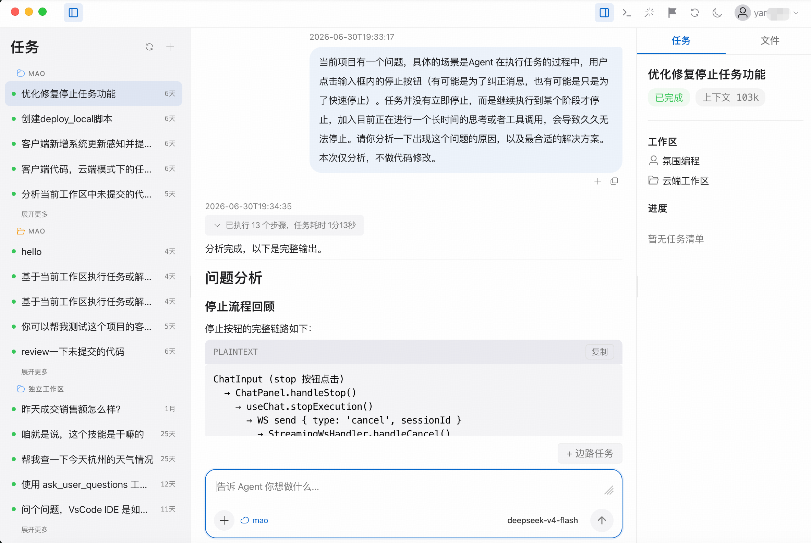
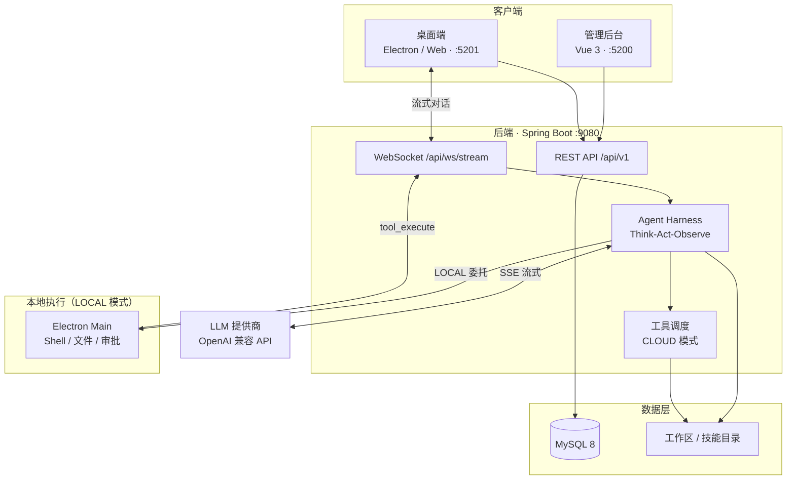

[](https://github.com/DC-ET/mao/actions/workflows/ci.yml)
[](LICENSE)

<p align="center">
  
</p>

<h1 align="center">Mao</h1>

<p align="center">
  <strong>Enterprise-grade, self-hosted AI Agent platform — RBAC, audit trails, and dual execution modes.</strong><br/>
  企业级可私有化部署的 AI Agent 管理与协作平台
</p>

<p align="center">
  <a href="#快速开始">快速开始</a> ·
  <a href="#docker-compose推荐试用">Docker</a> ·
  <a href="USER_GUIDE.md">用户手册</a> ·
  <a href="#mao-与-codex-有什么区别">与 Codex 对比</a> ·
  <a href="#架构">架构</a> ·
  <a href="#文档">文档</a> ·
  <a href="#参与贡献">参与贡献</a>
</p>

---

Mao 面向希望把 AI Agent 纳入正式 IT 体系的企业。许多团队已经在用各类智能体工具，但配置分散、权限难管、调用难以追溯——Mao 提供可私有化部署的统一工作台，让 Agent、模型、用户与审计集中在一处管理。

平台内置完整的 Agent 运行引擎（Think-Act-Observe 循环），支持流式对话、工具调用、技能扩展与上下文压缩；既可由服务端执行工具（CLOUD），也可通过 Electron 桌面端在本地执行（LOCAL），兼顾安全边界与开发效率。数据与模型密钥留在企业自己的环境里，不依赖第三方托管。

> **开源说明**：本项目采用 [MIT 许可证](LICENSE)，仅提供源码与自部署文档，不提供官方托管服务。LLM 需在管理后台自行配置 API Key；桌面端提供 Electron 源码，需自行构建。当前界面语言为中文。

## 客户端预览

<p align="center">
  
</p>

## 为什么选择 Mao

| 能力 | Mao |
|------|-----|
| 部署方式 | 完全自托管，数据与 API Key 留在企业内网 |
| 企业治理 | RBAC 角色权限 + 管理类 API 操作审计 |
| 工具执行 | **CLOUD**（服务端）与 **LOCAL**（桌面端 Electron）双模式，LOCAL 支持工具审批 |
| Agent 引擎 | 内置 Harness 运行时，非仅 LLM 网关或对话壳 |
| 扩展 | 文件系统 Skill 知识文档 + 丰富内置工具（Shell / 文件 / 搜索等） |
| 认证集成 | 本地账号 / LDAP / 飞书 SSO（可选） |

若你更需要「低代码工作流编排」或「开箱即用的 SaaS」，可优先考虑 Dify、n8n 等产品；若你需要把 Agent 纳入现有 IT 权限与审计体系，并在服务端与本地之间灵活切换工具执行边界，Mao 更合适。

## Mao 与 Codex 有什么区别？

[Mao](https://github.com/DC-ET/mao) 与 [OpenAI Codex](https://openai.com/codex/) 都面向「把完整工作委托给 AI Agent」而非单纯聊天，底层也均采用 Agent Loop（理解 → 调用工具 → 观察结果 → 继续推进）。二者定位不同：**Codex 是 OpenAI 提供的托管式工程助手产品；Mao 是企业可私有化部署的 Agent 管理与协作平台**。

| 维度 | OpenAI Codex | Mao |
|------|--------------|-----|
| 产品形态 | 商业 SaaS，绑定 ChatGPT 订阅 | 开源（MIT），企业自托管部署 |
| 数据与密钥 | 由 OpenAI 云端托管 | 数据、工作区、API Key 留在企业内网 |
| 使用入口 | App / CLI / IDE / Web 等多端统一 | 管理后台 + 桌面端（Web / Electron） |
| 模型选择 | OpenAI 体系 | 任意 OpenAI 兼容 API，多模型可配置 |
| 企业治理 | 面向个人与小团队效率 | RBAC 角色权限、操作审计、LDAP / 飞书 SSO |
| 工具执行 | 云端 Sandbox 为主 | **CLOUD**（服务端）与 **LOCAL**（本机 Electron）可切换；LOCAL 支持工具审批 |
| Agent 管理 | 单一助手体验为主 | 多 Agent 配置、Skill 绑定、会话与用量统计 |
| 协作能力 | 异步后台任务、多 worktree 并行等（产品持续演进） | 子代理委派、Side Task 并行子会话 |
| 上手成本 | 注册即用 | 需自行部署（Docker Compose 或手动安装） |

**一句话概括**：若你需要开箱即用、与 OpenAI 生态深度集成的个人/小团队工程助手，选 Codex；若你需要把 Agent 纳入企业 IT 体系（权限、审计、内网部署、自选模型、本地工具执行边界），并在团队内统一管理多个 Agent，选 Mao。

## 架构



## 核心特性

- **统一管理** — 集中管理 Agent、模型、用户、技能等配置
- **权限与治理** — RBAC 角色权限模型（用户管理已接入；Agent / 模型等模块持续完善）；管理类 REST API 操作审计
- **Agent 运行引擎** — 内置 Think-Act-Observe 循环，支持 LLM 流式调用、工具调度与上下文压缩
- **双执行模式** — CLOUD（服务端执行工具）与 LOCAL（委托桌面端 Electron 执行）；LOCAL 模式支持会话级权限等级与工具审批
- **协作扩展** — 子代理委派（Delegate）与 Side Task 并行子会话；文件系统 Skill 知识文档扩展
- **WebSocket 流式对话** — 实时双向通信，支持消息持久化与 Token 用量追踪
- **双端架构** — 管理后台 + Electron 桌面客户端

## 技术栈

### 后端

| 组件 | 技术 |
|------|------|
| 语言 | Java 17 |
| 框架 | Spring Boot 3.5.14 |
| ORM | MyBatis-Plus 3.5.6 |
| 数据库 | MySQL 8.x |
| 认证 | Spring Security + JWT |
| 认证方式 | 本地密码 / LDAP（可选）/ 飞书 SSO（可选） |
| LLM 通信 | OkHttp + OpenAI 兼容协议（SSE 拉流） |
| 客户端通信 | WebSocket（`/api/ws/stream`） |
| 对象存储 | 本地文件系统 / 阿里云 OSS（可选） |
| API 文档 | SpringDoc OpenAPI 2.8.6 |
| 构建工具 | Maven |

### 前端（管理后台 & 桌面端）

| 组件 | 技术 |
|------|------|
| 框架 | Vue 3.5 + TypeScript |
| 构建工具 | Vite 8.x |
| UI 组件库 | Element Plus 2.14 |
| 状态管理 | Pinia 3.x |
| 桌面端 | Electron 28 |

## 快速开始

### Docker Compose（推荐试用）

仅需安装 [Docker](https://docs.docker.com/get-docker/) 与 Docker Compose，无需本地 JDK / Node / MySQL。

```bash
# 可选：自定义密钥（复制 .env.docker.example 为 .env）
cp .env.docker.example .env

# 构建并启动 MySQL + 后端 + 管理后台 + 桌面端 Web
docker compose up -d --build

# 查看启动日志（首次构建较慢，后端需等待 Flyway 迁移完成）
docker compose logs -f backend
```

| 服务 | 地址 |
|------|------|
| 管理后台 | http://localhost:5200 |
| 桌面端 Web | http://localhost:5201 |
| 后端 API / Swagger | http://localhost:9080/api/swagger-ui.html |

默认账号：`admin` / `admin123`。启动后登录管理后台，在「模型管理」中配置真实 LLM API Key 即可对话。日常使用与功能说明见 **[用户手册](USER_GUIDE.md)**。

> **说明**：Docker 镜像提供 **CLOUD 模式** Web 体验（浏览器访问桌面端）。**LOCAL 模式**（Electron 本地工具执行）仍需按下方步骤本地构建 `desktop` 并运行 `npm run dev:electron`。

停止服务：`docker compose down`（加 `-v` 可清除数据卷）。

### 本地开发（手动）

#### 环境要求

- JDK 17+
- Maven 3.8+
- Node.js 18+
- MySQL 8.x

#### 1. 初始化数据库与配置

```bash
# 创建数据库
mysql -e "CREATE DATABASE mao CHARACTER SET utf8mb4 COLLATE utf8mb4_unicode_ci;"

# 复制配置模板并编辑
cp backend/src/main/resources/application-example.yml \
   backend/src/main/resources/application-local.yml
```

编辑 `application-local.yml`，至少配置 MySQL。生产环境请设置环境变量 `JWT_SECRET`。

确保 `application.yml` 中 `spring.profiles.active` 指向你的本地 profile（通常为 `local`）。

#### 2. 启动后端

```bash
cd backend
mvn clean install
mvn spring-boot:run
```

服务地址：`http://localhost:9080`  
Swagger UI：`http://localhost:9080/api/swagger-ui.html`  
Flyway 会在首次启动时自动建表并写入初始数据。

#### 3. 配置 LLM 模型

使用默认账号登录管理后台，进入「模型管理」，添加或编辑模型并填入你自己的 API Key。迁移脚本会插入占位模型 `deepseek-v4-flash`（`sk-xxxxxxxxxxxx`），**必须替换为真实密钥后才能对话**。更多操作说明见 [用户手册](USER_GUIDE.md)。

#### 4. 启动管理后台

```bash
cd admin
npm install
npm run dev
```

访问 `http://localhost:5200`

#### 5. 启动桌面客户端

```bash
cd desktop
npm install
npm run dev           # 浏览器预览
npm run dev:electron  # Electron 模式（LOCAL 工具执行）
```

也可使用仓库脚本一键启停（需已完成上述配置）：

```bash
./scripts/start-all.sh    # 启动 backend + admin + desktop
./scripts/stop-all.sh     # 停止全部服务
```

#### 默认账号

| 用户名 | 密码 | 角色 |
|--------|------|------|
| admin | admin123 | 系统管理员 |

> 生产环境部署后请立即修改默认密码。详见 [SECURITY.md](SECURITY.md)。

## 环境变量

### 后端（常用）

| 变量 | 说明 |
|------|------|
| `JWT_SECRET` | JWT 签名密钥（生产必设） |
| `WORKSPACE_ROOT` | Agent 工作区根目录，默认 `/opt/mao/data/workspace` |
| `SKILLS_DIR` | 技能目录，默认 `/opt/mao/data/skills` |
| `FILE_UPLOAD_DIR` | 上传文件目录 |
| `UPLOAD_STORAGE_MODE` | `local` 或 `oss` |
| `UPLOAD_BASE_URL` | 本地存储模式下的公网访问前缀 |
| `TAVILY_API_KEY` | Tavily 搜索（可选） |
| `LDAP_ENABLED` / `LDAP_URL` 等 | LDAP 认证（可选，`LDAP_ENABLED` 默认 `false`） |
| `FEISHU_ENABLED` / `FEISHU_APP_ID` / `FEISHU_APP_SECRET` / `FEISHU_REDIRECT_URI` | 飞书 OAuth（可选，`FEISHU_ENABLED` 默认 `false`），`FEISHU_REDIRECT_URI` 必须是后端公网回调地址，如 `https://your-domain/api/v1/auth/feishu/callback` |
| `OSS_*` | 阿里云 OSS（可选） |

完整配置项请参考 [application-example.yml](backend/src/main/resources/application-example.yml)。

### 前端

| 变量 | 说明 |
|------|------|
| `VITE_API_BASE_URL` | API 基础地址 |
| `VITE_WS_BASE_URL` | WebSocket 地址（可选，默认从 API 地址推导） |

**管理后台**（`admin/`）

| 文件 | 用途 |
|------|------|
| `.env.development` | 本地开发，`/api/v1`（Vite 代理到 9080） |
| `.env.production` | 生产构建，`/api/v1`（由 Nginx 反代） |

**桌面端**（`desktop/`）

| 文件 | 用途 |
|------|------|
| `.env.development` | 本地开发，`http://localhost:9080/api/v1` |
| `.env.production` | 生产构建，改为你的部署域名，如 `https://mao.example.com/api/v1` |

本地覆盖：创建 `.env.local`（已被 gitignore）。

## 生产部署

详细步骤见 [DEPLOY.md](DEPLOY.md)。

```bash
# 后端打包
cd backend && mvn clean package -DskipTests
# 产物：backend/target/mao-server.jar

# 前端打包
cd admin && npm run build
cd desktop && npm run build
```

### 部署架构（示例）

| 组件 | 部署方式 | 说明 |
|------|---------|------|
| Java 后端 | jar + systemd | 端口 9080 |
| 管理后台 | Nginx 静态文件 | 如 `mao-admin.example.com` |
| 桌面端 Web | Nginx 静态文件 | 如 `mao.example.com` |
| MySQL | 自建或云服务 | 内网访问 |

### Electron 桌面端

仓库仅提供 Electron **源码**，不包含官方签名安装包。如需桌面端，请自行：

```bash
cd desktop
# 先修改 .env.production 中的 API 地址为你的部署域名
npm run build
npm run dist   # 本地打包，需自行处理代码签名与分发
```

## API 文档

后端启动后访问：`http://localhost:9080/api/swagger-ui.html`

主要 API 前缀：`/api/v1/`

| 模块 | 路径前缀 | 说明 |
|------|---------|------|
| 认证 | `/api/v1/auth` | 登录、Token 刷新 |
| 用户 | `/api/v1/users` | 用户管理 |
| Agent | `/api/v1/agents` | Agent 配置 |
| 会话 | `/api/v1/sessions` | 对话会话 |
| 模型 | `/api/v1/models` | LLM 模型配置 |
| 技能 | `/api/v1/skills` | 技能管理 |
| 快捷指令 | `/api/v1/quick-commands` | 快捷指令列表 |

WebSocket 端点：`/api/ws/stream`

## 测试

CI 在每次 push / PR 时执行后端编译与前端构建（见 [`.github/workflows/ci.yml`](.github/workflows/ci.yml)）。

```bash
# 后端单元测试
cd backend && mvn test

# 端到端测试（需先启动 backend、admin、desktop）
npm test
npm run test:admin
npm run test:desktop
```

## 参与贡献

欢迎通过 Issue 与 Pull Request 参与项目。开始前请阅读 [CONTRIBUTING.md](CONTRIBUTING.md)。

- **Bug / 功能建议** — 提交 [GitHub Issue](https://github.com/DC-ET/mao/issues)
- **安全漏洞** — 请参阅 [SECURITY.md](SECURITY.md)，勿公开披露
- **提交 PR 前** — 确保 `cd backend && mvn compile` 与相关前端 `npm run build` 通过

## 文档

| 文档 | 说明 |
|------|------|
| [USER_GUIDE.md](USER_GUIDE.md) | 用户手册（登录、模型与 Agent 配置、任务对话、工具审批、常见问题） |
| [DEPLOY.md](DEPLOY.md) | 生产部署指南 |
| [CONTRIBUTING.md](CONTRIBUTING.md) | 贡献指南 |
| [SECURITY.md](SECURITY.md) | 安全策略 |
| [docs/requirement.md](docs/requirement.md) | 需求说明 |
| [docs/technical-design.md](docs/technical-design.md) | 技术设计 |
| [CLAUDE.md](CLAUDE.md) | 维护者 / AI 辅助开发指引 |

## 许可证

[MIT License](LICENSE) — Copyright (c) 2026 Mao Contributors
