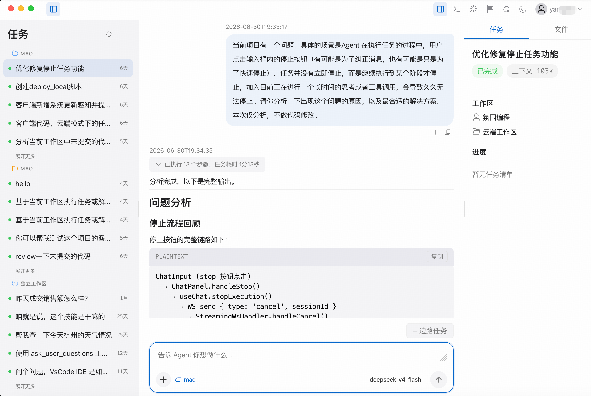
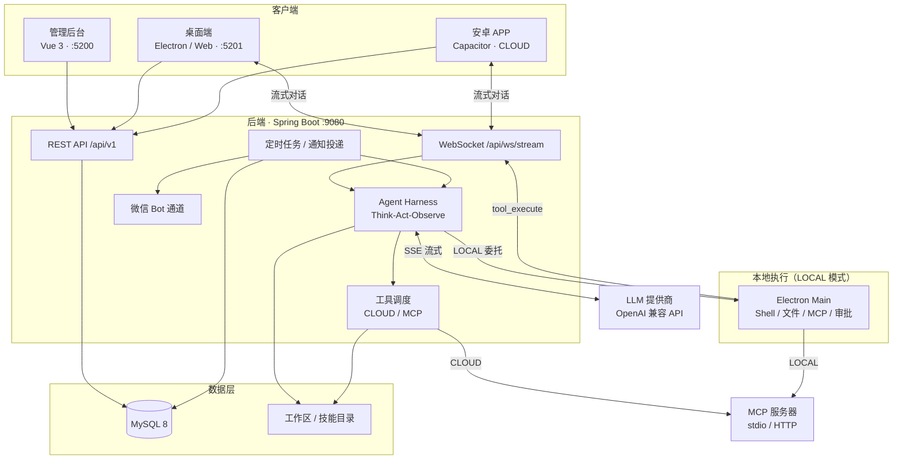

[](https://github.com/DC-ET/mao/actions/workflows/ci.yml)
[](LICENSE)

<p align="center">
  
</p>

<h1 align="center">Mao</h1>

<p align="center">
  <strong>Self-hosted AI Agent platform for individuals and teams — RBAC, audit trails, and dual execution modes.</strong><br/>
  个人与企业都适用的可私有化部署 AI Agent 管理与协作平台
</p>

<p align="center">
  <a href="#快速开始">快速开始</a> ·
  <a href="#docker-compose推荐试用">Docker</a> ·
  <a href="USER_GUIDE.md">用户手册</a> ·
  <a href="#mao-与-codex-有什么区别">与 Codex 对比</a> ·
  <a href="#架构">架构</a> ·
  <a href="#文档">文档</a> ·
  <a href="#参与贡献">参与贡献</a>
</p>

---

> **重要提示**：当前项目尚未经过企业级生产环境验证。部署前请务必充分了解本项目的功能限制与适用边界，自行评估风险后再决定是否上线使用。

Mao 面向个人开发者与各类团队，提供可私有化部署的 AI Agent 管理与协作平台。许多用户已经在用各类智能体工具，但配置分散、权限难管、调用难以追溯——Mao 把 Agent、模型、用户与审计集中在一处，既适合个人自用，也方便在团队内统一管理。

平台内置完整的 Agent 运行引擎（Think-Act-Observe 循环），支持流式对话、工具调用、MCP 外部工具、技能扩展、上下文压缩、定时任务与子任务协作；既可由服务端执行工具（CLOUD），也可通过 Electron 桌面端在本地执行（LOCAL），兼顾安全边界与开发效率。客户端覆盖管理后台、桌面端（Web / Electron）与安卓 APP（Capacitor，CLOUD 模式）。数据与模型密钥留在你自己的环境里，不依赖第三方托管。

> **开源说明**：本项目采用 [MIT 许可证](LICENSE)，仅提供源码与自部署文档，不提供官方托管服务。LLM 需在管理后台自行配置 API Key；桌面端提供 Electron 源码，需自行构建。当前界面语言为中文。

## 客户端预览

<p align="center">
  
</p>

## 为什么选择 Mao

| 能力 | Mao |
|------|-----|
| 部署方式 | 完全自托管，数据与 API Key 留在本地或内网 |
| 权限与审计 | RBAC 角色权限 + 管理类 API 操作审计 |
| 工具执行 | **CLOUD**（服务端）与 **LOCAL**（桌面端 Electron）双模式，LOCAL 支持工具审批 |
| Agent 引擎 | 内置 Harness 运行时，非仅 LLM 网关或对话壳 |
| 客户端 | 管理后台 + 桌面端（Web / Electron）+ 安卓 APP（Capacitor，CLOUD） |
| 任务协作 | 主任务、Side Task、子代理委派、定时任务与完成通知 |
| 扩展 | 文件系统 Skill + MCP 外部工具 + 内置工具（Shell / 文件 / 搜索 / 文生图 / 定时任务等） |
| 认证集成 | 本地账号 / LDAP / 飞书 SSO（可选） |

若你更需要「低代码工作流编排」或「开箱即用的 SaaS」，可优先考虑 Dify、n8n 等产品；若你需要可私有化部署、可自选模型，并在服务端与本地之间灵活切换工具执行边界，Mao 更合适。

## Mao 与 Codex 有什么区别？

[Mao](https://github.com/DC-ET/mao) 与 [OpenAI Codex](https://openai.com/codex/) 都面向「把完整工作委托给 AI Agent」而非单纯聊天，底层也均采用 Agent Loop（理解 → 调用工具 → 观察结果 → 继续推进）。二者定位不同：**Codex 是 OpenAI 提供的托管式工程助手产品；Mao 是个人与企业都适用的可私有化部署 Agent 管理与协作平台**。

| 维度 | OpenAI Codex | Mao |
|------|--------------|-----|
| 产品形态 | 商业 SaaS，绑定 ChatGPT 订阅 | 开源（MIT），可私有化自托管 |
| 数据与密钥 | 由 OpenAI 云端托管 | 数据、工作区、API Key 留在本地或内网 |
| 使用入口 | App / CLI / IDE / Web 等多端统一 | 管理后台 + 桌面端（Web / Electron）+ 安卓 APP |
| 模型选择 | OpenAI 体系 | 任意 OpenAI 兼容 API，多模型可配置 |
| 权限与审计 | 面向个人与小团队效率 | RBAC 角色权限、操作审计、LDAP / 飞书 SSO |
| 工具执行 | 云端 Sandbox 为主 | **CLOUD**（服务端）与 **LOCAL**（本机 Electron）可切换；LOCAL 支持工具审批 |
| Agent 管理 | 单一助手体验为主 | 多 Agent 配置、Skill 绑定、会话与用量统计 |
| 协作能力 | 异步后台任务、多 worktree 并行等（产品持续演进） | Side Task 并行子会话、子代理委派、定时任务 |
| 上手成本 | 注册即用 | 需自行部署（Docker Compose 或手动安装） |

**一句话概括**：若你需要开箱即用、与 OpenAI 生态深度集成的个人/小团队工程助手，选 Codex；若你需要可私有化部署、自选模型、本地工具执行边界，并统一管理多个 Agent（个人自用或团队协作均可），选 Mao。

## 架构


```mermaid
flowchart TB
    subgraph clients["客户端"]
        Admin["管理后台<br/>Vue 3 · :5200"]
        Desktop["桌面端<br/>Electron / Web · :5201"]
        Android["安卓 APP<br/>Capacitor · CLOUD"]
    end

    subgraph backend["后端 · Spring Boot :9080"]
        API["REST API /api/v1"]
        WS["WebSocket /api/ws/stream"]
        Harness["Agent Harness<br/>Think-Act-Observe"]
        Tools["工具调度<br/>CLOUD / MCP"]
        Scheduler["定时任务 / 通知投递"]
        Weixin["微信 Bot 通道"]
    end

    subgraph local["本地执行（LOCAL 模式）"]
        Electron["Electron Main<br/>Shell / 文件 / MCP / 审批"]
    end

    subgraph data["数据层"]
        MySQL[(MySQL 8)]
        Workspace["工作区 / 技能目录"]
    end

    LLM["LLM 提供商<br/>OpenAI 兼容 API"]
    MCP["MCP 服务器<br/>stdio / HTTP"]

    Admin --> API
    Desktop --> API
    Android --> API
    Desktop <-->|流式对话| WS
    Android <-->|流式对话| WS
    WS --> Harness
    Harness --> Tools
    Tools -->|CLOUD| MCP
    Electron -->|LOCAL| MCP
    Scheduler --> Harness
    Scheduler --> Weixin
    Harness -->|LOCAL 委托| Electron
    Electron -->|tool_execute| WS
    Harness <-->|SSE 流式| LLM
    API --> MySQL
    Scheduler --> MySQL
    Harness --> Workspace
    Tools --> Workspace
```

## 核心特性

- **统一管理** — 集中管理 Agent、模型、用户、技能等配置
- **权限与治理** — RBAC 角色权限模型（用户管理已接入；Agent / 模型等模块持续完善）；管理类 REST API 操作审计
- **Agent 运行引擎** — 内置 Think-Act-Observe 循环，支持 LLM 流式调用、工具调度与上下文压缩
- **双执行模式** — CLOUD（服务端执行工具）与 LOCAL（委托桌面端 Electron 执行）；LOCAL 模式支持会话级权限等级与工具审批
- **MCP 集成** — 管理后台统一管理全局 MCP 服务器（stdio / HTTP），桌面端支持用户级私有 MCP；按 Agent 关联注入外部工具（命名 `mcp__{server}__{tool}`）；CLOUD 模式服务端直连，LOCAL 模式由桌面端代理并纳入工具审批；单台服务器故障降级不阻塞会话
- **多模态能力** — 模型按类型分类（chat / reasoning / image / speech 等）；支持文生图工具；微信通道可语音回复，并可发送图片与文件
- **协作扩展** — Side Task 并行子会话、子代理委派（Delegate）与子智能体执行可见性；文件系统 Skill 知识文档扩展
- **任务自动化** — Agent 可创建定时任务；用户与管理员可查看、暂停或删除任务；任务完成可通过钉钉/飞书 Webhook 或微信通道通知
- **工作区体验** — 云端工作区支持新建、复用与 HTTPS Git 初始化；桌面端可查看文件树、文件内容与 Git 状态/单文件差异
- **WebSocket 流式对话** — 实时双向通信，支持消息持久化、Token 用量追踪、上下文窗口占比与压缩状态提示
- **可选微信通道** — 桌面端扫码绑定微信 Bot 后，可在微信中与指定 Agent 对话；支持语音回复、图片/文件发送；定时任务结果可回传微信
- **内置操作 Skill** — 仓库提供 `mao-user-cli` / `mao-admin-cli`，便于 Agent 通过用户端或管理端 REST API 完成非对话运维操作
- **多端架构** — 管理后台 + Electron / Web 桌面端 + 安卓 APP（Capacitor WebView，仅 CLOUD）

## 技术栈

### 后端

| 组件 | 技术 |
|------|------|
| 语言 | Java 17 |
| 框架 | Spring Boot 3.5.14 |
| ORM | MyBatis-Plus 3.5.6 |
| 数据库 | MySQL 8.x |
| 认证 | Spring Security + JWT |
| 认证方式 | 本地密码 / LDAP（可选）/ 飞书 SSO（可选） |
| LLM 通信 | OkHttp + OpenAI 兼容协议（SSE 拉流） |
| 客户端通信 | WebSocket（`/api/ws/stream`） |
| 对象存储 | 本地文件系统 / 阿里云 OSS（可选） |
| API 文档 | SpringDoc OpenAPI 2.8.6 |
| 构建工具 | Maven |

### 前端（管理后台 & 桌面端 & 安卓）

| 组件 | 技术 |
|------|------|
| 框架 | Vue 3.5 + TypeScript |
| 构建工具 | Vite 8.x |
| UI 组件库 | Element Plus 2.14 |
| 状态管理 | Pinia 3.x |
| 桌面端 | Electron 28 |
| 安卓 APP | Capacitor 7（复用 `desktop/` 前端，仅 CLOUD） |

## 快速开始

### Docker Compose（推荐试用）

仅需安装 [Docker](https://docs.docker.com/get-docker/) 与 Docker Compose，无需本地 JDK / Node / MySQL。

```bash
# 可选：自定义密钥（复制 .env.docker.example 为 .env）
cp .env.docker.example .env

# 构建并启动 MySQL + 后端 + 管理后台 + 桌面端 Web
docker compose up -d --build

# 查看启动日志（首次构建较慢，后端需等待 Flyway 迁移完成）
docker compose logs -f backend
```

| 服务 | 地址 |
|------|------|
| 管理后台 | http://localhost:5200 |
| 桌面端 Web | http://localhost:5201 |
| 后端 API / Swagger | http://localhost:9080/api/swagger-ui.html |

默认账号：`admin` / `admin123`。启动后登录管理后台，在「模型管理」中配置真实 LLM API Key 即可对话。日常使用与功能说明见 **[用户手册](USER_GUIDE.md)**。

> **说明**：Docker 镜像提供 **CLOUD 模式** Web 体验（浏览器访问桌面端）。**LOCAL 模式**（Electron 本地工具执行）仍需按下方步骤本地构建 `desktop` 并运行 `npm run dev:electron`。

停止服务：`docker compose down`（加 `-v` 可清除数据卷）。

### 本地开发（手动）

#### 环境要求

- JDK 17+
- Maven 3.8+
- Node.js 18+
- MySQL 8.x

#### 1. 初始化数据库与配置

```bash
# 创建数据库
mysql -e "CREATE DATABASE mao CHARACTER SET utf8mb4 COLLATE utf8mb4_unicode_ci;"

# 复制配置模板并编辑
cp backend/src/main/resources/application-example.yml \
   backend/src/main/resources/application-local.yml
```

编辑 `application-local.yml`，至少配置 MySQL。生产环境请设置环境变量 `JWT_SECRET`。

确保 `application.yml` 中 `spring.profiles.active` 指向你的本地 profile（通常为 `local`）。

#### 2. 启动后端

```bash
cd backend
mvn clean install
mvn spring-boot:run
```

服务地址：`http://localhost:9080`  
Swagger UI：`http://localhost:9080/api/swagger-ui.html`  
Flyway 会在首次启动时自动建表并写入初始数据。

#### 3. 配置 LLM 模型

使用默认账号登录管理后台，进入「模型管理」，添加或编辑模型并填入你自己的 API Key。迁移脚本会插入占位模型 `deepseek-v4-flash`（`sk-xxxxxxxxxxxx`），**必须替换为真实密钥后才能对话**。更多操作说明见 [用户手册](USER_GUIDE.md)。

#### 4. 启动管理后台

```bash
cd admin
npm install
npm run dev
```

访问 `http://localhost:5200`

#### 5. 启动桌面客户端

```bash
cd desktop
npm install
npm run dev           # 浏览器预览
npm run dev:electron  # Electron 模式（LOCAL 工具执行）
```

也可使用仓库脚本一键启停（需已完成上述配置）：

```bash
./scripts/start-all.sh    # 启动 backend + admin + desktop
./scripts/stop-all.sh     # 停止全部服务
```

#### 默认账号

| 用户名 | 密码 | 角色 |
|--------|------|------|
| admin | admin123 | 系统管理员 |

> 生产环境部署后请立即修改默认密码。详见 [SECURITY.md](SECURITY.md)。

## 环境变量

### 后端（常用）

| 变量 | 说明 |
|------|------|
| `JWT_SECRET` | JWT 签名密钥（生产必设） |
| `APP_GIT_CREDENTIAL_SECRET` | 用户 Git Access Token 加密密钥（生产必设） |
| `APP_NOTIFICATION_WEBHOOK_SECRET` | 任务通知 Webhook 加密密钥（生产建议设置） |
| `APP_MCP_SECRET` | MCP 服务器环境变量加密密钥（生产建议设置；使用 MCP 功能时必设） |
| `WORKSPACE_ROOT` | Agent 工作区根目录，默认 `/opt/mao/data/workspace` |
| `SKILLS_DIR` | 技能目录，默认 `/opt/mao/data/skills` |
| `FILE_UPLOAD_DIR` | 上传文件目录 |
| `UPLOAD_STORAGE_MODE` | `local` 或 `oss` |
| `UPLOAD_BASE_URL` | 本地存储模式下的公网访问前缀 |
| `TAVILY_API_KEY` | Tavily 搜索（可选） |
| `LDAP_ENABLED` / `LDAP_URL` 等 | LDAP 认证（可选，`LDAP_ENABLED` 默认 `false`） |
| `FEISHU_ENABLED` / `FEISHU_APP_ID` / `FEISHU_APP_SECRET` / `FEISHU_REDIRECT_URI` | 飞书 OAuth（可选，`FEISHU_ENABLED` 默认 `false`），`FEISHU_REDIRECT_URI` 必须是后端公网回调地址，如 `https://your-domain/api/v1/auth/feishu/callback` |
| `WEIXIN_BOT_ENABLED` / `WEIXIN_BOT_MONITOR_ENABLED` 等 | 微信 Bot 通道（可选，默认开启；详见 `application-example.yml`） |
| `TASK_NOTIFICATION_WORKER_DELAY_MS` / `TASK_NOTIFICATION_BATCH_SIZE` / `TASK_NOTIFICATION_MAX_ATTEMPTS` | 任务通知投递调度参数 |
| `OSS_*` | 阿里云 OSS（可选） |

完整配置项请参考 [application-example.yml](backend/src/main/resources/application-example.yml)。

### 前端

| 变量 | 说明 |
|------|------|
| `VITE_API_BASE_URL` | API 基础地址 |
| `VITE_WS_BASE_URL` | WebSocket 地址（可选，默认从 API 地址推导） |

**管理后台**（`admin/`）

| 文件 | 用途 |
|------|------|
| `.env.development` | 本地开发，`/api/v1`（Vite 代理到 9080） |
| `.env.production` | 生产构建，`/api/v1`（由 Nginx 反代） |

**桌面端**（`desktop/`）

| 文件 | 用途 |
|------|------|
| `.env.development` | 本地开发，`http://localhost:9080/api/v1` |
| `.env.production` | 生产构建，改为你的部署域名，如 `https://mao.example.com/api/v1` |

本地覆盖：创建 `.env.local`（已被 gitignore）。

## 生产部署

详细步骤见 [DEPLOY.md](DEPLOY.md)。

```bash
# 后端打包
cd backend && mvn clean package -DskipTests
# 产物：backend/target/mao-server.jar

# 前端打包
cd admin && npm run build
cd desktop && npm run build
```

### 部署架构（示例）

| 组件 | 部署方式 | 说明 |
|------|---------|------|
| Java 后端 | jar + systemd | 端口 9080 |
| 管理后台 | Nginx 静态文件 | 如 `mao-admin.example.com` |
| 桌面端 Web | Nginx 静态文件 | 如 `mao.example.com` |
| MySQL | 自建或云服务 | 内网访问 |

### Electron 桌面端

仓库仅提供 Electron **源码**，不包含官方签名安装包。如需桌面端，请自行：

```bash
cd desktop
# 先修改 .env.production 中的 API 地址为你的部署域名
npm run build
npm run dist   # 本地打包，需自行处理代码签名与分发
```

### 安卓 APP

基于 Capacitor 7（WebView 壳）复用桌面端 Vue 前端，包名 `cn.etarch.mao.app`，**仅支持 CLOUD 模式**（无 `electronAPI`，LOCAL / 工具审批不可用）。发版前先更新 `android/CHANGELOG.md` 顶部版本条目（`versionName` 取首条 `##`；`versionCode` 由脚本按已发布 APK 自增）。

**环境要求**：JDK 21 + Android SDK（`platforms;android-35`、`build-tools;34.0.0`）；签名凭据通过环境变量 `MAO_KEYSTORE_*` 或本地 `keystore-credentials.env` 注入（**严禁入 git**）。

```bash
# 一键：构建 desktop（--base=./）→ cap sync → assembleRelease → 发布
cd android
export ANDROID_HOME=/opt/android-sdk   # 按本机路径调整
bash build-apk.sh                      # 可选 --dry-run / --version 0.0.x
```

默认发布目录（可用环境变量覆盖）：
- APK：`mao-android-<versionName>-<versionCode>.apk`
- OTA 清单：`android-latest.json`（含 changelog）

详见 [安卓 APP 技术方案](docs/android-app-technical-design.md)。

**应用内更新（OTA）**：启动时检查 `android-latest.json`；支持强制更新（不可跳过）与普通更新（可忽略）；原生 `AppUpdate` 插件完成下载与安装。

## API 文档

后端启动后访问：`http://localhost:9080/api/swagger-ui.html`

主要 API 前缀：`/api/v1/`

| 模块 | 路径前缀 | 说明 |
|------|---------|------|
| 认证 | `/api/v1/auth` | 登录、Token 刷新 |
| 用户 | `/api/v1/users` | 用户管理 |
| Agent | `/api/v1/agents` | Agent 配置 |
| 会话 | `/api/v1/sessions` | 对话会话 |
| 模型 | `/api/v1/models` | LLM 模型配置 |
| 技能 | `/api/v1/skills` | 技能管理 |
| 用户技能 | `/api/v1/user-skills` | 个人 Skill 上传、查询、删除 |
| 快捷指令 | `/api/v1/quick-commands` | 快捷指令列表 |
| 文件 / 工作区 | `/api/v1/files` | 附件、工作区浏览、工作区 Git 只读诊断 |
| Git 凭证 | `/api/v1/user/git-credentials` | 用户 Git Access Token 管理 |
| 定时任务 | `/api/v1/scheduled-tasks` | 定时任务查询、暂停、删除 |
| 用户偏好 | `/api/v1/user-preferences` | 任务面板与任务通知偏好 |
| MCP 服务器 | `/api/v1/mcp-servers` | 全局 / 用户级 MCP 配置、启停、测试连接、工具清单与用户偏好 |
| 微信 Bot | `/api/v1/weixin` | 微信 Bot 绑定与解绑 |
| 工具元数据 | `/api/v1/tools` | 内置工具查询 |

WebSocket 端点：`/api/ws/stream`

## 测试

CI 在每次 push / PR 时执行后端编译与前端构建（见 [`.github/workflows/ci.yml`](.github/workflows/ci.yml)）。

```bash
# 后端单元测试
cd backend && mvn test

# 端到端测试（需先启动 backend、admin、desktop）
npm test
npm run test:admin
npm run test:desktop
```

## 参与贡献

欢迎通过 Issue 与 Pull Request 参与项目。开始前请阅读 [CONTRIBUTING.md](CONTRIBUTING.md)。

- **Bug / 功能建议** — 提交 [GitHub Issue](https://github.com/DC-ET/mao/issues)
- **安全漏洞** — 请参阅 [SECURITY.md](SECURITY.md)，勿公开披露
- **提交 PR 前** — 确保 `cd backend && mvn compile` 与相关前端 `npm run build` 通过

## 文档

| 文档 | 说明 |
|------|------|
| [USER_GUIDE.md](USER_GUIDE.md) | 用户手册（登录、模型与 Agent 配置、任务对话、定时任务、工具审批、常见问题） |
| [DEPLOY.md](DEPLOY.md) | 生产部署指南 |
| [CONTRIBUTING.md](CONTRIBUTING.md) | 贡献指南 |
| [SECURITY.md](SECURITY.md) | 安全策略 |
| [docs/requirement.md](docs/requirement.md) | 需求说明 |
| [docs/technical-design.md](docs/technical-design.md) | 技术设计 |
| [docs/cloud-workspace-git-init.md](docs/cloud-workspace-git-init.md) | 云端工作区 Git 初始化方案 |
| [docs/desktop-git-inspector-design.md](docs/desktop-git-inspector-design.md) | 桌面端工作区 Git 状态/差异查看方案 |
| [docs/scheduled-task-system-design.md](docs/scheduled-task-system-design.md) | 定时任务系统技术方案 |
| [docs/task-completion-webhook-notification-design.md](docs/task-completion-webhook-notification-design.md) | 任务完成通知技术方案 |
| [docs/compaction-design.md](docs/compaction-design.md) | 会话上下文压缩设计 |
| [docs/loop-compaction-reuse-session-design.md](docs/loop-compaction-reuse-session-design.md) | Loop 中途压缩复用会话策略 |
| [docs/mcp-integration-technical-design.md](docs/mcp-integration-technical-design.md) | MCP 协议集成技术方案 |
| [docs/android-app-technical-design.md](docs/android-app-technical-design.md) | 安卓 APP（Capacitor）技术方案 |
| [docs/weixin-bot-integration-technical-design.md](docs/weixin-bot-integration-technical-design.md) | 微信 Bot 通道技术方案（可选能力） |
| [android/CHANGELOG.md](android/CHANGELOG.md) | 安卓 APP 发版说明 |
| [skills/mao-user-cli/SKILL.md](skills/mao-user-cli/SKILL.md) | 用户端 REST 操作 Skill / CLI |
| [skills/mao-admin-cli/SKILL.md](skills/mao-admin-cli/SKILL.md) | 管理端 REST 操作 Skill / CLI |
| [CLAUDE.md](CLAUDE.md) | 维护者 / AI 辅助开发指引 |

## 许可证

[MIT License](LICENSE) — Copyright (c) 2026 Mao Contributors
