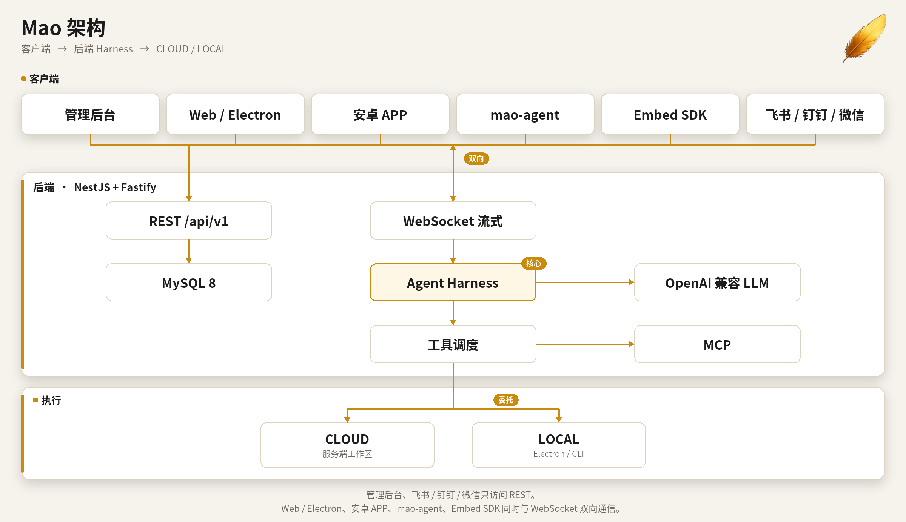

[](https://github.com/DC-ET/mao/actions/workflows/ci.yml)
[](LICENSE)

<p align="center">
  
</p>

<h1 align="center">Mao</h1>

<p align="center">
  <strong>Self-hosted AI Agent runtime for individuals and teams.</strong><br/>
  把能做事的 Agent 放进你自己的环境：双执行边界、RBAC、审计，以及真正的 Think-Act-Observe 引擎。
</p>

<p align="center">
  <a href="#快速开始">快速开始</a> ·
  <a href="skills/mao-cli/reference/project.md">项目说明</a> ·
  <a href="USER_GUIDE.md">用户手册</a> ·
  <a href="skills/mao-cli/reference/deploy.md">自托管部署</a> ·
  <a href="#参与贡献">参与贡献</a>
</p>

---

> **适用边界**：尚未经过企业级生产环境充分验证。MIT 开源，只提供源码与自部署文档，没有官方 SaaS。LLM 需在管理后台自行配置 API Key；界面目前为中文。

## 它是什么

Mao 不是又一个 ChatGPT 套壳，也不是 Dify / n8n 那样的低代码工作流。它是一套**可私有化部署的 Agent 工作台**：集中管理多个 Agent、模型和权限，用内置 Harness 跑 Think-Act-Observe 循环，让模型真正去读文件、跑命令、搜网页、拆子任务。

三件事构成产品内核：

1. **数据与密钥留在你这边** — 自托管，工作区、会话、模型 Key 不出内网。
2. **执行边界可切换** — **CLOUD** 在服务器工作区干活；**LOCAL** 在本机目录干活，并走权限档位与工具审批。
3. **Agent 是一等公民** — 多 Agent、Skill、MCP、提示词版本、用量与审计；对话只是入口，治理才是平台。

适合：需要私有化、自选模型、服务端与本地工具边界可切换的个人与团队。  
不适合：想要开箱 SaaS、低代码画布，或英文界面。

<p align="center">
  
</p>

## 核心能力

| | |
|---|---|
| **Harness 引擎** | Think-Act-Observe 循环、流式输出、上下文压缩、崩溃恢复；不是 LLM 网关。 |
| **CLOUD / LOCAL** | 云端在服务器执行；本地经 Electron 或 `mao-agent --local` 在本机执行，支持只读 / 读写 / 智能审批 / 完全权限。 |
| **多 Agent** | 角色提示词、Skill、MCP、经验、推荐问题；提示词可版本化与回滚。可在管理后台停用，停用后使用侧列表不再展示。 |
| **工具与扩展** | Shell、文件、搜索、网页、文生图/改图、子代理委派；Skill + 全局/用户级 MCP。 |
| **协作** | 边路任务、后台子代理（`default` / `explorer` / `worker` / `reviewer`）、定时任务、完成通知。 |
| **工作区** | 云端新建 / 复用 / Git HTTPS clone；文件树与 Git diff 只读浏览；CLOUD 可开服务端交互终端。 |
| **治理** | RBAC、管理 API 审计、用量分析、调用流水；本地账号 / LDAP / 飞书登录。 |
| **多端** | 管理后台、Web / Electron、安卓 APP（CLOUD）、终端 `mao-agent`、REST `mao-cli`。 |
| **通道** | 飞书机器人、钉钉机器人、微信 Bot、页面 Embed SDK（可操作宿主页面）。 |

任意 [OpenAI 兼容](skills/mao-cli/reference/admin.md#模型管理) 模型均可接入。若你要的是画布编排或托管服务，更适合看 Dify、n8n；若要对齐 Codex 类编码助手但数据不出域，看 [与 Codex 的对比](skills/mao-cli/reference/project.md#与-openai-codex-对比)。

## 架构

<p align="center">
  
</p>

生产环境单域名分流：桌面 `/`、管理后台 `/admin/`、API `/api/`、上传 `/uploads/`。

## 怎么用

日常路径很短：

```
管理员：配模型 → 建 Agent → 开账号 / 配权限
用户：选 Agent → 选 CLOUD 或 LOCAL → 选工作区 → 描述目标 → Agent 调工具做事
```

- **CLOUD**：浏览器、安卓、飞书、微信都能用；文件和命令跑在服务器工作区。
- **LOCAL**：Electron 或 `mao-agent --local`；改的是你电脑上的目录，高风险操作可审批。
- **拆活**：复杂任务用边路任务或子代理；重复劳动用定时任务，完成时钉钉 / 飞书 / 微信通知。

完整手册见 [USER_GUIDE.md](USER_GUIDE.md)。上线检查清单见 [business_process.md](skills/mao-cli/business_process.md)。

## 快速开始

先把服务跑起来，再打开网页。两条路：

| | 怎么跑 | 跑起来之后打开 |
|---|--------|----------------|
| **本地** | Node.js 22+、MySQL 8、起 backend / admin / desktop | 工作台 `http://localhost:5201` · 管理后台 `http://localhost:5200/admin/` |
| **服务器** | Linux + Nginx + HTTPS，仓库 `/opt/mao`，数据 `/opt/mao-data` | 工作台 `https://your-mao.example.com/` · 管理后台 `https://your-mao.example.com/admin/` |

### 1. 本地运行

需要 Node.js 22+、MySQL 8.x，以及编译 `node-pty` 的 C/C++ 工具链。逐步说明见 [install.md](skills/mao-cli/reference/install.md)。

```bash
git clone https://github.com/DC-ET/mao.git
cd mao
mysql -e "CREATE DATABASE mao CHARACTER SET utf8mb4 COLLATE utf8mb4_unicode_ci;"

cd backend-ts && npm install && npm run start:dev   # :9080
cd admin && npm install && npm run dev              # 管理后台
cd desktop && npm install && npm run dev            # 工作台
```

Electron LOCAL（本机目录与工具审批）：`cd desktop && npm run dev:electron`。

### 2. 服务器部署

1. 准备 Linux、Node 22+、Nginx、MySQL 8，克隆到 `/opt/mao`，创建 `/opt/mao-data`
2. 构建 backend、admin、desktop，写好 `backend-ts/.env`（JWT、数据库、数据目录）
3. 启动后端，配置 Nginx + HTTPS（桌面 `/`、管理后台 `/admin/`、API `/api/`）
4. 登录管理后台，**立刻改掉默认密码**，再配真实模型 Key

完整步骤与升级见 [deploy.md](skills/mao-cli/reference/deploy.md)，环境变量见 [config.md](skills/mao-cli/reference/config.md)。

### 3. 打开网页

| 入口 | 本地 | 服务器 |
|------|------|--------|
| 工作台（对话、任务、工作区） | http://localhost:5201 | `https://your-mao.example.com/` |
| 管理后台（模型、Agent、用户） | http://localhost:5200/admin/ | `https://your-mao.example.com/admin/` |

默认管理员 `admin` / `admin123`（对外暴露后立刻改密）。先到管理后台 **模型管理** 换成真实 API Key，否则无法对话；然后在工作台选 Agent、建任务、描述目标。CLOUD 任务在浏览器里就能跑，用法见 [桌面端手册](skills/mao-cli/reference/desktop.md)。

### REST 运维（可选）

```bash
cd skills/mao-cli && npm install . -g
mao auth login --username admin --password '<your-password>'
mao agent list
```

`mao` 管配置与元数据，不负责对话。日常使用请打开工作台网页。

## 客户端与通道

| 入口 | 用途 |
|------|------|
| [管理后台](skills/mao-cli/reference/admin.md) | 模型、Agent、用户角色、Skill、MCP、审计、用量 |
| [桌面 Web](skills/mao-cli/reference/desktop.md) | 日常任务与对话（CLOUD） |
| [Electron](skills/mao-cli/reference/electron.md) | LOCAL 本机工具、图形审批（需自行打包，无官方签名安装包） |
| [安卓](skills/mao-cli/reference/android.md) | Capacitor 壳远程加载 Web，仅 CLOUD |
| [mao-agent](skills/mao-cli/reference/mao-agent.md) | 终端 REPL / CI（`-p`） |
| [飞书机器人](skills/mao-cli/reference/feishu-bot.md) | 私聊或群里 @ 机器人 |
| [钉钉机器人](skills/mao-cli/reference/dingtalk-bot.md) | 私聊或群里 @ 机器人 |
| [微信 Bot](skills/mao-cli/reference/weixin.md) | 扫码绑定后在微信里对话 |
| [Embed SDK](skills/mao-cli/reference/embed-sdk.md) | 内部网页嵌入对话浮窗，可操作当前页面 |

页面嵌入最小例子（把域名换成你的站点）：

```html
<script src="https://mao.example.com/embed/mao-chat.js"></script>
<script>
  MaoChat.init({
    serverUrl: 'https://mao.example.com',
    agentId: 1,
    getToken: () => fetch('/your-backend/embed-token').then(r => r.json()).then(d => d.accessToken),
    context: () => ({ page: location.pathname }),
  });
</script>
```

公司 SSO、页面操作授权与安全边界见 [embed-sdk.md](skills/mao-cli/reference/embed-sdk.md)，不要把 `agentId` 当成权限控制。

## 文档

产品说明的正文在可独立分发的 [`skills/mao-cli/`](skills/mao-cli/SKILL.md)：

| 文档 | 说明 |
|------|------|
| [project.md](skills/mao-cli/reference/project.md) | 定位、架构、特性、与 Codex 对比 |
| [install.md](skills/mao-cli/reference/install.md) / [deploy.md](skills/mao-cli/reference/deploy.md) | 本地开发 / 生产部署 |
| [config.md](skills/mao-cli/reference/config.md) | 环境变量、数据目录、默认账号 |
| [USER_GUIDE.md](USER_GUIDE.md) | 各端使用手册索引 |
| [troubleshooting.md](skills/mao-cli/reference/troubleshooting.md) | 排障 |
| [CHANGELOG.md](CHANGELOG.md) | 发版说明 |
| [docs/plan/2026-05-20-technical-design.md](docs/plan/2026-05-20-technical-design.md) | 早期技术方案（部分已过时，以源码与 mao-cli 为准） |

## 开发

```bash
cd backend-ts && npm test && npm run build
cd admin && npm run build
cd desktop && npm run build
cd agent-cli && npm test
cd sdk/embed && npm test && npm run build
```

根目录 `npm test` 为 Playwright E2E。首次运行前执行 `bash scripts/e2e-setup.sh` 搭建隔离环境（本地 MySQL 建 `mao_e2e` 库 + 迁移 + 种子数据）；之后测试会自动拉起隔离后端(:9180)与 admin/desktop dev server，跑完自动退出，不会触碰线上 9080。贡献方式见 [CONTRIBUTING.md](CONTRIBUTING.md)；AI 辅助开发见 [AGENTS.md](AGENTS.md)。

## 参与贡献

欢迎 Issue 与 PR。开始前请读 [CONTRIBUTING.md](CONTRIBUTING.md)。

- Bug / 功能 — [GitHub Issues](https://github.com/DC-ET/mao/issues)
- 安全漏洞 — [SECURITY.md](SECURITY.md)，请勿公开披露

暂不接受：官方托管 / SaaS 化、界面国际化、官方签名 Electron 包分发。

## 许可证

[MIT License](LICENSE) — Copyright (c) 2026 Mao Contributors
