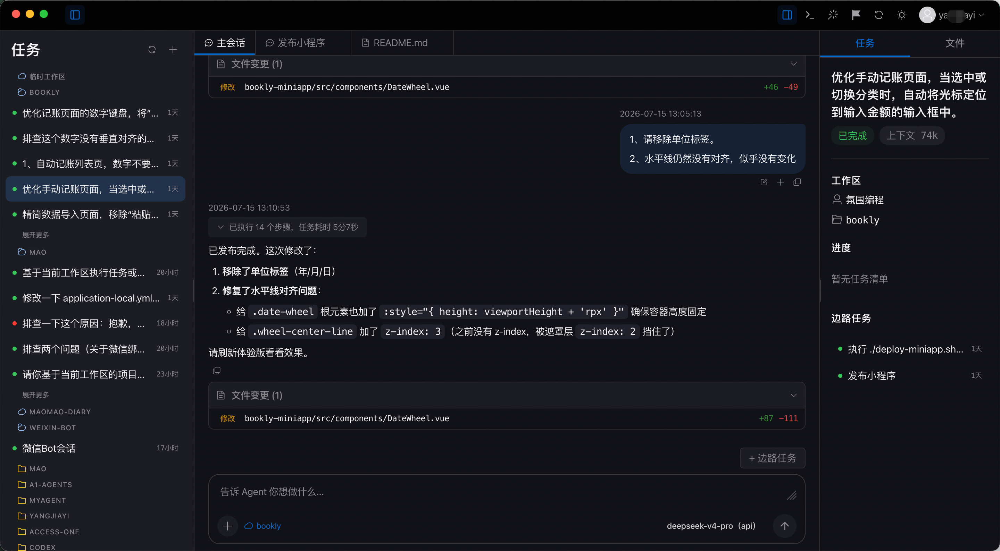

[](https://github.com/DC-ET/mao/actions/workflows/ci.yml)
[](LICENSE)

<p align="center">
  
</p>

<h1 align="center">Mao</h1>

<p align="center">
  <strong>Self-hosted AI Agent platform for individuals and teams — RBAC, audit trails, and dual execution modes.</strong><br/>
  个人与企业都适用的可私有化部署 AI Agent 管理与协作平台
</p>

<p align="center">
  <a href="skills/mao-cli/reference/install.md">快速开始</a> ·
  <a href="USER_GUIDE.md">用户手册</a> ·
  <a href="skills/mao-cli/reference/project.md">项目说明</a> ·
  <a href="skills/mao-cli/SKILL.md">mao-cli 知识库</a> ·
  <a href="#参与贡献">参与贡献</a>
</p>

---

> **重要提示**：当前项目尚未经过企业级生产环境验证。部署前请充分了解功能限制与适用边界，自行评估风险后再决定是否上线。

Mao 提供可私有化部署的 AI Agent 管理与协作：内置 Think-Act-Observe 引擎，支持 CLOUD / LOCAL 双执行模式、MCP、Skill、定时任务与多端客户端（管理后台、Web/Electron 桌面、安卓 APP、`mao-agent` 终端 CLI）。数据与模型密钥留在你自己的环境。

> **开源说明**：MIT 许可证，仅提供源码与自部署文档。LLM 需在管理后台配置 API Key；界面语言为中文。

## 客户端预览

<p align="center">
  
</p>

## 产品文档（mao-cli 知识库）

**面向用户与 Agent 的产品说明、部署、配置、全端手册与 REST CLI** 统一维护在 [`skills/mao-cli/`](skills/mao-cli/SKILL.md)，可单独分发。仓库内其他产品向文档以引用为主：

| 文档 | 说明 |
|------|------|
| [skills/mao-cli/SKILL.md](skills/mao-cli/SKILL.md) | 总路由：问答、部署、手册、REST CLI |
| [reference/project.md](skills/mao-cli/reference/project.md) | 定位、架构、与 Codex 对比、核心特性 |
| [reference/install.md](skills/mao-cli/reference/install.md) | 本地开发安装 |
| [reference/deploy.md](skills/mao-cli/reference/deploy.md) | 生产自托管部署 |
| [reference/config.md](skills/mao-cli/reference/config.md) | 环境变量与默认账号 |
| [USER_GUIDE.md](USER_GUIDE.md) | 用户手册索引 |
| [DEPLOY.md](DEPLOY.md) | 部署指南索引 |

## 快速开始

### 仅对话（mao-agent）

```bash
curl -fsSL https://raw.githubusercontent.com/DC-ET/mao/main/scripts/install-mao-agent.sh | bash
mao-agent login
mao-agent
```

详见 [skills/mao-cli/reference/mao-agent.md](skills/mao-cli/reference/mao-agent.md)。

### 本地开发三端

Node.js 22+、MySQL 8.x → 按 [install.md](skills/mao-cli/reference/install.md) 克隆、配库、启动 backend / admin / desktop。默认管理员 `admin` / `admin123`（上线后立即改密）。

### 生产部署

见 [deploy.md](skills/mao-cli/reference/deploy.md)。维护者：真实部署目录为 `/opt/mao`。

### REST 运维（mao-cli）

```bash
cd skills/mao-cli && npm install . -g
mao auth login
```

## 测试

```bash
cd backend-ts && npm test && npm run build
cd admin && npm run build
cd desktop && npm run build
cd agent-cli && npm test
```

根目录 `npm test` 为 Playwright E2E（需先启动三端）。

## 参与贡献

欢迎 Issue 与 PR。开始前阅读 [CONTRIBUTING.md](CONTRIBUTING.md)。

- Bug / 功能 — [GitHub Issues](https://github.com/DC-ET/mao/issues)
- 安全漏洞 — [SECURITY.md](SECURITY.md)，勿公开披露

## 文档索引

| 文档 | 说明 |
|------|------|
| [skills/mao-cli/](skills/mao-cli/SKILL.md) | **产品知识库 + REST CLI**（部署、手册、排障） |
| [CONTRIBUTING.md](CONTRIBUTING.md) | 贡献与开发指引 |
| [SECURITY.md](SECURITY.md) | 安全策略 |
| [CHANGELOG.md](CHANGELOG.md) | 发版说明 |
| [docs/plan/technical-design.md](docs/plan/technical-design.md) | 技术设计（维护者） |
| [docs/](docs/) | 各专题设计稿 |
| [AGENTS.md](AGENTS.md) / [CLAUDE.md](CLAUDE.md) | AI 辅助开发指引 |
| [agent-cli/README.md](agent-cli/README.md) | mao-agent 开发者说明 |

## 许可证

[MIT License](LICENSE) — Copyright (c) 2026 Mao Contributors
