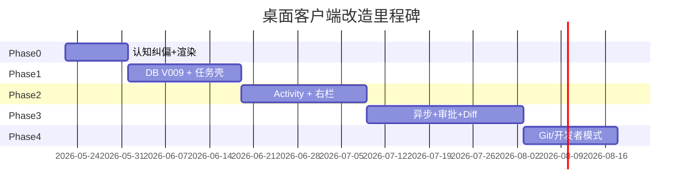

# 桌面客户端分阶段技术改造方案

> Note: The `bash` tool has been removed. `shell` is now the only command execution tool. See `shell-unification-design.md`.

> 综合 `desktop-layout-reflection.md`（普通用户 / 布局）、`desktop-codex-ux-comparison.md`（任务对话 / Codex 对齐）与 `desktop-ux-refactor-plan.md`（组件与能力清单），输出可执行的分阶段技术方案。  
> 初版阶段**不考虑存量数据兼容**（见 `CLAUDE.md`），允许 Session 语义升级、表结构扩展与 API 破坏性调整。

---

## 0. 文档定位与目标

### 0.1 要解决的问题（技术语言）

| 问题域 | 现状 | 目标 |
|--------|------|------|
| 领域模型 | `Session` = 聊天线程 | `Session` 对外呈现为 **Task**（任务） |
| 主界面对象 | Agent 名 + 连接状态 | 任务标题 + 阶段 + 已耗时 |
| 工具呈现 | `tool_call_result` 全文进 UI | **Activity 摘要** + 可展开详情 |
| 布局 | 顶栏产品 Tab + 双栏聊天 | 任务页三职责分区（索引 / 叙事 / 监督） |
| 首页 | Agent 卡片墙 | 进行中任务 + 继续入口 |
| 执行模型 | 单 SSE 前台阻塞 | 可切换会话、后台跑、通知回流 |

### 0.2 设计原则（实施时不得偏离）

1. **任务优先，聊天降格** — 消息流是任务叙事的一种渲染，不是唯一数据源。  
2. **渐进披露** — 默认摘要；终端 / diff / 路径在二级。  
3. **三栏各司其职** — 左索引、中叙事+活动、右进度/环境（可折叠为抽屉）。  
4. **普通用户默认简单** — 方案 A（对话主舞台）；开发者双栏为 **opt-in**（`developerMode`）。  
5. **先后端契约、后 UI 换皮** — 避免仅改前端导致刷新后状态丢失。

### 0.3 目标架构（逻辑视图）

```
┌─────────────────────────────────────────────────────────────────┐
│                        Desktop (Electron + Vue)                  │
│  ┌─────────────┐  ┌──────────────────────┐  ┌─────────────────┐ │
│  │ TaskIndex   │  │ TaskWorkspace        │  │ TaskInspector   │ │
│  │ (左栏)      │  │ (中栏)               │  │ (右栏/抽屉)     │ │
│  │ · 项目分组  │  │ · TaskHeader         │  │ · Progress      │ │
│  │ · 任务列表  │  │ · NarrativeStream    │  │ · Workspace/Git │ │
│  │ · 搜索      │  │ · ActivityFeed       │  │ · Approvals     │ │
│  └──────┬──────┘  │ · TaskInput          │  └────────┬────────┘ │
│         │         └──────────┬───────────┘           │          │
│         └────────────────────┼───────────────────────┘          │
│                              │ composables + Pinia stores        │
└──────────────────────────────┼──────────────────────────────────┘
                               │ REST + SSE (+ WS local tools)
┌──────────────────────────────┼──────────────────────────────────┐
│                    Backend (Spring Boot)                         │
│  SessionController ──► SessionService ──► session / message       │
│         │                    │                                   │
│         │              HarnessService / AgentLoop                  │
│         │                    │                                   │
│         │              AgentEventListener ──► SSE 事件扩展       │
│         │                    │                                   │
│         └────────────► ActivityService (Phase 2+)               │
│                      ► ExecutionRun (Phase 3 异步)              │
└─────────────────────────────────────────────────────────────────┘
```

**关键决策：** Phase 1–2 **不新建 `task` 表**，在 `session` 上扩展任务字段；Phase 2 新增 `session_activity` 存活动行；Phase 3 新增 `execution_run` 支持一轮用户发送对应一次可追踪执行。

---

## 1. 阶段总览

| 阶段 | 周期（参考） | 主题 | 后端 | 前端 | 用户可感知变化 |
|------|-------------|------|------|------|----------------|
| **Phase 0** | 1–1.5 周 | 认知纠偏 + 基础债 | 小改 | 主改 | 标题像人话、工具默认折叠、顶栏收敛 |
| **Phase 1** | 2–3 周 | 任务壳 + 契约扩展 | 中改 | 主改 | 任务页布局、状态行、首页任务列表 |
| **Phase 2** | 3–4 周 | 活动流 + 监督右栏 | 主改 | 主改 | Codex 式 Read/Edited 行、Progress |
| **Phase 3** | 4–5 周 | 异步 + 审批 + Diff | 主改 | 中改 | 提交后切换任务、审批队列、变更审查 |
| **Phase 4** | 按需 | 工程化增强 | 中改 | 中改 | Git 摘要、开发者模式、离线缓存 |

依赖关系：`Phase 0 → 1 → 2 → 3`，Phase 4 可与 Phase 3 部分并行。

---

## 2. Phase 0 — 认知纠偏与渲染基础

> 目标：不改动核心 harness 流程，用最小代价对齐「任务语言 + 渐进披露」。  
> 对应反思文档 P0 项。

### 2.1 后端改造

| 项 | 文件/模块 | 改动 |
|----|-----------|------|
| 会话标题生成 | `SessionService.saveMessage` | 首条 USER 消息：若内容为 shell 命令（`/^[a-z]+\s/` 或长度&lt;30 且含 `\|$/`），则调用 `TitleGenerator` 生成展示标题（规则：去命令化 →「执行命令：列出目录」；或截断意图句） |
| 标题 API | `SessionController` | `PUT /sessions/{id}` 支持 `title` 更新（可选） |
| 工具结果截断 | `SessionController` SSE / `HarnessService` | `tool_call_result` 增加 `summary` 字段（后端生成，如 bash 取首行+行数；read 取 path） |
| SessionVO 扩展（可选本阶段） | `SessionVO` | 增加 `displayTitle`（与 `title` 相同，为 Phase 1 预留） |

**新增类（建议）：**

```
backend/.../session/util/TitleGenerator.java
backend/.../session/util/ToolResultSummarizer.java
```

**SSE 事件（向后兼容，新增 listener 字段）：**

```json
// tool_call_result 增补
{ "call_id": "...", "summary": "Listed 12 entries in .", "result": "...(full)", "status": "success" }
```

### 2.2 前端改造

| 项 | 文件 | 改动 |
|----|------|------|
| 工具卡默认折叠 | `useChat.ts` | `isExpanded: false`；running 时仅展开摘要行动画 |
| 摘要展示 | `ToolCallCard.vue` | 主行显示 `summary` / 本地 `summarizeToolCall()`；详情区 `result` |
| 聊区宽度 | `ChatView.vue` | 去掉 `max-width: 900px` 或提至 `min(100%, 1100px)`，主栏 ≥65% |
| 顶栏收敛 | `TopNav.vue` + `Layout.vue` | 路由 `/chat/*`、`/task/*` 时隐藏 Hub/创建 Tab，仅保留 Logo + 通知 + 用户 |
| Workspace 降级 | `ChatView.vue` | `WorkspaceBar` 改为首次 LOCAL 无 workspace 时 `el-alert` 引导，有值后收进 `ChatHeader` 下拉 |
| 文案 | `ChatInput.vue` | placeholder →「继续说明本次任务…」 |
| 连接状态 | `ChatHeader.vue` | 正常时仅灰点；断连 toast + 红点 |
| Markdown | `useMarkdown.ts` | 确认 marked 已接入（若未完成则本阶段完成） |

### 2.3 验收标准

- [ ] 侧栏不再出现裸 `ls -l` 作为主标题（90% 场景）  
- [ ] 打开任务页顶栏无「工作台 / Hub / 创建 Agent」  
- [ ] bash 类工具默认高度 ≤ 单行摘要 + 展开按钮  
- [ ] 主对话列宽 ≥ 窗口 60%  

### 2.4 风险与规避

- 仅前端截断会导致历史消息仍丑 → Phase 0 必须后端写 `summary` 或前端统一 `summarize` 工具函数。

---

## 3. Phase 1 — 任务壳与 Session 契约升级

> 目标：确立「Session = Task」的产品壳；工作台任务化；路由与 Store 对齐。  
> 布局：方案 **A + B**（任务首页 + 单栏任务页）。

### 3.1 数据模型（后端）

**迁移 `V009__session_task_fields.sql`：**

```sql
ALTER TABLE `session`
  ADD COLUMN `phase` VARCHAR(32) DEFAULT 'IDLE'
    COMMENT 'IDLE|RUNNING|RESUMING|WAITING_APPROVAL|COMPLETED|FAILED|CANCELLED',
  ADD COLUMN `summary` VARCHAR(512) NULL COMMENT '任务一句话摘要',
  ADD COLUMN `started_at` DATETIME NULL COMMENT '本轮执行开始时间',
  ADD COLUMN `elapsed_ms` BIGINT DEFAULT 0 COMMENT '累计执行毫秒',
  ADD COLUMN `steps_json` JSON NULL COMMENT '进度步骤 [{id,label,done}]',
  ADD COLUMN `project_key` VARCHAR(256) NULL COMMENT 'workspace 基名或用户定义项目名',
  ADD COLUMN `last_activity_at` DATETIME NULL,
  MODIFY COLUMN `status` VARCHAR(20) DEFAULT 'ACTIVE'
    COMMENT 'ACTIVE|ARCHIVED（保留）';

CREATE INDEX `idx_session_user_phase` ON `session` (`user_id`, `phase`);
```

**实体与 VO：**

- `Session.java` 增加上述字段  
- `SessionVO` 增加：`phase`, `summary`, `elapsedMs`, `steps`, `projectKey`, `running`（派生：`phase==RUNNING`）

**状态机（`SessionService`）：**

```
发送消息 → phase=RUNNING, started_at=now
SSE message_end → phase=IDLE（或 COMPLETED 若 Agent 显式结束）
工具需审批 → phase=WAITING_APPROVAL
错误 → phase=FAILED
```

由 `HarnessService` / `SessionController` 在 `message_end`、错误回调中调用 `sessionService.updatePhase`。

### 3.2 API 改造

| 方法 | 路径 | 说明 |
|------|------|------|
| GET | `/v1/sessions` | 增加 `?groupBy=project`；返回带 `phase/elapsedMs/summary` |
| GET | `/v1/sessions/dashboard` | **新增**：`{ running: [], recent: [] }` 供工作台 |
| PATCH | `/v1/sessions/{id}` | 更新 `title/summary/projectKey/phase` |
| SSE | `session_status` | **新增事件**：`{ phase, elapsedMs }` 每 5s 或状态变更时推送 |

**列表查询：**

```java
// SessionService.listSessionsForDashboard(userId)
// - running: phase in (RUNNING, RESUMING, WAITING_APPROVAL)
// - recent: updated_at desc limit 20
```

### 3.3 前端改造

#### 3.3.1 路由

```ts
// router/index.ts
{ path: 'workbench', component: TaskHomeView },      // 替代纯 Agent 网格
{ path: 'tasks/:sessionId', component: TaskView }, // 统一任务页（原 ChatView 升级）
{ path: 'chat/:agentId', redirect: to => create task flow }  // 兼容旧链
```

#### 3.3.2 目录结构（目标）

```
desktop/src/
├── views/
│   ├── task/
│   │   ├── TaskHomeView.vue       # 方案 B 首页
│   │   └── TaskView.vue           # 任务主壳
├── components/task/
│   ├── TaskHeader.vue             # 任务标题 + phase + elapsed
│   ├── TaskIndexPanel.vue         # 左栏（原 SessionPanel 升级）
│   ├── NarrativeStream.vue        # 中栏消息+叙事
│   ├── TaskInput.vue              # 原 ChatInput
│   └── TaskInspectorDrawer.vue    # 右栏占位（Phase 2 填满）
├── composables/
│   ├── useTask.ts                 # 聚合 session + chat + status
│   └── useTaskStatus.ts           # SSE session_status
├── stores/
│   ├── session.ts                 # 扩展 phase/summary/projectKey
│   └── taskDashboard.ts           # running/recent
```

#### 3.3.3 组件职责迁移

| 旧组件 | 新组件 | 变化 |
|--------|--------|------|
| `ChatView.vue` | `TaskView.vue` | 三列 grid；中列 `flex:1` |
| `ChatHeader.vue` | `TaskHeader.vue` | H1=title/summary；副标题=agentName · projectKey |
| `SessionPanel.vue` | `TaskIndexPanel.vue` | 按 `projectKey` 分组；显示 phase 点、`elapsed` |
| `WorkbenchView.vue` | `TaskHomeView.vue` | 进行中任务列表 + 次要 Agent 条 |

#### 3.3.4 Store 与 composable

```ts
// stores/session.ts 扩展
interface Session {
  phase: TaskPhase
  summary?: string
  elapsedMs: number
  projectKey?: string
  steps?: TaskStep[]
}

// composables/useTask.ts
// - loadSession(sessionId)
// - sendMessage → 自动 PATCH phase
// - subscribe session_status SSE
```

#### 3.3.5 交互

- 工作台点「继续」→ `/tasks/:id`  
- 选 Agent → `POST /sessions` + 跳转 `/tasks/:id`（**取消每次模式弹窗**，读 `localStorage.executionMode` 或 Agent 默认）  
- 默认应用启动路由：`/workbench` 若有 `running[0]` 可提示「继续」但不自动跳转（避免惊吓）

### 3.4 验收标准

- [ ] 任务页主标题为 `session.title` 或 `summary`  
- [ ] Header 显示「已运行 Xm · 执行中/等待输入」  
- [ ] 工作台首屏为进行中任务，Agent 网格降为二级区域  
- [ ] 创建任务 ≤2 步到输入框（选 Agent → 输入）  
- [ ] 刷新页面后 phase/elapsed 与后端一致  

### 3.5 工作量粗估

| 端 | 人日 |
|----|------|
| 后端迁移 + API + phase 机 | 3–4 |
| 前端路由 + Task 壳 + Home | 5–7 |
| 联调 | 2 |
| **合计** | **10–13** |

---

## 4. Phase 2 — 活动流与监督右栏（对齐 Codex）

> 目标：中间「叙事 + 活动行」分离；右侧 Progress / 工作区 / 待审批占位。

### 4.1 数据模型（后端）

**迁移 `V010__session_activity.sql`：**

```sql
CREATE TABLE `session_activity` (
  `id`           BIGINT PRIMARY KEY AUTO_INCREMENT,
  `session_id`   BIGINT NOT NULL,
  `run_id`       VARCHAR(64) NULL COMMENT 'Phase3 execution_run 关联',
  `type`         VARCHAR(32) NOT NULL COMMENT 'EXPLORE|READ|EDIT|RUN|SEARCH|TOOL|...',
  `target`       VARCHAR(512) NULL COMMENT '文件路径/命令摘要',
  `summary`      VARCHAR(512) NOT NULL,
  `detail_json`  JSON NULL COMMENT '完整入参/出参引用',
  `status`       VARCHAR(20) DEFAULT 'SUCCESS',
  `duration_ms`  INT NULL,
  `created_at`   DATETIME DEFAULT CURRENT_TIMESTAMP,
  INDEX `idx_session_created` (`session_id`, `created_at`)
);
```

**写入点：** `AgentLoop` 工具执行前后 → `ActivityService.record(sessionId, type, target, summary)`。

**工具名 → Activity 类型映射（`ActivityTypeMapper`）：**

| tool | type | summary 示例 |
|------|------|----------------|
| read_file | READ | Read `src/App.vue` |
| write_file / edit_file | EDIT | Edited `Button.vue` |
| bash | RUN | Ran `npm test` (exit 0) |
| glob / list | EXPLORE | Explored 3 files |

### 4.2 API 与 SSE

| 方法 | 路径 | 说明 |
|------|------|------|
| GET | `/v1/sessions/{id}/activities` | 分页活动列表 |
| GET | `/v1/sessions/{id}/snapshot` | **聚合**：session + steps + activities(最近50) + pendingApprovals |
| SSE | `activity` | `{ id, type, target, summary, status }` |
| SSE | `step_update` | `{ steps: [...] }` 计划步骤更新 |

**步骤 `steps_json` 来源（优先级）：**

1. Agent 在回复中用结构化块输出 plan（Phase 2 可选解析）  
2. 启发式：根据 activity 序列生成（读→改→测）  
3. 管理员配置 Agent 默认步骤模板  

**Harness 改动：**

- `AgentEventListener` 增加 `onActivity(ActivityDTO)`  
- `SessionController` SSE 转发 `activity` / `step_update`

### 4.3 前端改造

#### 4.3.1 新组件

```
ActivityLine.vue        # 单行：图标 + summary + 耗时 + 展开
ActivityFeed.vue        # 嵌入 NarrativeStream，与 MessageBubble 交错渲染
TaskInspector.vue       # 右栏：Progress / Workspace / Approvals(空)
ProgressChecklist.vue   # steps_json 绑定
```

#### 4.3.2 渲染策略

消息流渲染顺序（单条 assistant turn）：

1. `MessageBubble` — 仅 **叙事 Markdown**（剥离 toolCalls 默认展示）  
2. `ActivityFeed` — 本轮 `toolCalls` 转成 `ActivityLine` 列表（用 SSE `summary`）  
3. 用户消息仍为气泡  

**布局 CSS：**

```css
.task-layout {
  display: grid;
  grid-template-columns: var(--aw-task-index-width) 1fr var(--aw-task-inspector-width);
}
/* inspector-width: 280px; <1024px 时 inspector 变 drawer */
```

#### 4.3.3 TaskIndexPanel 升级

- 分组：`projectKey || '未分类'`  
- 项：`summary || title` + `formatElapsed` + phase 图标  
- 顶栏：搜索（`keyword` 已有 API）+ 新任务  

#### 4.3.4 composable

```ts
// useActivity.ts — 订阅 SSE activity，写入 activityList
// useTaskSnapshot.ts — 进入任务页 GET snapshot 一次
```

### 4.4 验收标准

- [ ] 执行 `read_file` 后中栏出现 `Read path` 单行，非全文塞进气泡  
- [ ] 右栏 Progress 至少 3 步且随执行勾选（可启发式）  
- [ ] 侧栏按项目分组，显示 `22m` 类相对时间  
- [ ] 窄屏右栏收为抽屉，主栏仍 ≥60%  

### 4.5 工作量粗估

| 端 | 人日 |
|----|------|
| 后端 activity 表 + harness 埋点 + API | 5–6 |
| 前端 Activity + Inspector + 布局 | 6–8 |
| **合计** | **11–14** |

---

## 5. Phase 3 — 异步执行、审批与变更审查

> 目标：委托任务后可离开；审批队列；文件 diff 审查。Codex 要点 4、7、8、9、15。

### 5.1 数据模型（后端）

**迁移 `V011__execution_run_and_approval.sql`：**

```sql
CREATE TABLE `execution_run` (
  `id`              BIGINT PRIMARY KEY AUTO_INCREMENT,
  `session_id`      BIGINT NOT NULL,
  `event_id`        VARCHAR(64) NOT NULL,
  `status`          VARCHAR(32) DEFAULT 'QUEUED' COMMENT 'QUEUED|RUNNING|WAITING_APPROVAL|DONE|FAILED|CANCELLED',
  `user_message_id` BIGINT NULL,
  `started_at`      DATETIME,
  `finished_at`     DATETIME,
  INDEX `idx_session_status` (`session_id`, `status`)
);

CREATE TABLE `approval_request` (
  `id`           BIGINT PRIMARY KEY AUTO_INCREMENT,
  `session_id`   BIGINT NOT NULL,
  `run_id`       BIGINT NULL,
  `tool_name`    VARCHAR(64) NOT NULL,
  `payload_json` JSON NOT NULL,
  `status`       VARCHAR(20) DEFAULT 'PENDING' COMMENT 'PENDING|APPROVED|REJECTED',
  `created_at`   DATETIME DEFAULT CURRENT_TIMESTAMP
);

CREATE TABLE `session_change` (
  `id`          BIGINT PRIMARY KEY AUTO_INCREMENT,
  `session_id`  BIGINT NOT NULL,
  `file_path`   VARCHAR(1024) NOT NULL,
  `change_type` VARCHAR(20) COMMENT 'CREATE|MODIFY|DELETE',
  `diff_text`   MEDIUMTEXT,
  `status`      VARCHAR(20) DEFAULT 'PENDING' COMMENT 'PENDING|ACCEPTED|REJECTED',
  `created_at`  DATETIME DEFAULT CURRENT_TIMESTAMP
);
```

### 5.2 执行与 SSE 改造

**流程：**

```
POST /sessions/{id}/messages → 创建 execution_run(QUEUED) → 返回 eventId
Agent 线程执行 → run.status=RUNNING
需审批 → approval_request + run=WAITING_APPROVAL + SSE approval_required
完成 → run=DONE + session.phase=IDLE + 通知
```

**SSE 新增：**

- `approval_required` — `{ approvalId, toolName, preview }`  
- `run_status` — `{ runId, status }`  
- `change_recorded` — `{ changeId, filePath, diffPreview }`

**Harness / LocalTool：**

- bash 审批从 Electron 弹窗 → 优先 `approval_request` API；桌面轮询或 WS 推送  
- `write_file` / `edit_file` 执行后写 `session_change`（diff 由工具层生成）

### 5.3 API 清单

| 方法 | 路径 | 说明 |
|------|------|------|
| POST | `/v1/sessions/{id}/approvals/{aid}/approve` | 批准 |
| POST | `/v1/sessions/{id}/approvals/{aid}/reject` | 拒绝 |
| GET | `/v1/sessions/{id}/changes` | 待审查变更列表 |
| POST | `/v1/sessions/{id}/changes/{cid}/accept` | 接受变更 |
| POST | `/v1/sessions/{id}/runs/{rid}/cancel` | 取消执行 |

**用户设置（Phase 3）：**

- 表 `user_preference` 或 Redis：`bashPolicy`, `fileWritePolicy`（ALLOW|ASK|DENY）

### 5.4 前端改造

| 模块 | 改动 |
|------|------|
| `useSSE` | 监听 `approval_required` / `run_status` / `change_recorded` |
| `TaskInspector` | Approvals 列表 + Changes 列表（`DiffView.vue`） |
| `stores/taskDashboard` | `running` 从 `execution_run` 驱动，侧栏 spinner |
| `useChat` / `useTask` | 发送后可 `router.push` 另一任务；SSE 在后台继续（多 EventSource 或单连接 multiplex） |
| `NotificationBell` | 对接 run DONE / FAILED |
| `BashConfirmDialog` | 改为应用内审批卡片，支持「始终允许 git *」 |

**多会话 SSE 策略：**

- 方案 A：每 session 一个 EventSource（实现简单，≤3 并发）  
- 方案 B：`GET /users/me/events` 统一流（Phase 4 优化）

### 5.5 验收标准

- [ ] 任务 A 执行中可打开任务 B 并发送消息  
- [ ] 侧栏任务 A 显示进行中，完成后通知  
- [ ] bash 审批在右栏可见，批准后继续执行  
- [ ] `edit_file` 后在 Inspector 看到 diff，可 Accept/Reject  

### 5.6 工作量粗估

| 端 | 人日 |
|----|------|
| 后端 run/approval/change + harness | 8–10 |
| 前端异步 + inspector + diff | 7–9 |
| Electron 审批链路改造 | 3–4 |
| **合计** | **18–23** |

---

## 6. Phase 4 — 工程化与开发者模式（可选）

| 能力 | 后端 | 前端 |
|------|------|------|
| Git 摘要 | Electron 读 `git status -sb` 上报或 CLI 代理 API | Inspector `GitPanel` |
| 开发者模式 | — | 设置开启后启用双栏 `ReviewPanel`（方案 C） |
| 项目规则 | Harness 启动读 `AGENTS.md` | Inspector `ContextPanel` |
| 离线缓存 | — | IndexedDB 缓存 sessions/messages snapshot |
| 统一事件流 | `UserEventStreamController` | 替换多 EventSource |
| Hub 一键试用 | `POST /sessions?trial=true` | TaskHome 卡片 |

---

## 7. 横切关注点

### 7.1 与现有代码的映射（优先改动文件）

**后端**

```
session/entity/Session.java
session/service/SessionService.java
session/controller/SessionController.java
harness/core/AgentEventListener.java
harness/core/AgentLoop.java
harness/core/HarnessService.java
resources/db/migration/V009~V011__.sql
```

**前端**

```
desktop/src/views/chat/ChatView.vue          → task/TaskView.vue
desktop/src/components/chat/*                → components/task/*
desktop/src/components/common/TopNav.vue
desktop/src/composables/useChat.ts           → useTask.ts
desktop/src/composables/useSSE.ts
desktop/src/stores/session.ts
desktop/src/views/workbench/WorkbenchView.vue → task/TaskHomeView.vue
```

### 7.2 测试策略

| 阶段 | 后端 | 前端 |
|------|------|------|
| 0 | `TitleGeneratorTest`, `ToolResultSummarizerTest` | 组件快照：ToolCallCard 折叠 |
| 1 | `SessionPhaseTest`, API 契约测试 | TaskHeader 状态、e2e 创建任务 |
| 2 | Activity 写入集成测试 | ActivityFeed 渲染、e2e 读文件 |
| 3 | approval 流、run 状态机 | 双任务并行 e2e、diff accept |

### 7.3 性能与限制

- `session_activity` 每 session 保留最近 500 条，归档删 detail_json  
- SSE 连接数：Phase 3 前单连接；之后限制每用户 ≤5  
- 大结果集：bash stdout >32KB 只存 detail_json，summary 固定规则生成  

### 7.4 安全

- 审批 payload 不返回到列表 API 的敏感环境变量  
- `session_change.diff` 仅 session owner 可读  
- 路径展示：UI 用 `projectKey` + 相对路径，API 仍可返回绝对路径给 LOCAL 模式  

---

## 8. 阶段依赖与里程碑



**建议里程碑演示：**

| 里程碑 | 演示脚本 |
|--------|----------|
| M0 | 打开旧会话，标题可读，bash 折叠 |
| M1 | 工作台见进行中任务，进入后见「已运行 2m」 |
| M2 | 重构任务：中栏计划文字 + Read/Edited 行 + 右侧勾选 |
| M3 | 提交长任务后切换另一会话，回来收 diff + 通知 |

---

## 9. 与历史文档的关系

| 文档 | 角色 | 本方案中的去向 |
|------|------|----------------|
| `desktop-layout-reflection.md` | 为何改、布局原则 | → Phase 0–1 布局与文案 |
| `desktop-codex-ux-comparison.md` | Codex 差距 | → Phase 2–3 活动流/右栏/异步 |
| `desktop-ux-refactor-plan.md` | 组件清单与依赖 | → 并入各 Phase 前端目录；Markdown/深色模式放 Phase 0–1 |
| **本文** | **实施总纲** | 执行时以本文阶段为准 |

**`desktop-ux-refactor-plan.md` 优先级调整说明：**

原 P0「工具卡片 bash 终端全量展示」与反思结论冲突，改为：

- P0：摘要化工具卡 + 任务标题（本文 Phase 0）  
- P1：任务壳 + Activity（本文 Phase 1–2）  
- 原 P2「底部 ToolExecutionPanel」→ 合并入右栏 Inspector 的「过程」Tab，不再单独占底部第四横条（避免又多一层）

---

## 10. Phase 0 启动清单（可直接开工）

**后端（1 PR）**

1. 新增 `TitleGenerator`、`ToolResultSummarizer`  
2. 改 `SessionService.saveMessage` 标题逻辑  
3. SSE `tool_call_result` 增加 `summary`  

**前端（1 PR）**

1. `ToolCallCard` 默认折叠 + summary  
2. `TopNav` 任务路由下隐藏产品 Tab  
3. `ChatView` 宽度、`ChatInput` 文案、`ChatHeader` 连接态  
4. `WorkspaceBar` 条件展示  

**合并后** 即可对外演示 M0。

---

## 11. 总结

改造的主线不是「再加一个终端面板」，而是：

1. **Phase 0–1**：把 Session 在产品和 API 上呈现为 Task（标题、阶段、首页）。  
2. **Phase 2**：用 Activity + 右栏 Progress 对齐 Codex 的「快扫层」。  
3. **Phase 3**：用 Run + Approval + Change 对齐 Codex 的「委托与监督闭环」。  

前后端必须同步推进：**仅改 UI 不改 SSE/表结构，刷新即丢任务态**；仅改后端不改呈现，用户仍以为在聊天。按 Phase 0→1→2→3 顺序，可在约 **8–10 周**（1 前端 + 1 后端）内达到与 Codex 任务对话体验同量级的可用产品，Phase 4 按工程深度选配。
