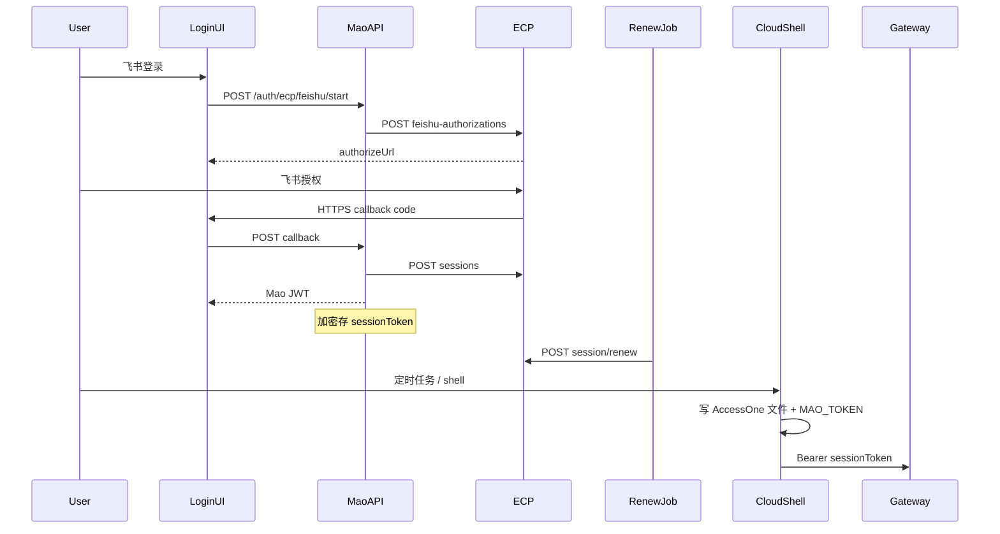

# ECP 原生飞书登录技术方案

- 日期：2026-09-14
- 状态：按已确认主线开发
- 范围：Mao 服务端、管理后台、桌面 Web/Electron/安卓登录；CLOUD shell 网关凭证注入

## 1. 需求背景与目标

CLOUD 定时任务与 Agent shell 在服务端执行，当前仅注入短效 `MAO_TOKEN`（Mao JWT），可供 `mao-cli` / `mao-agent` 调用 Mao API。内部业务 CLI（如 `bigdata-cli` → `gateway.example.com`）要求 **人维度** 的 ECP `sessionToken`（`Authorization: Bearer`），短效 Mao JWT 无法替代。

目标：在管理后台开启 ECP 登录后，用户通过 **ECP 飞书** 登录 Mao；服务端加密保存 ECP `sessionToken`，在 12 小时 TTL 内由常驻任务自动 renew；CLOUD shell 将会话票写入虚拟 HOME 的 AccessOne 兼容目录，使 `bigdata-cli` / `access-cli auth resolve` 能读到 Bearer 票。

**确定采用：ECP 原生 HTTP Session API + Mao 自签 JWT 双票，不使用第三方 ECP SDK 接管前端路由/菜单/权限。**

## 2. 已确认需求与范围

### 2.1 本期必须做

1. 管理后台「集成配置」开关；**开启 ECP 后关闭**密码/LDAP/Mao 飞书/公司 SSO 登录入口，后端同步拒绝对应接口。
2. ECP 飞书 OAuth：`POST feishu-authorizations` → 跳转 `authorizeUrl` → HTTPS 回调 → `POST sessions`（`loginMethod: FEISHU_CALLBACK`）。
3. 回调 URL（须在 ECP 登记）：
   - 桌面 / Web / 安卓：`https://mao.example.com/auth/ecp/feishu-callback`
   - 管理后台：`https://mao.example.com/admin/auth/ecp/feishu-callback`
4. 用户映射：**仅邮箱**（`data.user.email`）；`user_external_identity.provider='ecp'`，`subject=email`；冲突策略对齐公司 SSO（多账号同邮箱、管理员账号等拒绝自动合并）。
5. 签发 Mao JWT（access/refresh）供 REST/WS/`MAO_TOKEN`；ECP `sessionToken` AES-GCM 加密存入 `user_ecp_session`。
6. 常驻 **EcpRenewScheduler**：到期前约 30 分钟 `POST /public/session/renew`；用户行锁；先落库新票；renew 丢响应禁止用旧票狂重试。
7. CLOUD shell / 服务端终端：向虚拟 HOME 写入 `~/.config/com.access.accessone/profiles.json` 与 `profiles/mao/account.json`（`ecp_session_token` 字段）。
8. `GET /v1/auth/features` 返回 `ecpEnabled`（与 `feishuEnabled` 互斥）。
9. 单测覆盖配置解析、身份映射、互斥登录、renew 边界、AccessOne 文件写入。

### 2.2 本期明确不做

- 第三方 ECP SDK、Spring starter、OAuth2/OIDC（无 refresh_token，TTL 更短）
- ECP 密码/OTP 登录、选公司/选身份、`unionId` 映射
- 用 ECP 角色覆盖 Mao 权限；Embed SDK 公司 SSO 改 ECP
- `mao-cli` 浏览器飞书登录；LOCAL/Electron 本机覆盖真实 AccessOne 目录
- 将 `appSecret` 写入 git 或文档明文（原生 Session 不使用 appSecret）

## 3. 外部契约（ECP 生产）

| 项 | 值 |
|---|---|
| Base URL | `https://ecp.example.com/api/v1` |
| appCode | `EK0001`（可配置，默认此值） |
| 飞书授权 | `POST /public/login/apps/{appCode}/feishu-authorizations` |
| 换票 | `POST /public/login/apps/{appCode}/sessions`，`loginMethod: FEISHU_CALLBACK` |
| 校验 | `GET /public/session?appCode=`，`Authorization: Bearer` |
| 续期 | `POST /public/session/renew?appCode=`，Bearer **未过期**旧票换新票 |
| 默认 TTL | 43200 秒（12h）；过期后不能 renew |
| loginVariant | 默认 `PARTNER`；联调 400/401 时可改配置 |

响应成功约定：`code=0`（或等价 success），`data.sessionToken`、`data.expiresAt`（epoch 毫秒或 ISO，实现按实际字段解析）。

⚠️ **renew 响应不含用户信息**（无 `data.user` / `email`）：只有换票（`sessions`）才返回用户邮箱。解析必须分开——`renewSession` 只取 `sessionToken` + `expiresAt`，不得复用要求邮箱的登录解析，否则 renew 会必然失败并把会话打成 `FAILED`。

## 4. 认证链路

```text
用户点击飞书登录
  → POST /v1/auth/ecp/feishu/start（desktop|admin）
  → Mao 调 ECP feishu-authorizations，落 oauth state
  → 浏览器跳转 authorizeUrl → 飞书授权
  → 回调 Vue 页 /auth/ecp/feishu-callback?code&state
  → POST /v1/auth/ecp/feishu/callback
  → Mao 调 ECP sessions，得 sessionToken + 用户邮箱
  → 邮箱映射/创建 Mao 用户，加密存票
  → 返回 Mao JWT
  → 客户端轮询 GET /v1/auth/ecp/feishu/status 或直接拿 callback 响应

CLOUD 任务 / shell
  → 读 user_ecp_session 解密
  → 写入虚拟 HOME AccessOne 布局
  → bigdata-cli 经 access-cli 读 Bearer 调 gateway.example.com

后台 EcpRenewScheduler（常驻）
  → 扫描 expires_at 在 30 分钟内且 renew_status=ACTIVE
  → 用户行锁 → renew → 先 UPDATE 新票 → 旧票作废
```



## 5. 数据模型

### 5.1 system_setting

键 `auth.ecp.config`，JSON：

```json
{
  "enabled": false,
  "appCode": "EK0001",
  "baseUrl": "https://ecp.example.com/api/v1",
  "loginVariant": "PARTNER",
  "timeoutMs": 10000,
  "desktopCallbackUrl": "https://mao.example.com/auth/ecp/feishu-callback",
  "adminCallbackUrl": "https://mao.example.com/admin/auth/ecp/feishu-callback"
}
```

保存后对新登录与 renew 即时生效（renew 调度器下一 tick 读新配置）。

### 5.2 user_ecp_session

| 列 | 说明 |
|---|---|
| user_id | 唯一，FK user |
| session_token_enc | AES-GCM 密文 |
| expires_at | ECP 票过期时间 |
| renew_status | ACTIVE / RENEWING / FAILED |
| last_renew_at | 上次 renew 成功时间 |

### 5.3 ecp_oauth_state

对齐 `feishu_oauth_state`：state、status、user_id、expires_at、consumed_at；额外 `callback_target`（desktop/admin）用于校验回调来源。

### 5.4 user_external_identity

复用 V106 表：`provider='ecp'`，`subject=email`，`email_at_binding=email`。

## 6. API

| 方法 | 路径 | 说明 |
|---|---|---|
| GET | `/v1/auth/features` | `{ feishuEnabled, ecpEnabled }` |
| POST | `/v1/auth/ecp/feishu/start` | body: `{ target: 'desktop' \| 'admin' }` → authUrl, state, pollInterval |
| POST | `/v1/auth/ecp/feishu/callback` | body: `{ state, code }` → LoginVO |
| GET | `/v1/auth/ecp/feishu/status` | query: state → 轮询状态 |

ECP 开启时：`POST /v1/auth/login`、飞书 QR/callback、`POST /v1/auth/sso/exchange` 返回 403/业务码说明已切换 ECP。

## 7. Renew 策略

- 扫描间隔：60s（可配置常量）
- 触发：`expires_at <= now + 30min` 且 `renew_status = ACTIVE`
- 流程：`FOR UPDATE` 用户会话行 → 调 renew → 成功则 UPDATE 新 token+expires_at → `renew_status=ACTIVE`
- renew 网络超时/无响应：标记 `FAILED`，**不得**用旧票重试 renew；用户须重新飞书登录
- renew 响应解析失败同样按 `FAILED` 处理（新票可能已签发但被丢弃，旧票已作废）；此时须清理虚拟 HOME 的 AccessOne 布局，避免下游 CLI 读到旧票后误报「ECP 登录态已失效」
- 并发：同一用户仅一个 renew；ECP 返回「Session already renewed」视为另一 worker 已成功，重读 DB
- Mao 停机超过 12h：所有票过期，须全员重新登录

## 8. CLOUD 凭证注入

写入路径（Linux 虚拟 HOME，`XDG_CONFIG_HOME` 默认 `~/.config`）：

```text
{userHome}/.config/com.access.accessone/profiles.json
  → { "activeProfileId": "mao" }
{userHome}/.config/com.access.accessone/profiles/mao/account.json
  → { "ecp_session_token": "<sessionToken>" }
```

与 `access-cli` / `bigdata-cli` 的 `readEcpToken()` 对齐。缺票或解密失败：打 warn，不阻断 shell；`MAO_TOKEN` 仍照常注入。

## 9. 前端

- Admin：`EcpConfigPanel` 于系统设置「集成配置」
- Desktop/Admin 登录页：`ecpEnabled` 时仅「飞书登录」
- 回调页：`EcpFeishuCallbackView.vue`，读 query 调 callback API，成功跳转首页
- Electron：`open-feishu-auth-window` 扩展识别 `/auth/ecp/feishu-callback`，关窗后父页轮询 status

## 10. 风险与运维

| 风险 | 缓解 |
|---|---|
| 12h TTL + 停机 | 常驻 renew；监控 `renew_status=FAILED` |
| renew 丢响应旧票作废 | 不重试旧票；标 FAILED 促重新登录 |
| 邮箱变更/回收 | 已接受；不用 unionId 纠偏 |
| appSecret 泄露 | 不入库；原生 Session 不用 secret |
| 生产联调 loginVariant | 配置项可调，默认 PARTNER |

## 11. 测试清单

- [ ] 配置校验与默认值
- [ ] 邮箱创建/绑定/冲突
- [ ] ECP 开启时密码/飞书/SSO 被拒绝
- [ ] renew 成功替换、失败不重试旧票
- [ ] AccessOne 文件内容与权限（0700 目录）
- [ ] features 互斥
- [ ] 回调 + status 轮询端到端（mock ECP HTTP）
