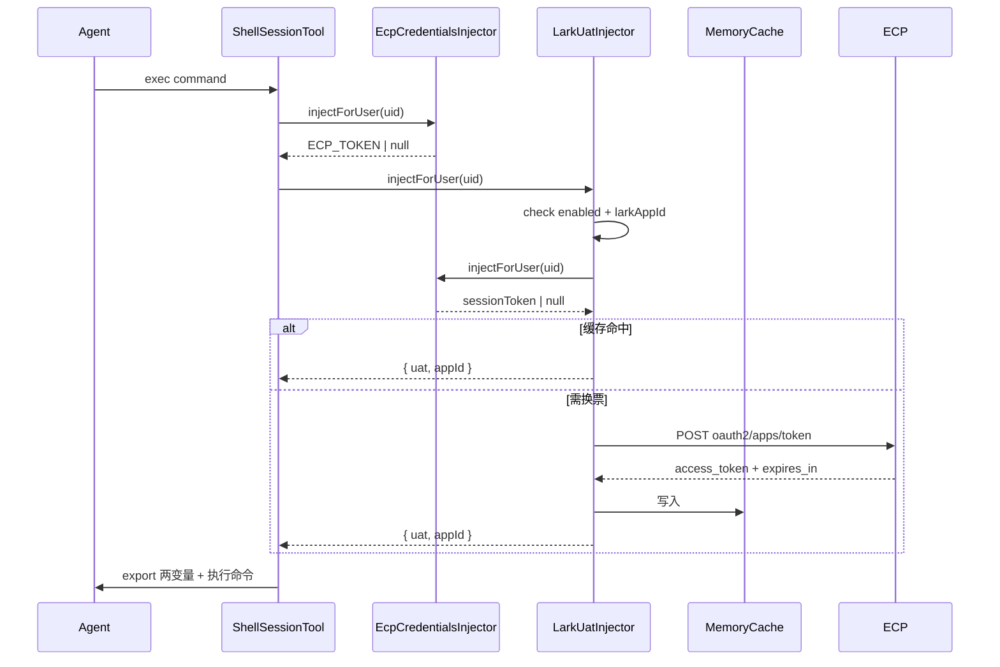

# 飞书 UAT Shell 注入技术方案（lark-cli）

- 日期：2026-09-18
- 状态：已实现
- 范围：后端 ECP 客户端与 UAT 注入器、CLOUD shell / 交互终端 env 注入、管理后台 ECP 配置扩展
- 关联：`docs/plan/2026-09-14-ecp-native-login-technical-design.md`；参考外部方案《lark-cli 接入 Mao 方案》方案 B

## 1. 需求背景与目标

`lark-cli` 以 **用户身份** 操作飞书时，走官方「环境变量凭证 provider」：只需注入 `LARKSUITE_CLI_APP_ID` + `LARKSUITE_CLI_USER_ACCESS_TOKEN`（UAT），即可跳过 keychain / `auth login`，全程不碰 appSecret。

目标：管理后台 **ECP 飞书登录开关打开** 后，CLOUD Agent shell 与交互式终端在已有 `ECP_TOKEN` / `MAO_TOKEN` 之外，自动注入上述两个环境变量，使 Agent 内直接调用 `lark-cli` 即可带上当前用户凭证。

**确定采用：Mao 侧集中换票 + 进程内存缓存（对照原方案「方案 B」），不依赖 skill 内 shim。**

## 2. 已确认需求与范围

### 2.1 本期必须做

1. `EcpClient` 新增「ECP sessionToken → 飞书 UAT」换票方法。
2. `EcpConfig` 增加可选字段 `larkAppId`（飞书应用 App ID），管理后台 ECP 面板可配。
3. 新增 `LarkUatInjector`：ECP 开启 + 用户有有效 ECP 会话 + 已配置 `larkAppId` 时，换取并返回 UAT。
4. UAT 使用 **进程内存缓存**；丢失后按需重新换取，不做落库。
5. 注入点：
   - Agent shell：`ShellSessionTool.injectMaoToken()`，每条命令前 `export`
   - 交互终端：`TerminalManager.buildEnv()`，spawn 时写入 env
6. 注入变量：
   - `LARKSUITE_CLI_USER_ACCESS_TOKEN`
   - `LARKSUITE_CLI_APP_ID`
7. 开关条件：`EcpConfig.enabled === true` 且 `larkAppId` 非空；否则不注入（`ECP_TOKEN` 行为不变）。
8. 单测：换票解析、缓存命中/刷新窗/指纹隔离、注入顺序、管理后台配置校验。

### 2.2 本期明确不做

- UAT 落库（`user_lark_uat` 表）与集中审计
- skill 内 `lark-uat-shim.js`（方案 A）；本方案独立交付，不依赖 skill 目录
- bot 身份 / TAT / appSecret
- ECP renew 失败时的全局 UAT 批量清理钩子（内存缓存随进程重启清空；ECP 无效时单用户路径已覆盖）
- 安卓原生壳、LOCAL/Electron 本机路径特殊处理

## 3. 外部契约（ECP 换 UAT）

| 项 | 值 |
|---|---|
| 方法 | `POST` |
| 路径 | `{baseUrl}/public/protocols/oauth2/apps/token` |
| Query | `appCode={ecpAppCode}`、`ecpUserToken={ECP sessionToken}` |
| 成功响应 | OAuth2 token 风格（见下） |
| UAT 有效期 | 响应 `expires_in`（秒）；缺失/非法时回退 7200s |

成功响应示例：

```json
{
  "access_token": "u-…",
  "expires_in": 833,
  "scope": "contact:user.base:readonly",
  "token_type": "Bearer",
  "issued_token_type": "urn:ecp:token-type:feishu-user-access-token"
}
```

解析约定：

- 同时兼容 **裸 OAuth 响应**（无 `code`/`data` 包裹）与现有 `unwrapData` 的 `{ code, data }` 包裹。
- 必填 `access_token`（兼容 `accessToken` / `userAccessToken` 别名）。
- `expires_in` → `expiresAt = now + expires_in * 1000`。
- 非 2xx 或缺 `access_token`：抛 `EcpError`，由注入器降级处理。

⚠️ token 放在 **query string**（按契约），不放 Authorization body；接入后确认网关/访问日志对 query 的脱敏策略。

## 4. 注入链路

```text
Agent shell / 交互终端准备执行命令
  → injectMaoToken / buildEnv
  → EcpCredentialsInjector.injectForUser(userId)     // 既有：有效则返回 ECP sessionToken，写 AccessOne
  → LarkUatInjector.injectForUser(userId)            // 新增
       ├─ config.enabled && config.larkAppId ？否则 null
       ├─ 取 ECP sessionToken（复用 EcpCredentialsInjector）
       ├─ 内存缓存命中（指纹一致 + 未进刷新窗）→ 直接返回
       └─ POST ECP 换 UAT → 写缓存 → 返回 { uat, appId }
  → shell: export LARKSUITE_CLI_* 前置到命令前
  → terminal: env.LARKSUITE_CLI_* 写入 spawn 环境
```



## 5. 配置模型

### 5.1 system_setting：`auth.ecp.config` 扩展

在现有 JSON 上 **新增可选字段** `larkAppId`（默认空字符串）：

```json
{
  "enabled": false,
  "appCode": "EK6301",
  "baseUrl": "https://ecp.acg.team/api/v1",
  "loginVariant": "PARTNER",
  "timeoutMs": 10000,
  "desktopCallbackUrl": "https://mao.etarch.cn/auth/ecp/feishu-callback",
  "adminCallbackUrl": "https://mao.etarch.cn/admin/auth/ecp/feishu-callback",
  "larkAppId": ""
}
```

校验规则：

- `larkAppId` 允许缺失（存量配置兼容）；存在时必须为 string，长度 ≤ 128。
- 允许为空串：表示「ECP 已开但尚未配置 lark App」→ 不注入 UAT，不报错。
- 未知字段仍拒绝（与现网 `validateEcpConfig` 一致）。

生效：保存后对 **新发生的注入** 即时生效（每次 `injectForUser` 现读 config），无需重启。

### 5.2 内存缓存（无表）

进程内结构，按用户隔离：

```ts
interface LarkUatCacheEntry {
  uat: string;
  expiresAt: number;      // epoch ms
  fingerprint: string;    // sha256(ECP sessionToken) 前 24 位 base64url
}
// Map<userId, LarkUatCacheEntry> + Map<userId, Promise> 去重并发
```

| 策略 | 取值 | 说明 |
|---|---|---|
| 刷新窗 | 提前 5 分钟 | 对齐 lark-cli 内部 `refreshAheadMs` |
| 指纹 | ECP 票哈希 | 用户重登换新 ECP 票 → 旧 UAT 作废 |
| 换票失败 | 降级用未过期旧票 | 仅当指纹仍一致且 `expiresAt > now`；否则清空 |
| ECP 无效 | 清空该用户缓存 | 与 AccessOne 清理同因：避免废票误导 |
| 进程重启 | 全部丢失 | 可接受；下次注入按需重取 |
| 并发 | 同 userId in-flight Promise 合并 | 避免同一用户并发打爆 ECP |

## 6. 模块设计

### 6.1 `EcpClient.getUserAccessToken`

文件：`backend-ts/src/auth/ecp.client.ts`

```ts
export interface LarkUserAccessToken {
  accessToken: string;
  expiresAt: Date;
  scope?: string;
}

// POST {baseUrl}/public/protocols/oauth2/apps/token?appCode=&ecpUserToken=
async getUserAccessToken(config: EcpConfig, ecpUserToken: string): Promise<LarkUserAccessToken>
```

`ecpUserToken` 做 `encodeURIComponent`；超时复用 `config.timeoutMs`。

### 6.2 `createLarkUatInjector`

新文件：`backend-ts/src/auth/lark-uat-injector.ts`

```ts
export interface LarkUatCredentials {
  uat: string;
  appId: string;
}

export interface LarkUatInjector {
  /** ECP 开启且可换 UAT 时返回凭证；否则 null（不抛错，不阻断 shell）。 */
  injectForUser(userId: number): Promise<LarkUatCredentials | null>;
}

export function createLarkUatInjector(deps: {
  ecpInjector: EcpCredentialsInjector;  // 复用：会话校验 + 解密 + AccessOne 写入
  ecpClient: EcpClient;
  getConfig: () => Promise<EcpConfig>;
}): LarkUatInjector
```

依赖注入器而非 session repository，避免重复实现「FAILED / 过期 / 解密失败」分支；AccessOne 在同一次调用里顺带完成（与现状一致）。

### 6.3 ShellSessionTool

文件：`backend-ts/src/harness/tool/impl/shell-session-tool.ts`

- 新增可选构造依赖 `larkUatInjector?: { injectForUser(userId): Promise<{uat,appId}|null> } | null`
- `injectMaoToken()` 在 `ECP_TOKEN` 之后、`MAO_TOKEN` 之前追加两行 export
- 失败仅 `harnessLog('warn')`，不阻断命令

### 6.4 TerminalManager

文件：`backend-ts/src/harness/terminal/terminal-manager.ts`

- `TerminalManagerDeps` 增加 `larkUatInjector?`
- `buildEnv()` 在 ECP 注入之后写入 `env.LARKSUITE_CLI_*`

### 6.5 装配

文件：`backend-ts/src/create-app.ts`、`backend-ts/src/harness/tool/tool-registry.ts`

```ts
const larkUatInjector = createLarkUatInjector({
  ecpInjector,
  ecpClient: new EcpClient(),          // 与 EcpAuthService 各自持有，HTTP 无状态
  getConfig: () => settingService.getEcpConfig(),
});
```

- `createDefaultToolRegistry({ ..., shellLarkUatInjector: larkUatInjector })`
- `new TerminalManager({ ..., larkUatInjector })`

## 7. 管理后台

文件：

- `admin/src/views/settings/ecpConfig.ts` — 同步 `larkAppId` 字段与校验
- `admin/src/views/settings/components/EcpConfigPanel.vue` — 新增表单项

文案建议：

| 项 | 内容 |
|---|---|
| 标签 | lark App ID |
| placeholder | `cli_xxxx` |
| hint | 开启 ECP 后，Agent shell 注入 `LARKSUITE_CLI_APP_ID` 与用户飞书 UAT，供 lark-cli 使用；须与 ECP 换票返回的 UAT 属同一飞书应用。留空则不注入。 |

## 8. 安全与行为边界

| 点 | 说明 |
|---|---|
| UAT 等同用户身份 | 注入后 shell 内任意命令可读（`env`、`ps e`）。已接受方案 B 代价；不写日志明文 |
| 双变量缺一不可 | 只注 UAT 不注 APP_ID 时 lark-cli 会 `blocked by env`；APP_ID 为空则整体跳过注入 |
| 仅 user 身份 | env 模式下 lark-cli strict mode 钉为 user，`--as bot` 不可用（上游行为，非本期范围） |
| ECP 关闭 | `enabled=false` → 不换票、不注入；`ECP_TOKEN` 原逻辑不受影响 |
| appSecret | 全程不涉及 |
| UAT 与 Mao 飞书机器人 App | **不要**复用 `auth.feishu.appId`；必须用 ECP 换票对应的 App，故独立配置 `larkAppId` |

## 9. 风险与运维

| 风险 | 缓解 |
|---|---|
| ECP 换 UAT 接口异常 | 注入器 catch → 本轮不注入；有未过期缓存则降级复用 |
| 缓存未落库，多实例/重启丢票 | 可接受；每实例独立向 ECP 换票，正确性不受影响，仅多几次 ECP 调用 |
| 换票频率过高 | 内存缓存 + 5 分钟刷新窗 + in-flight 合并；监控可看 warn 日志中的 refresh failed |
| query 带 token 被日志记录 | ECP/网关侧脱敏；Mao 侧不把完整 URL 打进 info 日志（debug 仅 userId / expiresAt） |
| 存量配置无 `larkAppId` | 解析默认 `''`，校验兼容缺失键 |
| UAT 静默失效（上游 `user_info` 校验失败无告警） | 依赖真实 API 报错；排错先查 ECP 会话与 `larkAppId` 是否匹配 |

## 10. 测试清单

- [ ] `EcpClient.getUserAccessToken`：裸响应 / `{code,data}` 包裹 / 缺 `access_token` / 非 2xx
- [ ] `validateEcpConfig`：兼容无 `larkAppId` 的存量 JSON；非法类型拒绝
- [ ] 注入器：未开启 / 无 `larkAppId` / 无 ECP 会话 → null
- [ ] 首次换票写缓存；二次命中不再打 ECP
- [ ] 进入 5 分钟刷新窗重新换票
- [ ] ECP 票指纹变化使旧缓存失效
- [ ] 换票失败且旧票未过期 → 降级返回旧票
- [ ] `ShellSessionTool`：两变量 export 在业务命令之前
- [ ] `TerminalManager`：spawn env 含两变量
- [ ] `EcpCredentialsInjector` 为 null 时 Lark 注入器同步为 null

## 11. 交付物

| 类型 | 路径 |
|---|---|
| 换票客户端 | `backend-ts/src/auth/ecp.client.ts` |
| 注入器 | `backend-ts/src/auth/lark-uat-injector.ts`（+ spec） |
| 配置 | `backend-ts/src/auth/ecp.config.ts` |
| Shell / 终端 | `shell-session-tool.ts`、`terminal-manager.ts`（+ spec） |
| 装配 | `create-app.ts`、`tool-registry.ts` |
| 管理后台 | `ecpConfig.ts`、`EcpConfigPanel.vue` |
| 说明 | 根 `CHANGELOG.md`；必要时 `skills/mao-cli` 使用说明提及两 env |
