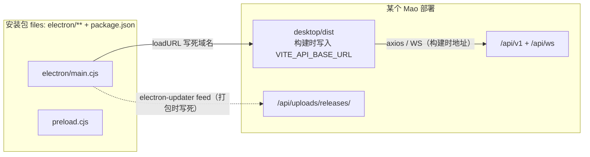
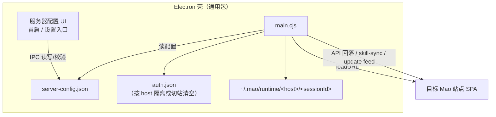

# 桌面客户端多服务器 baseUrl 可配置方案

> 状态：已实现（0.0.164）；实现以本文件为范围说明，行为细节见 `skills/mao-cli/reference/electron.md`  
> 关联代码：`desktop/electron/serverConfig.cjs`、`desktop/electron/main.cjs`、`desktop/electron/server-picker/`、`desktop/src/views/settings/ServerSettingsView.vue`  
> 参考先例：`mao-agent` / `mao-cli` 的 `--base-url` / `MAO_BASE_URL`

## 1. 背景与目标

### 1.1 现状痛点

当前桌面客户端**按部署环境打包**：安装包在构建时绑定固定 Mao 站点（生产为 `https://mao.etarch.cn`）。若私有化部署了多套 Mao，每套都要单独改配置、单独 `npm run dist`，维护成本随实例数线性上升。

### 1.2 目标

交付**一个通用桌面安装包**，用户在客户端内可配置 / 切换服务器 `baseUrl`（站点根地址），连接不同 Mao 实例，无需为每套系统单独打包。

### 1.3 非目标（本期明确不做）

| 不做 | 原因 |
|------|------|
| 同一客户端**并行**登录多套服务器（多 Profile 同时在线） | auth / 会话 / LOCAL runtime 全维度隔离成本高，作二期 |
| 把 Vue 前端打进安装包并做全量 runtime API 配置 | 与现有「远程 SPA」架构偏离；每套 Mao 本就应部署自己的 `desktop/dist` |
| 管理后台、安卓商店上架、后端协议改造 | 与本需求无关 |
| 通用包自动更新所有私有实例的**业务前端** | 业务前端随各站 Nginx 部署刷新，与壳更新解耦（现有模型） |

## 2. 现状代码结论

### 2.1 生产架构：远程壳

生产 Electron **不打包前端**，只加载远程 SPA：



因此：**只要壳 `loadURL` 指到 A 站，且 A 站已用本域构建并部署了 `desktop/dist`，API/WS 就自动是 A 站的。**  
通用壳只需负责「连哪一站」，不必先重写前端 env。

### 2.2 硬编码与配置落点

| 位置 | 现状 | 改造角色 |
|------|------|----------|
| `desktop/electron/main.cjs:972` | `loadURL('https://mao.etarch.cn')` | **主改造点**：改为读用户配置 |
| `desktop/electron/main.cjs:658-663` | `getApiBaseUrl()` 回落 `https://mao.etarch.cn/api` | 按配置站点推导 `${origin}/api` |
| `desktop/electron/main.cjs:551-567` | 更新源优先读 `MAO_DESKTOP_UPDATE_URL`，否则用打包时 `publish.url` | 更新源策略：跟随站点或中心源 |
| `desktop/electron/main.cjs:1049-1050` | `userData/auth.json` 全局一份 | 切站清态 / 按 host 隔离 |
| `desktop/electron/main.cjs:666-675` | LOCAL 运行时 `~/.mao/runtime/<sessionId>` | 按 host 命名空间隔离 |
| `desktop/.env.production` | `VITE_API_BASE_URL=https://mao.etarch.cn/api/v1` | **保留**：各私有部署构建自己的 dist 时写入本域 |
| `desktop/package.json` `build.publish[0].url` | 更新地址打包时写死 | 通用包默认值；运行时可 override |
| `desktop/src/api/index.ts:17,36` 等 | 读 `import.meta.env.VITE_API_BASE_URL` | 远程 SPA 模式下**无需**为多服务器改 |
| `android/capacitor.config.json` | `server.url` 写死 | 同构问题，二期可选 |

### 2.3 认证与本地执行链路（切换时必须处理）

- 渲染进程 token：`desktop/src/utils/auth-storage.ts` — Electron 下主进程写 `userData/auth.json`，并镜像 localStorage。
- 主进程读 token：`readAuthStore()` / LOCAL shell 注入 `MAO_TOKEN`（`refreshMaoTokenInShellSession`）。
- Skill 同步：渲染进程传 `apiBase`，主进程 `resolveSkillSyncBaseUrl` 在缺失时回落 `getApiBaseUrl()`。
- 飞书登录：`open-feishu-auth-window` 打开渲染层传入的 `authUrl`，回调 path 可配，**站点相关 URL 由远端 SPA 提供**，壳一般不用改。

## 3. 方案选型

| 方案 | 结论 | 说明 |
|------|------|------|
| **A. 壳层可配置站点根地址 + 远程 SPA** | **采用** | 与现有架构一致；改动集中在 Electron 主进程与配置入口 |
| B. 前端打进包 + 运行时 API/WS 全配置 | 不采用（备选） | 需改打包与全部 `VITE_*` 调用点；仅当目标环境无法部署 Web 时再考虑 |
| C. 每套系统仍单独打包 | 现状 | 被本方案替代 |
| D. 多 Profile 并行多站 | 二期 | 在 A 稳定后再做 |

**方案 A 前提（部署侧，已基本满足）**：每套 Mao 在自身域名下构建并部署 `desktop/dist`，且 `VITE_API_BASE_URL` 指向本域 `/api/v1`（见 `skills/mao-cli/reference/electron.md`、单域名 Nginx 约定）。

## 4. 目标行为

### 4.1 用户可见

1. **首次启动**：未配置服务器 → 展示服务器配置入口（本地页或原生对话框），用户填写站点地址并校验。
2. **连接成功**：壳加载该站点 SPA；登录、会话、LOCAL 等与现在一致。
3. **切换服务器**：设置中修改地址 → 确认副作用（登出、本地缓存隔离）→ 清 token → 重载到新站。
4. **设置页展示**：当前服务器地址、壳版本；可编辑。
5. **错误态**：地址非法 / 站点不可达 / 不像 Mao → 明确提示，不静默回落旧站。

### 4.2 配置模型

存储路径（主进程，不入 git）：

```text
<userData>/server-config.json
```

建议结构：

```json
{
  "version": 1,
  "serverBaseUrl": "https://mao.example.com",
  "updateFeedMode": "follow-site",
  "updatedAt": "2026-03-01T12:00:00.000Z"
}
```

| 字段 | 说明 |
|------|------|
| `serverBaseUrl` | 站点根，无尾斜杠；仅 `https:`（内网可配置放宽 `http:` + 风险确认） |
| `updateFeedMode` | `follow-site` \| `package-default` \| `disabled`（见 §7） |
| `version` | 配置 schema 版本，便于后续迁移 |

**默认值策略（需产品确认，见 §12）**：

- 开源/示例：首次可预填 `https://mao.etarch.cn` 作为占位提示，但**允许用户改**；
- 纯私有分发：预填部署方域名，或首次强制填写。

### 4.3 URL 归一化

对齐 `mao-cli` / `mao-agent` 的「接受站点根 / `/api` / `/api/v1`」习惯：

1. `trim`，去首尾 `/`；
2. 补全协议：无协议时默认 `https://`；
3. 剥掉路径后缀：`/api/v1`、`/api` → 站点根；
4. 拒绝：非 http(s)、含用户信息（`user:pass@`）、非法 URL、空 host；
5. 存储与 `loadURL` 一律使用**站点根**。

推导（主进程）：

| 用途 | 推导 |
|------|------|
| 前端 SPA | `{serverBaseUrl}` |
| API 回落（skill-sync 等） | `{origin}/api` |
| 更新源 follow-site | `{origin}/api/uploads/releases/` |

### 4.4 站点探测（保存前）

保存配置前建议探测（超时约 5s）：

1. `GET {origin}/api/v1/health` 或项目已有公开探测接口（若无则退化探测）；
2. 退化探测：`GET {origin}/` 与/或 `GET {origin}/version.json`，检查响应像 Mao Web（标题/资源/version 字段）；
3. 失败提示区分：网络错误 / HTTP 错误 / 非 Mao 站点；
4. 探测失败**默认阻止保存**，可提供「仍要保存」二次确认（内网自签等场景）。

> 若后端暂无专用 health 接口，实现时可选：登录接口 OPTIONS/GET 不鉴权路径、`version.json`、管理端静态资源特征。**不要**探测需要鉴权的业务接口。

## 5. 架构与模块改动

### 5.1 目标架构



### 5.2 Electron 主进程（`desktop/electron/main.cjs`）

| 模块 | 改动 |
|------|------|
| 配置读写 | 新增 `server-config` 读写：`getServerConfig` / `setServerConfig` / `normalizeServerBaseUrl` |
| `loadMainContent()` | 开发：仍 `localhost:5201`；生产：`loadURL(serverBaseUrl)`；**无配置**则 `loadFile` 本地配置页或 `about:blank` + 配置窗口 |
| `getApiBaseUrl()` | 开发回落不变；生产 `{origin}/api`，`origin` 来自当前配置 |
| Skill sync | `resolveSkillSyncBaseUrl` 已优先用渲染层 `apiBase`；确认回落走新 `getApiBaseUrl()` |
| Auth | 切站时清空或切换 `auth.json`；读写可带 `serverHost` |
| LOCAL 路径 | `resolveLocalRuntimeDir` 等改为 `~/.mao/runtime/<serverHostKey>/<sessionId>` |
| 更新 | 按 `updateFeedMode` 在 `setupAutoUpdater` 时 `setFeedURL`（已有 env override 可复用逻辑） |
| 菜单/快捷入口 | 应用菜单增加「服务器设置…」（macOS/Windows 一致） |
| 热切换 | 保存新站点后：清 token → 关闭 MCP/终端等站点相关资源 → `reload` 或重建窗口 |

**兼容迁移**：

- 无 `server-config.json` 但存在旧默认行为：首次升级读包内默认域名写入配置（或提示确认）；
- 已有 `auth.json` 且升级后站点仍为默认域：保持登录态；
- 若默认域变化：提示重新登录。

### 5.3 Preload / IPC（`desktop/electron/preload.cjs` + `types/electron.d.ts`）

新增桥（命名可微调）：

```ts
serverConfig: {
  get(): Promise<{ serverBaseUrl: string; updateFeedMode: string; hasCustomServer: boolean }>
  set(payload: { serverBaseUrl: string; updateFeedMode?: string }): Promise<{ ok: true; serverBaseUrl: string } | { ok: false; error: string }>
  probe(baseUrl: string): Promise<{ ok: boolean; error?: string; detail?: string }>
}
```

约束：`contextIsolation: true`、`sandbox: true` 保持不变；配置与探测**只在主进程**做网络请求。

### 5.4 本地服务器配置页（无登录态时）

两种实现，推荐 **(1)**：

1. **本地静态页（推荐）**  
   - `desktop/electron/server-picker/index.html`（极简原生 HTML/JS，不依赖 Vue 构建）；  
   - 主进程 `loadFile`；  
   - 仅表单 + 探测结果 + 保存；保存成功后 `loadURL` 目标站。  
   - 优点：首启零依赖、不会误连旧站、也不依赖远端 SPA 是否部署成功。

2. 原生 `BrowserWindow` + `dialog` / 简易输入框  
   - 实现更快，但校验与多语言体验一般。

**不做**：依赖远端 Mao 的设置页完成「第一次填服务器」（鸡生蛋问题）。

### 5.5 渲染进程（远端 SPA 内「服务器设置」）

远端前端已部署在**当前站**，适合做「查看/修改当前服务器」：

| 改动 | 说明 |
|------|------|
| 设置入口 | `SettingsView.vue` 侧栏增加「服务器」；仅 `isElectronClient()` 时显示 |
| 读展示 | `electronAPI.serverConfig.get()` |
| 修改 | 确认弹窗（将登出并切换）→ `set` → 主进程清态并 reload |
| Web / 安卓 | 无 `electronAPI.serverConfig` 则不显示或只读展示 `location.origin` |

注意：该设置页来自 A 站前端，改配置指向 B 站后由**壳**执行切换；B 站自己的前端版本可以不同，可接受。

若希望**未登录**也能改服务器：统一走壳菜单 / 首启配置页，不依赖远端设置页。

### 5.6 共用前端 `VITE_*` 调用点

方案 A 下**不要求**改造下列文件（远程 SPA 由各站构建注入本域地址）：

- `desktop/src/api/index.ts`
- `desktop/src/composables/useStreamWS.ts`
- `desktop/src/composables/useTerminalWS.ts`
- `desktop/src/utils/avatar.ts`
- `desktop/src/composables/workspace-file-provider.ts`
- `desktop/src/composables/useVersionCheck.ts`（`version.json` 已相对 `window.location`）

**建议保留**（兼容未来方案 B / 开发体验）：后续若做 runtime config，可抽 `src/utils/server-origin.ts` 统一解析；本期不强制。

## 6. 切换服务器时的数据隔离（关键）

### 6.1 必须处理

| 数据 | 现状 | 策略（MVP） | 策略（进阶） |
|------|------|-------------|--------------|
| JWT / refresh | `userData/auth.json` + localStorage | **切站必清** | `auth.<hostHash>.json` 按站隔离 |
| Pinia 会话/Agent 等 | 远端 SPA 内存 + 该站 API | reload 后自然重新拉取 | — |
| LOCAL runtime | `~/.mao/runtime/<sessionId>` | 路径加 host 命名空间 | 清理策略/设置页提供「清理本机缓存」 |
| MCP stdio 子进程 | 主进程按 sessionId Map | 切站前 `closeMcpSession` 全关 | — |
| node-pty 终端 | terminalManager | 切站前 kill | — |
| 主题等 UI 偏好 | localStorage | 可跨站保留 | — |
| `app_version` 基线 | localStorage | 切站后重置，避免误报更新 | 按 host 存 |

### 6.2 LOCAL 目录命名空间

```text
现状：~/.mao/runtime/<sessionId>
目标：~/.mao/runtime/<serverHostKey>/<sessionId>
```

`serverHostKey` 建议：`hostname` 或 `hostname_port`（非法路径字符替换），例如 `mao.example.com`、`10.0.0.8_9080`。

影响函数（`main.cjs`）：`resolveLocalRuntimeDir`、`resolveLocalSkillsDir`、`resolveLocalShellOutputDir`、`formatLocalRuntimePath`、`isUnderLocalRuntime` 等。

**迁移**：旧路径数据可保留；新会话一律写新路径。不必自动搬迁（避免跨站误用）。

### 6.3 Token 策略选择

| 策略 | 优点 | 缺点 |
|------|------|------|
| **MVP：切站清空** | 实现简单、无串站风险 | 回 A 站需重新登录 |
| 进阶：按 host 分文件 | 切回免登录 | 文件管理与「退出登录」语义要更清晰 |

MVP 建议「切站清空」；若私有化用户强诉求免重复登录，二期做按 host 持久化。

## 7. 自动更新策略

`package.json` 现状：

```json
"publish": [{ "provider": "generic", "url": "https://mao.etarch.cn/api/uploads/releases/" }]
```

主进程已支持 `MAO_DESKTOP_UPDATE_URL` override（`getUpdateFeedUrlOverride` + `autoUpdater.setFeedURL`）。

| `updateFeedMode` | 行为 | 适用 |
|------------------|------|------|
| `follow-site` | feed = `{origin}/api/uploads/releases/` | 每套 Mao 自行托管壳安装包 |
| `package-default` | 使用打包时 publish.url 或 env | 中心分发壳更新，私有站不更新壳 |
| `disabled` | 不调用 checkForUpdates | 强隔离内网 |

**推荐默认**：`follow-site`（与「服务器可配置」语义一致）；中心团队若只维护一份壳安装包，可出厂默认 `package-default`。

注意：

- 各站需具备 releases 目录与 `latest*.yml`，否则 follow-site 会更新失败（应静默降级 + 设置页可见，而不是每次启动弹错）；
- 业务前端更新仍走各站部署 + `version.json` 提示，**不依赖**壳 feed。

## 8. 安全与协议约束

1. 默认仅允许 `https:`；`http:` 需显式开关或二次确认（内网 IP）。
2. 禁止 `file:`, `javascript:`, `data:` 等。
3. `loadURL` 只接受归一化后的 http(s) 站点根。
4. 探测请求由主进程发起，避免渲染层跨域与 SSRF 争议面扩大；探测目标仅用户输入的 http(s) URL。
5. 切站清 token，防止 JWT 泄露到错误实例。
6. 保持 `contextIsolation` / `sandbox`，preload 只暴露最小 serverConfig API。
7. 外链 `open-external` 协议白名单已存在，不放宽。

## 9. 改造文件清单（实现级）

| 文件 | 动作 |
|------|------|
| `desktop/electron/main.cjs` | 配置存储、归一化、loadURL、getApiBaseUrl、auth/runtime 隔离、更新 feed、切站流程、菜单入口 |
| `desktop/electron/preload.cjs` | 暴露 `serverConfig.get/set/probe` |
| `desktop/electron/server-picker/index.html`（新增） | 首启/无配置时的本地配置页 |
| `desktop/src/types/electron.d.ts` | `ElectronAPI.serverConfig` 类型 |
| `desktop/src/views/settings/SettingsView.vue` | 增加「服务器」导航项 |
| `desktop/src/views/settings/ServerSettingsView.vue`（新增） | 当前服务器展示/修改/说明 |
| `desktop/src/utils/auth-storage.ts` | 若 IPC 语义变化则同步；切站主进程清态后前端 reload 即可 |
| 测试：`desktop/electron/*.test.cjs`、`desktop/src/**/*.test.ts` | 见 §10 |
| 文档：`skills/mao-cli/reference/electron.md`、`desktop/README.md`、`CHANGELOG.md` | 见 §11 |
| **不改**（方案 A） | `desktop/.env.production` 业务含义；各站部署时仍按本域构建 dist |
| **可选二期** | `android/capacitor.config.json` / 启动读配置；多 Profile；runtime API 配置模块 |

## 10. 测试计划

### 10.1 单测 / 组件测

- URL 归一化：站点根、`/api`、`/api/v1`、尾斜杠、缺协议、非法协议、带 path/query。
- `server-config` 读写：默认值、非法 JSON、字段校验。
- LOCAL 路径：不同 host 不产生相同 runtime 目录；旧路径兼容只读。
- auth 切站：set 不同 baseUrl 后 `auth.json` 清空或切换。
- `getApiBaseUrl`：配置 `https://mao.example.com` → `https://mao.example.com/api`。

### 10.2 手工 / E2E 场景

| # | 场景 | 期望 |
|---|------|------|
| 1 | 全新安装、无配置 | 出现服务器配置页，未加载任何 Mao 业务页 |
| 2 | 填入合法私有站 | 探测通过 → 加载该站 SPA → 可登录 |
| 3 | 填入错误域名 | 明确错误，可重试，不写坏配置或可回退 |
| 4 | 切换 A→B | 登出态、加载 B；A 的 token 不可用 |
| 5 | LOCAL 会话在 A/B | runtime 目录 host 隔离，无文件串用 |
| 6 | skill-sync | 指向当前站 API，而非旧默认域 |
| 7 | 更新 feed follow-site | 设置页可见当前 feed；站无 releases 时不崩溃 |
| 8 | Web 浏览器打开同一前端 | 无服务器设置项或只读，行为与现在一致 |
| 9 | 开发 `dev:electron` | 仍连 vite :5201 与本地 API，不被生产配置打断 |

### 10.3 回归

- 现有 Electron LOCAL 工具审批、终端、Git、飞书登录窗口。
- `cd desktop && npm run test:unit`。
- CI：`desktop` build；不强制 Playwright 覆盖本功能（壳逻辑以 Node 测试为主）。

## 11. 文档与发版

按仓库 `AGENTS.md` 规则同步：

| 文档 | 内容 |
|------|------|
| `CHANGELOG.md` | 顶部新版本：`### desktop/electron`（可配置服务器地址）；若设置页 UI 变更记 `### 前端（桌面 / Web / 安卓）` |
| `skills/mao-cli/reference/electron.md` | 「多服务器 / 通用安装包」小节：配置入口、归一化规则、更新策略、私有部署前提 |
| `desktop/README.md` | 打包说明补充：通用包 vs 写死域名；`MAO_DESKTOP_UPDATE_URL` 与 `updateFeedMode` |
| `skills/mao-cli/reference/deploy.md`（若涉及） | 各实例需部署本域 `desktop/dist` 的强调说明 |
| 本文 `docs/plan/` | 实现后可将状态改为「已实现」并链 CHANGELOG 版本号 |

`desktop/package.json` 版本用 `sync-desktop`，勿手改。

## 12. 产品待确认项

| # | 问题 | 建议默认 |
|---|------|----------|
| 1 | 通用包首次默认域名？ | 提示占位 `mao.etarch.cn`，可改；私有分发可出厂预置 |
| 2 | 切站后是否必须重新登录？ | MVP 必须；二期按 host 记住 |
| 3 | 更新源默认策略？ | `follow-site`；中心团队可改为 `package-default` |
| 4 | 是否允许 `http://` 内网？ | 允许，二次确认 |
| 5 | 首启 UI 形态？ | 本地 HTML 配置页 + 菜单入口 |
| 6 | 安卓是否同期？ | 不同期；方案与 IPC 模型可复用，单独立项 |
| 7 | 多 Profile 并行？ | 不做；记入二期 |

## 13. 实施阶段建议

| 阶段 | 交付 | 验收 |
|------|------|------|
| **P1 配置与加载** | `server-config`、归一化、首启配置页、生产 `loadURL`、`getApiBaseUrl` | 一个包装两套站可分别登录使用 |
| **P2 切站隔离** | 清 auth、关 MCP/终端、LOCAL 目录 host 命名空间 | 切站无串 token / 无串工作区 |
| **P3 设置与更新** | 远端设置页 + 菜单入口、`updateFeedMode` | 设置内可改站；更新失败可降级 |
| **P4 文档与测试** | CHANGELOG、mao-cli 文档、单测与手工清单 | 文档与行为一致 |
| **二期（可选）** | 多 Profile、安卓壳可配置、按 host 记住登录 | 另出方案 |

## 14. 风险与缓解

| 风险 | 影响 | 缓解 |
|------|------|------|
| 私有站未正确构建/部署 `desktop/dist`（`VITE_API_BASE_URL` 仍指向别的域） | 壳已连 A 站，但前端 API 打到 B 站 | 部署文档强调本域构建；探测阶段可选校验 `version.json`/静态资源同源 |
| 各站前端版本不一致 | UI/能力差异 | 接受；壳与 SPA 版本解耦已是现状 |
| 切站残留 LOCAL/MCP | 串数据、僵尸进程 | 切站流程强制清理（§6） |
| follow-site 更新源缺失 | 更新报错打扰 | 失败降级、设置页可见、可选 disabled |
| 用户填钓鱼站 | token/数据风险 | HTTPS、探测提示、不自动发送 token 到未确认新站（先探测再 load，切站先清 token） |
| 首启配置页与远端设置页双入口不一致 | 用户困惑 | 文档写清：改服务器优先壳菜单/首启页；设置页为 Electron 专用增强 |

## 15. 结论

采用 **「Electron 壳层可配置站点根地址 + 远程 SPA」**：

1. 与现有生产架构一致，避免前端全量 runtime 配置化；
2. 通用安装包的核心是替换 `loadURL` / API 回落 / 更新源，并做好**切站隔离**；
3. 每套 Mao 仍需在本域部署正确构建的 `desktop/dist`（构建时注入本域 `VITE_API_BASE_URL`）；
4. MVP 范围清晰：单连接可切换，不做多 Profile 并行。

实现前请先确认 §12 产品待确认项中的默认策略。
