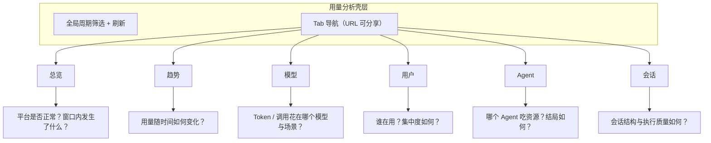

# 管理后台用量分析多 Tab 重构设计方案

> 范围：`admin/` 用量分析首页（`/analytics`）+ `backend-ts` 管理端分析接口。
> 目标：把「一页塞满所有分析」重构为**按维度分 Tab、按需取数**的生产级分析工作台。
> 状态：设计方案。Phase 1（壳层 + 6 Tab + 分维度接口 + 懒加载）已实现；Phase 2（`llm_call` 质量维度）待做。相关实现入口：`admin/src/views/analytics/AnalyticsView.vue`、`backend-ts/src/admin/admin-analytics.service.ts`、`backend-ts/src/admin/admin.routes.ts`。

---

## 1. 背景与问题

管理后台登录后默认落在用量分析页（`admin/src/router/index.ts` → `/analytics`）。当前页面在单次请求 `GET /admin/analytics/summary` 中一次性返回总量、趋势、分布、排行与模型明细，前端在同一视图堆叠：

- 4 张 KPI 卡（含 sparkline）
- 会话/消息双轴趋势、Token 趋势
- 会话结局环图、模型 Token 占比环图
- Agent Token 排行、用户活跃排行
- 模型用量明细表

这带来三类生产问题：

| 问题 | 表现 | 根因 |
|------|------|------|
| 信息过载 | 图表模块过多，扫一眼不知道先看什么 | 总量 / 趋势 / 分布 / 排行混排，无阅读路径 |
| 维度不全 | 会话类型、调用质量、场景、缓存、延迟等几乎不可见 | 接口与页面只覆盖「数量 + token 粗聚合」，未消费 `llm_call` 等细流水 |
| 加载慢 | 切周期整页 loading，message JOIN 聚合拖慢首屏 | 单接口串起全部查询；前端一次渲染全部 ECharts |

**核心目标**：

1. 按分析维度拆 Tab，每个 Tab 回答一类问题，图表归类展示。
2. 打通系统已有但未分析的数据维度（尤其是 `llm_call` 流水）。
3. 接口与前端按 Tab 懒加载，缩短首屏与切换成本。
4. 保持管理后台现有视觉语言（Mao tokens + Element Plus），不引入新设计体系。

**非目标**：

- 不做 BI 报表平台 / 自定义拖拽看板。
- 不在分析页内嵌完整管理列表（明细管理仍走用户 / 模型 / Agent / 会话 / 调用流水页）。
- 本期不做计费账单与成本折算（字段可预留，见 §10）。

---

## 2. 设计身份与原则

**Identity**：Product UI Designer × Data-Viz Designer——高频管理控制台的信息层级 + 编码正确的数据可视化。

管理员 90% 的时间状态是：**登录后快速判断「平台是否正常、资源花在哪、有没有异常」**，而不是欣赏图表集合。设计必须服务这个状态。

### 2.1 原则（冲突时按序优先）

1. **问题优先于图表**：每个 Tab / 面板先写清它回答的问题，再决定是否上图；回答不了的问题不硬画。
2. **一屏一焦点**：每个 Tab 只有 1 个主视觉（主图或主表），其余为支撑模块。
3. **精确数字可下钻**：图表给结构与趋势，表格给可核对的精确值，并可跳转管理页。
4. **按需取数**：只加载当前 Tab + 当前周期所需数据；切换周期只重拉已访问模块。
5. **沿用现有设计系统**：色板、字号、间距、阶段色语义与现网一致，降低实现与认知成本。

### 2.2 明确拒绝

- 单页并排 8+ 张同权重图表。
- 与管理列表重复的「半吊子明细」（分析页给 Top 与结构，完整列表去管理页）。
- 无单位、无口径、无时间窗的「孤岛大数字」。
- 双轴强行把会话数与消息数画在同一图里（改为小多图或指标切换，见 §5.2）。
- 环图超过 5 个有效切片（长尾合并「其他」，优先条形图）。

---

## 3. 数据维度盘点

### 3.1 系统内可分析数据源

| 数据源 | 关键字段 | 现用量页 | 本方案用法 |
|--------|----------|----------|------------|
| `session` | `user_id` `agent_id` `model_id` `phase` `status` `execution_mode` `session_type` `parent_session_id` `created_at` | 阶段分布、日趋势 | 会话结构、执行模式、类型拆分、失败率 |
| `message` | `session_id` `role` `token_count` `model_id` `created_at` `source_session_id` | 消息/token 趋势、分维聚合 | 对话 token、消息角色结构、会话深度（二期） |
| `llm_usage` | `user_id` `session_id` `model_id` `scene` `prompt/completion/total_tokens` `success` | 后台 token 合计 | 后台场景拆分（与 llm_call 对照） |
| `llm_call` | `user/agent/model` `scene` `stream` `effort` `protocol` `prompt/completion/cached_tokens` `success` `error_message` `first_token_ms` `duration_ms` `retry_count` `created_at` | **几乎未用**（仅独立「调用流水」页） | 模型质量、场景分布、缓存命中、延迟、失败原因——本方案最大增量 |
| `subagent_execution` | `parent/child_session_id` `status` `total_rounds` `total_prompt/completion_tokens` | 未用 | Agent Tab：子智能体执行与消耗（二期可上） |
| `agent` / `user` / `llm_model` | 名称、供应商、默认模型、状态、最后登录 | 仅用于拼名 | 排行标注、状态过滤、钻取目标 |
| `department` | 部门与用户关系 | 未用 | 可选：用户 Tab 部门汇总（三期） |

### 3.2 场景枚举（`llm_call.scene`）

与 `backend-ts/src/usage/llm-call-context.ts`、`admin/src/utils/llmCallLabels.ts` 对齐：

| 值 | 含义 | 分析意义 |
|----|------|----------|
| `agent` | 对话主路径 | 核心业务消耗 |
| `compaction` | 上下文压缩 | 长会话成本与策略效果 |
| `session_title` | 会话标题生成 | 辅助消耗占比 |
| `git_commit_message` | Git 提交信息 | 工具链辅助消耗 |
| `danger_assess` | 危险评估 | 安全链路开销与失败 |
| `voice_synthesis` | 语音合成 | 多媒体链路 |
| `feishu_summarize` | 飞书摘要 | 集成链路 |
| `connectivity_test` | 连通性测试 | 模型配置自检，分析时默认可排除 |
| `unknown` | 未知 | 需要可观测性补齐 |

### 3.3 口径约定（全 Tab 统一）

- **时间窗**：半开区间 `[startAt, endAtExclusive)`，上海时区日界；沿用现有 `days` + `endOffset`（今日 / 昨日 / 近 N 天，N≤90）。
- **Token 总量**：`totalTokens = 对话 message.token_count + llm_call.total_tokens（或 llm_usage）`；实现阶段以 **`llm_call` 为权威流水**，`message.token_count` 作会话侧交叉校验，避免双计。迁移期响应中同时给出 `chatTokens` / `callTokens` 与口径说明。
- **会话结局**：窗口内 **创建** 的会话按 `phase` 分布；实时运行态单独展示，不与窗口分布混算（延续现有 `overview` vs `period` 区分）。
- **活跃用户**：窗口内创建会话 **或** 发消息的去重 `user_id`。
- **成功 / 失败**：会话看 `phase ∈ {COMPLETED, FAILED}`；调用看 `llm_call.success`。
- **缓存命中率**：`sum(cached_tokens) / sum(prompt_tokens)`，`prompt_tokens=0` 时不展示。
- **百分比**：展示保留 1 位小数；排序与图表用原始值。

---

## 4. 信息架构：6 Tab 方案

按「管理员要回答的问题」归类，而不是按图表类型归类。



| Tab | 路由 query | 主问题 | 主数据源 | 主视觉 |
|-----|------------|--------|----------|--------|
| 总览 | `tab=overview` | 平台健康吗？窗口内关键变化？ | 轻量 overview + periodTotals | 指标条 + 运行态 + Top 洞察 |
| 趋势 | `tab=trends` | 用量怎么变？ | 日聚合 session/message/llm_call | 趋势小多图 |
| 模型 | `tab=models` | 资源花在哪个模型？表现如何？ | llm_call + message + llm_model | 模型排行条 + 明细表 |
| 用户 | `tab=users` | 谁在用？是否过度集中？ | session/message/llm_call × user | 活跃趋势 + 排行表 |
| Agent | `tab=agents` | 哪个 Agent 消耗大、失败多？ | session/message/llm_call × agent | 排行条 + 明细表 |
| 会话 | `tab=sessions` | 结构、结局、调用质量？ | session + llm_call | 结局分布 + 质量面板 |

**为什么是 6 个而不是 7+：**

- 「用户 / 模型 / Agent / 会话」是业务方点名的维度，必须一维一 Tab。
- 「趋势」跨维度，单独成 Tab，避免每个维度都重复画时间序列。
- 「总览」是默认态与健康检查，必须轻。
- 调用质量（延迟、失败、缓存）**不单开 Tab**：它服务「模型是否可用」与「会话是否失败」，分别并入「模型」「会话」，避免 Tab 膨胀。

**默认 Tab**：`overview`。侧边菜单与系统 TabBar 仍指向 `/analytics`，内部子 Tab 用 query，不占用管理后台页签标题（标题保持「用量分析」）。

---

## 5. 各 Tab 详细设计

### 5.0 壳层（所有 Tab 共用）

```
┌──────────────────────────────────────────────────────────┐
│ 用量分析    2026-07-12 ~ 2026-07-18（7 天）· 环比 07-05…  │
│             [今日|昨日|3天|7天|30天|90天]  ⟳              │
├──────────────────────────────────────────────────────────┤
│ 总览 | 趋势 | 模型 | 用户 | Agent | 会话                  │
├──────────────────────────────────────────────────────────┤
│                    当前 Tab 内容区                        │
└──────────────────────────────────────────────────────────┘
```

- 周期筛选**全局唯一**，切换后：刷新当前 Tab；已访问 Tab 标记为 dirty，下次进入时重拉。
- 工具栏固定展示解析后的时间窗与环比窗，避免用户误解「今日」口径。
- 刷新按钮只刷新当前 Tab（不再隐式全量刷）。
- URL：`/analytics?tab=models&days=7`；`today` / `yesterday` 映射为 `period=today|yesterday` 或继续用现有 `days=1&endOffset=0|1`，实现时与路由 keepAlive 兼容即可，推荐显式 `period` 可读参数。

**空态**（各 Tab 统一）：说明「当前时间窗内没有数据」+ 可能原因（周期太短 / 尚无用户使用 / 过滤过严）+ 主操作「放宽到近 7 天」。禁止只写「暂无数据」。

### 5.1 总览 `overview`

**问题**：打开后台，30 秒内知道平台是否正常。

| 模块 | 内容 | 交互 |
|------|------|------|
| 指标条（1 行） | 主指标：Token 消耗（窗口值 + 环比）；次指标：新增会话、消息数、活跃用户、会话失败率 | 次指标点击跳对应 Tab |
| 运行态快照 | 实时 phase：RUNNING / WAITING_APPROVAL / FAILED / CANCELLED | FAILED 点击 → `/sessions?phase=FAILED` |
| 环比摘要 | 相对上一周期：会话 / 消息 / Token / 活跃用户 变化一句话 | 仅展示，不做成 4 张浮动大卡 |
| Top 洞察（≤3 条） | 规则化生成，例如「Token Top1 模型占 xx%」「失败会话集中在 Agent X」 | 点击跳对应 Tab 并预置排序 |

**刻意不做**：总览不再放双轴趋势大图、不再放完整排行与模型表——那些属于后续 Tab。总览可以放 **1 条** 精简 sparkline 走势（Token），避免首屏图表轰炸。

**KPI 呈现约束**（对照 anti-slop D1）：

- 主指标字号约 28–32px，其余为紧凑数字列表（label + value + delta）。
- 同一浅色表面内完成，避免 4–6 张带阴影的独立小卡漂浮在画布上。
- 环比色沿用现网约定：**红=变差、绿=变好**（与 token/失败率 inverse 语义一致），并在 hint 中写明。

### 5.2 趋势 `trends`

**问题**：时间维度上，用量与结构如何变化。

**指标切换组**（单选，图随选变，避免同屏多张重复时间轴）：

| 视图 | 系列 | 图型 |
|------|------|------|
| 流量 | 会话数、消息数（**分两张小图**，不用双 y 轴） | 双 Line 小多图 |
| Token | 对话 Token / 调用 Token（堆叠柱） | Stacked Bar |
| 调用 | 调用次数、失败次数 | Bar + 折线或双小图 |
| 质量 | 成功率、缓存命中率 | Line（百分比轴） |

- 周期 ≤30 天：全量展示；>30 天：默认 zoom 到最近 30 天，保留 slider（沿用现逻辑）。
- Tooltip 显示绝对值 + 与前一日差。
- 下方可选「按日明细表」折叠区，便于复制数字。

**相对现状的改动**：现有「会话与消息双轴图」拆为小多图——双 y 轴不同单位易误读（Data-Viz refuse）。Token 堆叠图保留，但数据源逐步对齐 `llm_call`。

### 5.3 模型 `models`

**问题**：消耗与调用质量落在哪个模型 / 供应商。

| 模块 | 内容 |
|------|------|
| 主图 | 模型 Token 占比横向条（Top 10 + 其他），条尾直接标数值，少用环图 |
| 明细表 | 模型、供应商、状态/默认标记、会话数、消息数、调用次数、对话 Token、调用 Token、合计、占比、成功率、缓存命中率、首 token 中位耗时、总耗时中位 |
| 场景分布 | 选定模型后的 scene Token 占比（默认合计；表行点击切换模型） |
| 协议 / effort | 堆叠条或筛选分布（openai-compatible / anthropic / openai-responses；effort 档位） |

**表交互**：列排序默认 `totalTokens desc`；行操作链接到 `/models` 与 `/llm-call?modelId=`。

**指标注意**：窗口内全零模型不返回（延续现有过滤）；`connectivity_test` 默认在分析聚合中排除，可在「含自检调用」开关中打开。

### 5.4 用户 `users`

**问题**：活跃度与资源集中度。

| 模块 | 内容 |
|------|------|
| 主图 | 活跃用户数日趋势（窗口内） |
| 支撑图 | Top 10 消息数 / Token 排行（指标可切换，条形图） |
| 明细表 | 用户、显示名、会话数、消息数、Token、调用次数、失败调用、最后登录；分页或「Top 50 + 展开」 |
| 集中度 | 文案摘要：「Top 5 用户占窗口 Token 的 xx%」；可选 Lorenz 说明（三期） |

**钻取**：用户行 → `/users`；会话量可选深链 `/sessions?userId=`。

**不做**：分析页不展示密码/权限等管理字段；部门维度三期再加，避免依赖未治理的组织数据。

### 5.5 Agent `agents`

**问题**：哪个 Agent 消耗大、结局差。

| 模块 | 内容 |
|------|------|
| 主图 | Agent Token 排行（Top 10） |
| 支撑 | 会话数排行 或「Token vs 失败率」散点（二期，避免一期过重） |
| 明细表 | Agent、会话数、消息数、Token、调用次数、成功率、完成/失败会话、平均消息数/会话 |
| 会话结局 | 选中 Agent 的 phase 占比条（水平堆叠） |

**钻取**：`/agents`；会话 `/sessions?agentId=`。

**二期**：子智能体（`subagent_execution`）— 平均轮次、子会话 token、失败率；仅在有数据时显示模块。

### 5.6 会话 `sessions`

**问题**：会话结构是否健康，失败与慢调用集中在哪。

| 模块 | 内容 |
|------|------|
| 结局分布 | 窗口内新建会话的 phase 占比（堆叠条优先于环图；阶段色沿用 `PHASE_COLORS`） |
| 结构拆分 | `session_type`：NORMAL / SUBAGENT / Side Task；`execution_mode`：CLOUD / LOCAL |
| 运行态 | 实时快照条（与总览一致，此处可更细） |
| 调用质量面板 | 窗口内 `llm_call`：成功率、失败次数、retry>0 占比、首 token p50/p95、duration p50/p95、缓存命中率 |
| 失败切片 Top | 按 `agent` / `model` / `scene` 的失败次数 Top5（切换） |
| 错误摘要 | 失败调用的 `error_message` 归一 Top（截断展示） |

**钻取**：`/sessions`、`/sessions?phase=FAILED`、`/llm-call?success=false`。

---

## 6. 视觉系统

沿用 `admin/src/style.css` 与图表色板，不在本方案另起品牌。

| Token | 值 | 用途 |
|-------|-----|------|
| `--mao-ink` | `#1d1d1f` | 主文字、关键数字 |
| `--mao-muted` | `#86868b` | 次级文字、坐标轴 |
| `--mao-canvas` | `#f5f5f7` | 页面底 |
| `--mao-surface` | `#ffffff` | 卡片/表面 |
| `--mao-border` | `#e0e0e0` | 分割线 |
| `--mao-accent` | `#0066cc` | 主强调、选中 Tab、主指标辅线 |

**图表色板**（`admin/src/utils/echarts.ts` `CHART_PALETTE`）：`#0066cc` `#34c759` `#ff9500` `#af52de` `#5ac8fa` `#ff3b30` `#ffcc00` `#5856d6` `#00c7be` `#a2845e`；「其他」固定 `#c7c7cc`。

**阶段色**（沿用 `chart-options.ts`）：IDLE `#8e8e93`，RUNNING `#0066cc`，RESUMING `#5ac8fa`，WAITING_APPROVAL `#ff9500`，COMPLETED `#34c759`，FAILED `#ff3b30`，CANCELLED `#c7c7cc`。

**排版与密度**：

- 页标题 15px/600；模块标题 14px/600；正文与表格 13–14px；hint 12px。
- 基础间距 8 的倍数：模块间距 16px；卡片内边距沿用 Element Plus。
- 主图高度 280–320px；排行图高度 `max(200, 行数*34+32)`。
- 数字：KPI 用紧凑格式（万/亿），表格用千分位完整值。

**布局栅格**：

- 桌面：主图 `md=14/16` + 支撑 `md=10/16`，或主图全宽 + 下方表格全宽。
- 重要性差：主图明显大于支撑图，避免「全部 12 列一半一半」的均质网格。
- ≤768px：单列；KPI 条 2 列；表格横向滚动或关键列 + 详情；Tab 可横向滚动。

**组件种子**：

- Tab：`el-tabs`，样式对齐 `ModelListView` / `SkillListView`（简洁横排，无重阴影）。
- 表面：`el-card`，默认 shadow 或 hover；同一视图内阴影层级一致。
- 图表：`BaseChart` + `chart-options.ts` 工厂；新图类型在 `utils/echarts.ts` 按需 `use()`。
- 按钮：每屏至多一个 primary（通常是「查看调用流水 / 打开管理页」的文字链优先）。

---

## 7. 后端 API 设计

### 7.1 拆分原则

- 按 **scope** 拆接口，前端只拉当前 Tab。
- 公共参数：`days`（1–90）、`endOffset`（0–365）；响应均带 `period`（起止与环比窗）。
- 鉴权：`requireAdmin`；沿用 `/v1/**` Result 包装（`code=0`）。
- 旧接口 `/admin/analytics/summary`：一期保留但标记废弃，内部可改为只服务 overview 所需子集；前端切换完成后删除或缩成 overview。

### 7.2 接口列表

| Method | Path | 用途 |
|--------|------|------|
| GET | `/api/v1/admin/analytics/overview` | 总览：运行态、periodTotals、previousTotals、Top 洞察输入 |
| GET | `/api/v1/admin/analytics/trends` | 日序列：sessions/messages/tokens/calls/success 等 |
| GET | `/api/v1/admin/analytics/models` | 模型聚合 + 可选 `scene` 拆分 |
| GET | `/api/v1/admin/analytics/users` | 用户活跃与消耗排行/明细 |
| GET | `/api/v1/admin/analytics/agents` | Agent 排行与结局 |
| GET | `/api/v1/admin/analytics/sessions` | 会话结构 + 调用质量摘要 |

**可选查询参数**（按 scope）：

- models：`scene`、`provider`、`excludeConnectivity=true|false`
- users / agents：`limit`（默认 20，最大 100）
- sessions：`includeLive=true|false`

### 7.3 响应形状（示意）

```json
{
  "code": 0,
  "data": {
    "period": {
      "days": 7,
      "start": "2026-07-12",
      "end": "2026-07-18",
      "previousStart": "2026-07-05",
      "previousEnd": "2026-07-11"
    },
    "metrics": {
      "sessions": 0,
      "messages": 0,
      "chatTokens": 0,
      "callTokens": 0,
      "totalTokens": 0,
      "callCount": 0,
      "activeUsers": 0,
      "completedSessions": 0,
      "failedSessions": 0,
      "previous": { "sessions": 0, "messages": 0, "totalTokens": 0, "activeUsers": 0 }
    }
  }
}
```

明细数组字段与第 5 章表格列一一对应；聚合接口 **不返回** message 正文。

### 7.4 服务层结构

```
backend-ts/src/admin/analytics/
  analytics.types.ts          # Range、DTO、scope 常量
  analytics.queries.ts        # 纯 SQL/Store：按维度查询
  analytics.overview.ts
  analytics.trends.ts
  analytics.models.ts
  analytics.users.ts
  analytics.agents.ts
  analytics.sessions.ts
  analytics.routes.ts         # 注册 6 个 GET
```

- 将现有 `admin-analytics.service.ts` 的巨型 `summary()` 拆为按 scope 的 service；公共 `buildRange` / `dayMap` / 排序工具抽到 `analytics.queries.ts` 或 `common`。
- Store 层补充 `llm_call` 聚合查询（按日、按 model/agent/user/scene），利用现有索引：
  - `idx_llm_call_created`
  - `idx_llm_call_user_created`
  - `idx_llm_call_model_created`
  - `idx_llm_call_scene_created`
  - 会话侧：`idx_user`、`idx_agent`、`idx_session_user_phase`
- 并行 `Promise.all` 仅在同一 scope 内部；**禁止**再跨 6 个 Tab 一把梭。

### 7.5 性能预算（目标）

| Scope | 90 天窗口 p95 | 说明 |
|-------|---------------|------|
| overview | ≤ 300ms | 计数与小聚合，无大 JOIN |
| trends | ≤ 800ms | 日聚合；优先 `llm_call` / 索引扫描 |
| models / users / agents | ≤ 1s | 聚合 + 字典拼名；limit 限制 |
| sessions | ≤ 1.2s | 结构 + 质量分位；分位用近似或预聚合 |

超标时优先：缩默认 limit → 排除 connectivity_test → 二期日汇总表，而不是在前端硬扛。

### 7.6 二期：日汇总表（可选）

当 message/llm_call 体量导致 90 天聚合不稳定时：

```sql
CREATE TABLE analytics_daily_metric (
  stat_date DATE NOT NULL,
  dimension VARCHAR(32) NOT NULL,   -- global|model|user|agent|scene
  dimension_id BIGINT NULL,
  sessions INT DEFAULT 0,
  messages INT DEFAULT 0,
  call_count INT DEFAULT 0,
  success_count INT DEFAULT 0,
  prompt_tokens BIGINT DEFAULT 0,
  completion_tokens BIGINT DEFAULT 0,
  cached_tokens BIGINT DEFAULT 0,
  total_tokens BIGINT DEFAULT 0,
  first_token_ms_sum BIGINT DEFAULT 0,
  duration_ms_sum BIGINT DEFAULT 0,
  PRIMARY KEY (stat_date, dimension, dimension_id)
);
```

- 写入：每日增量汇总任务 + 近 2 日补跑。
- 读：窗口 >30 天走汇总表，≤30 天可走明细以保证新鲜度。
- 一期**不建表**，先靠接口拆分与索引验证收益。

---

## 8. 前端架构

### 8.1 目录

```
admin/src/views/analytics/
  AnalyticsView.vue           # 壳：工具栏 + Tabs + router-view/query 切换
  tabs/
    OverviewTab.vue
    TrendsTab.vue
    ModelTab.vue
    UserTab.vue
    AgentTab.vue
    SessionTab.vue
  composables/
    useAnalyticsPeriod.ts     # period 状态、resolvePeriod、URL 同步
    useAnalyticsScope.ts      # 按 scope 请求、seq 防竞态、dirty 缓存
  chart-options.ts            # 图表 option 工厂（扩展）
  types.ts                    # 与后端 DTO 对齐的 TS 类型
```

### 8.2 加载与缓存策略

| 策略 | 行为 |
|------|------|
| 首屏 | 只挂载并请求 `overview` |
| Tab 切换 | 首次进入才请求对应 scope；已缓存且未 dirty 则直接展示 |
| 周期切换 | 更新 period → 当前 Tab 立即重拉 → 其他 Tab 标 dirty |
| 竞态 | 每个 scope 独立 `fetchSeq`，丢弃过期响应（沿用现逻辑思路） |
| keepAlive | 壳层路由 `keepAlive: true` 保留；Tab 组件对已访问实例 keepAlive，未访问不创建 ECharts |
| 错误 | 单 Tab 失败不拖垮整页；展示错误态 + 重试；拦截器提示照旧 |

### 8.3 与管理页的边界

| 能力 | 用量分析 | 管理列表页 |
|------|----------|------------|
| 结构与趋势 | 是 | 否 |
| Top N / 汇总 | 是 | 否 |
| 全量筛选排序导出 | 否（一期） | 是（用户/会话/调用流水等） |
| 单条编辑 | 否 | 是 |

分析页所有「查看全部」均路由到既有页面，并尽量带 query 预置筛选。

---

## 9. 实施路径

### Phase 1 — 壳与拆分（优先解决慢与乱）

1. 后端拆 6 个 scope 接口；overview 复用/收缩现有 summary 查询。
2. 前端落地壳层 + Tab 懒加载；把现有图表迁入对应 Tab（趋势/模型/用户/Agent/会话）。
3. URL 同步 `tab` + `period`；空态与错误态规范。
4. 废弃前端对巨型 summary 的依赖（接口暂留）。
5. 同步更新：`skills/mao-cli` 中涉及用量分析的说明（若有）；CHANGELOG「admin→管理后台」。

**验收**：首屏只请求 overview；切 Tab 不再触发全量聚合；管理端操作路径不回归。

### Phase 2 — 补齐维度（`llm_call` 一等公民）

1. models/sessions 聚合接入 `llm_call`：成功率、缓存、延迟、scene、effort/protocol。
2. 趋势增加调用次数/失败/命中率视图。
3. 模型明细表与会话质量面板上线；默认排除 `connectivity_test`。
4. 排行与表钻取链接补全。

**验收**：不打开「调用流水」也能回答「哪个模型慢/贵/易失败」。

### Phase 3 — 深化（按需）

1. `analytics_daily_metric` 汇总与任务。
2. 自定义日期范围（不限于预设 N 天）。
3. 用户部门维度；Agent 子智能体模块；Top 洞察规则增强。
4. 导出 CSV（当前 Tab 明细表）。

### 代码落点（一期）

| 位置 | 变更 |
|------|------|
| `backend-ts/src/admin/` | 拆 analytics service/routes；保留权限 |
| `backend-ts/src/admin/*.spec.ts` | 按 scope 补聚合单测（含空窗口、环比除零） |
| `admin/src/views/analytics/` | 壳 + tabs + composables |
| `admin/src/utils/echarts.ts` | 按需增加图表类型注册 |
| `admin/src/router/index.ts` | 路由仍 `/analytics`，meta 不变 |
| `docs/plan/admin-analytics-redesign-design.md` | 本文档 |
| 根 `CHANGELOG.md` | 管理后台可见改动 |

---

## 10. 验收标准

### 功能

- [ ] 6 个 Tab 均可独立加载，周期筛选全局生效。
- [ ] 总览在无业务数据时仍显示运行态与可操作空态。
- [ ] 模型 / 用户 / Agent 明细指标与管理页抽查一致（同窗口口径误差为 0 或仅舍入差）。
- [ ] 会话 Tab 能区分：窗口内 phase 分布 vs 实时 phase。
- [ ] 所有「查看全部」深链可落到正确列表与筛选。
- [ ] 非管理员访问 `/analytics` 行为与现网一致（软回退）。

### 性能

- [ ] 首屏网络请求不含 models/users/agents/sessions/trends 的重查询（仅 overview）。
- [ ] 90 天窗口下切 Tab 可交互时间明显优于现状（目标：单 Tab ≤1.5s 有数据或有加载态）。
- [ ] 连续快速切换 Tab / 周期无错位数据（seq 防护）。

### 质量

- [ ] 后端 `npm run build` + `npm test` 通过。
- [ ] admin `vue-tsc` 通过。
- [ ] 空数据、单点数据（仅今日）、环比分母为 0 均不报错、不显示误导百分比。
- [ ] CHANGELOG 与相关文档（如 mao-cli）同步。

---

## 11. 设计决策轨迹（Decision Trace）

```json
[
  {
    "decision": "按分析维度拆 6 Tab，而非按「总量/趋势/分布」拆",
    "reason": "管理员带着维度问题进入（谁在用、哪个模型、哪个 Agent），按维度组织匹配决策路径；按图表类型组织会把同一问题拆散",
    "alternatives": ["按图表类型分组", "单页长滚动分区", "可配置看板"],
    "tradeoff": "跨维度对比需要多点一次 Tab；用趋势 Tab 与总览 Top 洞察缓解"
  },
  {
    "decision": "调用质量不单开 Tab，并入「模型」「会话」",
    "reason": "延迟/失败/缓存服务的是模型选型与会话健康两类决策，独立成页会制造第七入口且重复上下文",
    "alternatives": ["独立「质量」Tab", "只放在调用流水页"],
    "tradeoff": "质量分析入口更深；流水页仍保留原始明细供排查"
  },
  {
    "decision": "接口按 scope 拆分 + 前端懒加载，一期不做日汇总表",
    "reason": "慢的主因是单接口巨聚合与全图同渲；拆分即可立刻减负，汇总表引入运维成本应等数据量证明必要",
    "alternatives": ["前端虚拟滚动硬扛旧接口", "一期直接上汇总表", "Redis 缓存 summary"],
    "tradeoff": "90 天窗口下部分 scope 仍可能偏慢，需靠 limit 与二期汇总兜底"
  },
  {
    "decision": "`llm_call` 作为 Token/质量权威数据源，message.token 作交叉校验",
    "reason": "流水含 scene/缓存/延迟/成功等维度，覆盖对话与后台调用；仅用 message 会永远看不到辅助链路",
    "alternatives": ["继续 message + llm_usage 双轨", "只统计 scene=agent"],
    "tradeoff": "迁移期口径说明成本高；历史数据若 llm_call 覆盖不全需在 UI 标注「流水起始日」"
  },
  {
    "decision": "总览压缩为指标条 + 运行态 + Top 洞察，移走多数图表",
    "reason": "默认页 90% 场景是健康检查；图表下放各 Tab 可降低首屏渲染与认知负荷",
    "alternatives": ["总览保留全部旧图表", "总览做成迷你全站仪表盘"],
    "tradeoff": "想看趋势的用户要多点一次「趋势」"
  },
  {
    "decision": "趋势取消会话/消息双 y 轴，改为小多图或指标切换",
    "reason": "两序列单位不同，双轴易造成斜率误读，不符合数据可视化编码纪律",
    "alternatives": ["保留双轴", "归一化指数后同轴"],
    "tradeoff": "同一屏对比两指标的视线移动成本略增"
  },
  {
    "decision": "视觉沿用 Mao tokens 与现有 CHART_PALETTE/阶段色",
    "reason": "用量分析处于既有管理后台信息架构内，另起视觉会分裂系统并增加实现成本",
    "alternatives": ["分析页专用深色数据主题", "引入第三方 BI 皮肤"],
    "tradeoff": "页面「惊艳度」有限，换稳定与可维护"
  },
  {
    "decision": "分析页不做全量列表能力，只做 Top + 深链",
    "reason": "会话/调用流水/用户等管理页已存在；重复实现筛选分页会双倍维护且口径漂移",
    "alternatives": ["分析页内嵌完整分页表", "合并管理页进分析 Tab"],
    "tradeoff": "深度排查需跳页；通过 query 预置筛选降低跳转成本"
  }
]
```

---

## 12. 风险与边界

| 风险 | 缓解 |
|------|------|
| `llm_call` 历史覆盖不全或与 message token 对不齐 | UI 标注流水起始时间；双口径字段并行展示一段时间；以流水为准的新口径写入 CHANGELOG |
| 90 天 + 多维聚合拖慢 MySQL | scope 拆分、默认 limit、排除 connectivity_test、二期汇总表 |
| 前端 Tab 状态与 keepAlive 导致脏数据 | period 全局单源 + dirty 标记；seq 丢弃过期响应 |
| 环比色（红坏绿好）与国际习惯相反 | 维持项目现网约定，在工具栏 hint 与本文档写明，避免后续「纠正」造成反复 |
| 管理员误把分析页当审计 | 文案区分「分析聚合」与「调用流水/审计日志」 |
| 安卓/移动后台可用性 | 沿用 ≤768px 单列与表格降级策略，不为移动端重做信息架构 |

---

## 13. 反模板自检（Anti-slop）

- **D1 顶部 KPI 卡墙**：总览改为「1 主指标 + 紧凑次指标条」，不为每个数字单独做浮卡。
- **D2 所有面板等宽**：Tab 内主图大于支撑模块；总览几乎没有图。
- **D3 空态只写无数据**：统一教学型空态 + 放宽周期主操作。
- **D4 全局筛选无指示**：壳层常驻显示解析后的时间窗与环比窗。
- **C2 双 y 轴**：趋势 Tab 明确取消。
- **C5 多切片饼图**：占比默认条形 + Top N/其他；环图最多用于 ≤4 类阶段或模型。

---

## 14. 附录：与现状模块映射

| 现状模块（AnalyticsView） | 去向 |
|---------------------------|------|
| KPI 卡 ×4 | 总览指标条（压缩） |
| 会话与消息趋势 | 趋势（拆双轴） |
| Token 消耗趋势 | 趋势 |
| 会话结局分布 | 会话（改为堆叠条优先） |
| 模型 Token 占比环图 | 模型（改为条形优先） |
| Agent Token 排行 | Agent |
| 用户活跃排行 | 用户 |
| 模型用量明细表 | 模型（扩展质量列） |
| （缺失）调用质量/场景/缓存 | 模型 + 会话（Phase 2） |
| （缺失）执行模式/会话类型 | 会话（Phase 1–2） |

---

## 15. 参考实现锚点

- 页面：`admin/src/views/analytics/AnalyticsView.vue`
- 图表：`admin/src/views/analytics/chart-options.ts`、`admin/src/utils/echarts.ts`
- 聚合：`backend-ts/src/admin/admin-analytics.service.ts`
- 路由：`backend-ts/src/admin/admin.routes.ts`
- 流水：`backend-ts/db/migration/V113__llm_call.sql`、`backend-ts/src/usage/llm-call.repository.ts`
- 场景文案：`admin/src/utils/llmCallLabels.ts`
- 设计 token：`admin/src/style.css`
