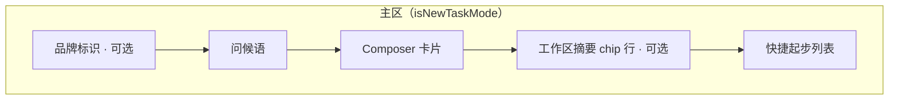

# 新建会话中心化 Composer 设计方案

> 状态：已实现（首版）  
> 日期：2026-08-16（设计） / 2026-09-16（实现）  
> 范围：desktop Web / Electron 新建会话 UI；不改后端 API、不改安卓壳交互逻辑  
> 参考：Codex 桌面客户端新建会话布局

---

## 1. 背景与问题

### 1.1 现状

新建会话（`isNewTaskMode`，路由无 `sessionId`）时，任务配置与输入框堆叠在主区**底部**：

```
┌──────────────────────────────────────────────────┐
│ 左：任务列表 │ 中：空状态（图标+一句文案） │ 右：检查器 │
│            │                                   │
│            │        我可以帮你做点什么？         │
│            │                                   │
│            │ ┌─ ChatInput（底部锚定）─────────┐  │
│            │ │ ▼ 选择智能体（卡片网格）        │  │
│            │ │ 云端/本地 · 工作区模式 · 路径   │  │
│            │ │ ─────────────────────────────  │  │
│            │ │ [编辑器 + 附件]                │  │
│            │ │ + 工作区  权限  模型   [发送]   │  │
│            │ └────────────────────────────────┘  │
└──────────────────────────────────────────────────┘
```

关键实现位置：

| 文件 | 职责 |
|------|------|
| `desktop/src/components/chat/ChatPanel.vue` | 空状态文案 + 底部挂载 `ChatInput` |
| `desktop/src/components/chat/ChatInput.vue` | 新任务配置栏（AgentSelector / 模式 / 工作区）+ 编辑器 + 工具条 |
| `desktop/src/components/task/AgentSelector.vue` | 智能体卡片网格（可折叠） |
| `desktop/src/views/task/TaskView.vue` | 新任务状态源（agentId / mode / workspace / model / draft） |
| `desktop/src/components/center/CenterTabContainer.vue` | 中心 Tab 容器，`chat` 时挂 `ChatPanel` |

### 1.2 问题

1. **视觉重心错位**：空状态只有一句灰字，真正的主操作（选 Agent + 输入任务）沉在底部，首屏中间大面积空白，用户第一眼找不到「从哪开始」。
2. **配置区过高**：`AgentSelector` 网格（最高 ~240px）+ 模式行 + 工作区控件 + 编辑器 + 工具条，新建会话时输入卡接近半屏，编辑区被挤到下方。
3. **信息层级扁平**：智能体、执行模式、工作区、权限、模型全部平铺，没有「主路径 / 高级配置」分层；Codex 类产品把「写什么」放在绝对中心，其余降为 chip / 一行控件。
4. **与成熟产品心智不一致**：用户熟悉 ChatGPT / Codex / Cursor 新建会话的「中心大输入框」模式，MAO 当前布局学习成本更高。

### 1.3 目标

- 新建会话时，**输入 Composer 垂直居中**（略偏视觉中心上方），成为页面绝对主角。
- 配置项按优先级收进 Composer 内的 **chip / 一行下拉**，默认不展开智能体网格。
- 空状态升级为「品牌标识 + 问候语 + Composer + 快捷起步」，对齐 Codex 气质，但用 MAO 自身设计 token。
- **已有会话布局不变**：会话进行中仍是底部 Composer + 消息流；仅 `isNewTaskMode` 切换中心态。

### 1.4 非目标

- 不改后端创建 session / 发送消息 API。
- 不改安卓 Capacitor 专属交互（安卓仍 CLOUD only，布局跟随 Web 响应式规则）。
- 不做全站导航/侧栏重构。
- 不引入语音输入、分支选择器等 Codex 有但 MAO 尚无的能力（可预留扩展位）。

---

## 2. 设计原则

| 原则 | 含义 |
|------|------|
| **中心即主任务** | 新建会话唯一必做动作是「描述任务」；Composer 居中并自动聚焦 |
| **渐进披露** | 智能体默认显示当前选中 chip；网格/列表仅在点击「更换」时展开 |
| **配置不打断** | 模式 / 工作区 / 权限 / 模型全部在 Composer 内完成，不跳转、不弹全屏向导 |
| **状态可见** | 当前 Agent、模式、工作区在工具条/下方 chip 始终可扫读，发送前可确认 |
| **两态分离** | `isNewTaskMode` 中心态；`sessionId` 存在时底部对话态。切换用轻量过渡，不复用错误布局 |

风格锚点：**Codex 桌面新建会话**（居中大 Composer + 下方工作区 chip + 推荐起步），视觉语言沿用 MAO 既有 `--aw-*` token（近似 Apple 系浅色产品页气质），不引入新色系。

---

## 3. 信息架构：谁进主路径

| 配置项 | Codex 对照 | MAO 处理 | 默认可见 |
|--------|-----------|----------|----------|
| 任务描述 | 大输入区 | Composer 正文，自动聚焦 | 是 |
| 附件 / 拖拽 | 预览行 | 保留现有 pending files | 有附件时 |
| 智能体 | （无，单 agent） | **一级 chip**：头像+名称；点开为面板（不是整块网格占位） | 是（选中态） |
| 执行模式 云端/本地 | （无） | 工具条左侧 **segmented chip**（云端/本地） | 是 |
| 工作区 | 目录 + 分支 chip | 工具条内 **工作区 chip**，点开浮层配置（现有/空白/Git/本地目录） | 是（摘要文案） |
| 权限级别 | 完全访问 | 仅 LOCAL 显示；复用 `PermissionLevelSwitcher` 样式，收紧为 chip | LOCAL 时 |
| 模型 | 模型名 + chevron | 工具条右侧，复用 `ModelSelector` | 是 |
| 发送 | 圆形箭头 | 右下角圆形发送（不可用态灰） | 是 |
| 快捷起步 | 推荐任务列表 | Composer **下方** 3～4 条可选 prompt（可后接数据源） | 是 |
| 问候语 | 品牌句 | 「今天想完成什么？」或「和 MAO 一起开始」——文案待产品定稿 | 是 |

**发送校验（行为不变）**：必须有正文或附件；必须已选 Agent；CLOUD+Git 模式 URL 合法。未选 Agent 时发送禁用，Agent chip 高亮提示。

---

## 4. 布局与视觉

### 4.1 中心态整体结构



布局示意（中心态 vs 现状）：

```svg
<svg xmlns="http://www.w3.org/2000/svg" viewBox="0 0 680 420" font-family="-apple-system, 'PingFang SC', 'Microsoft YaHei', sans-serif">
  <!-- Left: current -->
  <text x="120" y="28" text-anchor="middle" font-size="13" font-weight="500" fill="#1d1d1f">现状：配置沉底</text>
  <rect x="40" y="44" width="160" height="360" rx="8" fill="#fafafc" stroke="#e0e0e0" stroke-width="0.5"/>
  <rect x="52" y="56" width="48" height="336" rx="4" fill="#f0f0f0"/>
  <rect x="212" y="56" width="0" height="0"/>
  <text x="130" y="100" text-anchor="middle" font-size="11" fill="#86868b">我可以帮你做点什么？</text>
  <rect x="68" y="220" width="124" height="160" rx="10" fill="#ffffff" stroke="#e0e0e0"/>
  <text x="130" y="240" text-anchor="middle" font-size="10" fill="#5c5c5c">选择智能体网格</text>
  <rect x="76" y="252" width="48" height="36" rx="6" fill="#f5f5f7" stroke="#e0e0e0"/>
  <rect x="128" y="252" width="48" height="36" rx="6" fill="#f5f5f7" stroke="#e0e0e0"/>
  <rect x="76" y="300" width="108" height="16" rx="4" fill="#f5f5f7" stroke="#e0e0e0"/>
  <rect x="76" y="324" width="108" height="28" rx="6" fill="#ffffff" stroke="#e0e0e0"/>
  <rect x="76" y="360" width="72" height="10" rx="3" fill="#e0e0e0"/>
  <circle cx="172" cy="364" r="10" fill="#0066cc"/>

  <!-- Right: proposed -->
  <text x="460" y="28" text-anchor="middle" font-size="13" font-weight="500" fill="#1d1d1f">目标：Composer 居中</text>
  <rect x="300" y="44" width="320" height="360" rx="8" fill="#ffffff" stroke="#e0e0e0" stroke-width="0.5"/>
  <rect x="312" y="56" width="48" height="336" rx="4" fill="#f0f0f0"/>

  <!-- brand + greeting -->
  <rect x="448" y="78" width="36" height="36" rx="10" fill="none" stroke="#c7c7cc" stroke-width="1.2"/>
  <text x="466" y="101" text-anchor="middle" font-size="12" fill="#86868b">M</text>
  <text x="466" y="138" text-anchor="middle" font-size="15" font-weight="600" fill="#1d1d1f">今天想完成什么？</text>

  <!-- centered composer -->
  <rect x="348" y="160" width="236" height="150" rx="18" fill="#ffffff" stroke="#e0e0e0" stroke-width="1"/>
  <text x="364" y="188" font-size="11" fill="#999">告诉 Agent 你想做什么…</text>
  <line x1="364" y1="250" x2="568" y2="250" stroke="#f0f0f0"/>
  <!-- chips -->
  <rect x="364" y="262" width="58" height="22" rx="11" fill="#f5f5f7" stroke="#e0e0e0"/>
  <text x="393" y="277" text-anchor="middle" font-size="9" fill="#333">智能体</text>
  <rect x="428" y="262" width="44" height="22" rx="11" fill="#e8f1fc" stroke="#0066cc"/>
  <text x="450" y="277" text-anchor="middle" font-size="9" fill="#0066cc">云端</text>
  <rect x="478" y="262" width="44" height="22" rx="11" fill="#f5f5f7" stroke="#e0e0e0"/>
  <text x="500" y="277" text-anchor="middle" font-size="9" fill="#333">mao</text>
  <text x="548" y="277" text-anchor="middle" font-size="9" fill="#5c5c5c">模型</text>
  <circle cx="562" cy="273" r="11" fill="#0066cc"/>
  <path d="M562 268v10M557 273l5-5 5 5" stroke="#fff" stroke-width="1.4" fill="none" stroke-linecap="round"/>

  <!-- tips -->
  <rect x="368" y="330" width="196" height="18" rx="4" fill="none"/>
  <text x="376" y="343" font-size="10" fill="#5c5c5c">◦ 审查最近代码变更并给出风险清单</text>
  <text x="376" y="364" font-size="10" fill="#5c5c5c">◦ 把需求拆成可执行 TODO</text>
  <text x="376" y="385" font-size="10" fill="#5c5c5c">◦ 生成本周进展摘要</text>
</svg>
```

垂直节奏（主区可用高度内 flex 居中，组块总高不足时上下留白均分；过高时 Tips 先滚动裁剪）：

1. **Brand**（可选，约 48px）：MAO 标识或简洁图形；首版可用轻量线框/字母标，避免过度装饰。
2. **Greeting**（约 24–28px 字重 500–600）：一句主文案，颜色 `--aw-ink`，居中。
3. **Composer**（宽 `min(720px, 100% - 48px)`，圆角 20–24px）：
   - 背景 `--aw-surface`，边框 `1px solid var(--aw-hairline)`，焦点环 `0 0 0 3px rgba(0,102,204,0.12)`（沿用现有 primary）。
   - 内部：附件预览行（可选）→ 编辑区（min-height 约 96–120px，比会话态更高）→ 工具条。
4. **Chips 行**（可选）：工作区路径 / Git slug / 临时工作区，字号 fine，弱边框 pill。
5. **Tips**：列表项「图标 + 单行文案」，点击填入编辑器（不自动发送）。

左右任务列表、右侧检查器**保持现状**。首版不强制折叠侧栏；窄屏时侧栏已有折叠逻辑。

### 4.2 Composer 内部（新建态）

```
┌─────────────────────────────────────────────────────────────┐
│  [附件缩略图 × n]                                           │
│  今天想完成什么？…                    ← 大编辑区，自动聚焦   │
│                                                             │
│ ┌─────────────────────────────────────────────────────────┐ │
│ │ [☺ 编程智能体 ⌄]  [☁ 云端 ⌄]  [📁 mao ⌄]   [模型 ⌄] [↑]│ │
│ └─────────────────────────────────────────────────────────┘ │
└─────────────────────────────────────────────────────────────┘
```

- **智能体 chip**：默认展示已选 Agent（头像 20px + 名称 + chevron）。未选时文案「选择智能体」并带弱警示色。点击弹出 **Agent 面板**（浮层或 Composer 内展开区，替换原常驻网格）：搜索框 + 卡片列表（保留描述、头像）；选中后面板收起。
- **模式 chip**：`云端 | 本地` 紧凑 segmented（非大号 radio-button）。本地不可用（Web/安卓）时本地项 disabled + tooltip。
- **工作区 chip**：
  - LOCAL：目录名或「选择目录」。
  - CLOUD existing：项目名。
  - CLOUD git：repo slug 或「Git 地址」。
  - CLOUD new：项目名或「空白/临时」。
  - 点击打开 **Workspace 配置浮层**：模式段（现有/空白/Git）+ 对应控件（下拉/输入/本地选择）。逻辑复用现有 `workspaceMode` / `cloudProjectKey` / `gitCloneUrl` / `gitBranch`。
- **权限 chip**（仅 LOCAL）：复用 `PermissionLevelSwitcher`。
- **模型** + **发送**：与会话态一致；发送按钮在可发送时 `--aw-primary` 实心圆。

与现状的主要差异：**去掉常驻 `AgentSelector` 网格和常驻模式/工作区表单行**，全部收进 chip + 浮层；编辑区加高。

### 4.3 会话态（不变 + 微调）

- Composer **回到底部**，高度恢复紧凑（编辑区 min-height ~24–48px，随内容增长）。
- 工具条保留：`+` 上传、工作区指示、权限（LOCAL）、模型、发送。
- 不再出现 Agent 选择（已绑定会话）。
- 空消息但已有 `sessionId`：保留「在下方输入框描述你的任务」类引导，或改为轻量居中一句——**建议**：有 sessionId 仍用底部输入，引导文案可弱化，避免两套中心态。

切换动效：中心态 → 发送成功进入会话态时，Composer 从中心 **轻位移到底部**（可选 `200ms ease` transform/opacity 交叉淡入底部卡）。首版允许直接切换不做 FLIP，降低实现成本；有余力再加。

### 4.4 暗色模式

全部使用现有 CSS 变量；焦点环、选中 chip 背景用 `rgba` primary，避免写死色值。新建 Composer 阴影在暗色下减弱（`--aw-shadow-popover` 级别即可）。

---

## 5. 组件拆分（已实现）

| 组件 | 路径 | 职责 |
|------|------|------|
| `ChatPanel.vue` | `components/chat/` | `showCenterComposer` 时中心态外壳（品牌 + 问候 + Composer + Tips）；会话态仍底部 |
| `ChatInput.vue` | 改造 | `layout: 'centered' \| 'docked'`；centered 无顶部配置栏，工具条用 chip；`insertText` 供起步文案 |
| `AgentChip.vue` | `components/chat/` | 智能体 chip + 桌面 popover / 移动底部抽屉 |
| `WorkspaceChip.vue` | `components/chat/` | 工作区摘要 chip + 模式/工作区配置 |
| `WorkspaceConfigFields.vue` | `components/chat/` | 云端/本地工作区表单字段（浮层与抽屉共用） |
| `StarterPrompts.vue` | `components/chat/` | 静态快捷起步列表 |

**状态与事件沿用** `TaskView` provide 的 `newTask*` refs 与 `ChatInput` 现有 emits。`AgentSelector.vue` 仍保留给 `layout=docked` 且 `isNewTask` 的加载过渡分支。

---

## 6. 交互流程

### 6.1 主路径（CLOUD）

1. 进入新建会话 → 中心态渲染，编辑器自动聚焦。
2. Agent chip 默认上次使用 / 分组预选 / 系统默认；可点开更换。
3. 工作区默认沿用 `lastViewedSession`（现有逻辑），chip 显示摘要。
4. 输入任务 → Enter/点击发送 →（懒创建 session，逻辑不变）→ 进入会话态底部 Composer。

### 6.2 LOCAL 路径

1. 切换模式 chip → 本地。
2. 未选目录时工作区 chip 警示；点击打开目录选择。
3. 权限 chip 出现，默认沿用 `permissionLevel`。
4. 发送条件同现有 `canSend`。

### 6.3 Git 云端路径

工作区浮层选 Git → 输入 HTTPS 地址（+ 可选分支）→ slug 反映到 chip 与 placeholder → URL 非法则发送禁用。

### 6.4 快捷起步

点击 tip → 文本填入编辑器（可追加在已有内容后）→ 不自动发送，用户可改再发。

### 6.5 边界

| 场景 | 行为 |
|------|------|
| 无可用智能体 | chip 显示空态，发送禁用，面板内「暂无可用智能体」 |
| 智能体列表加载中 | chip skeleton / spinner，不阻塞编辑 |
| 工作区初始化中 | 复用 `initializingWorkspace`：发送禁用，placeholder 显示进度文案 |
| 拖拽文件 | 与现有一致，outline 提示 |
| `/` 快捷指令、`@` 文件引用 | 逻辑不变，面板相对中心 Composer 定位 |
| KeepAlive 切回 | 草稿与 `draftKey='new'` 逻辑不变 |
| 窄屏 / 安卓 | Greeting 字号降级；Tips 可只显示 2 条；chip 允许换行或次级滚 |

---

## 7. 响应式与移动端 Web

### 7.1 现状约束（改造前已存在）

| 事实 | 位置 | 对中心态的影响 |
|------|------|----------------|
| 移动断点 `width ≤ 768` | `usePanelLayout.isMobileDevice` | 右栏自动收起，**左栏不自动收**（约 140px） |
| 左栏仍占宽 | `style.css` `--aw-session-panel-width: 140px` | 375px 视口下主区仅约 235px，「居中」没有发挥余地 |
| 软键盘收缩策略 | `ChatInput` 配置栏 `flex: 0 1 auto` + 内部滚动 | 现状靠底部锚定扛键盘；中心 flex 布局若同样收缩，问候/Tips 会先被挤没 |
| 触屏 Enter 行为 | `isTouchDevice` 禁用 Enter 发送 | 与中心态无关，沿用 |
| 仅 CLOUD | Web / Capacitor 无 `electronAPI` | 窄屏不出现 LOCAL 目录选择与权限 chip，工具条更短 |
| 无独立移动壳 | 同一套 desktop 代码 | 中心态必须自己做好断点，不能假设「移动另有一套页」 |

### 7.2 移动端 Web 风险（若照搬桌面垂直居中）

1. **键盘一弹出，中心态崩**：问候 + Brand + 高编辑器 + Tips 在 500–600px 可视高度下放不下；键盘再占约 40%，发送按钮/工具条极易被顶出可视区。现有底部锚定能靠「配置区收缩 + 输入区贴底」活下来，纯 `justify-content: center` 不能。
2. **水平被侧栏吃掉**：左 140px + 主区居中卡，实际只剩一条窄缝；Agent/模式/工作区/模型/发送一行 chip 必然溢出。
3. **浮层难用**：Agent 面板、工作区配置若用桌面 popover，窄屏易裁切、点外面关闭命中差，且与软键盘叠层。
4. **点击目标**：chip 若高度 &lt; 32px，触控误触率升高（现仓库已对拖拽柄等做过 coarse 指针加宽）。

### 7.3 移动端策略（推荐：中心态只给桌面，移动降级）

**原则**：中心态是「桌面大屏的视觉主角」；移动端 Web / Capacitor 的新建会话仍以 **可靠发送** 为第一目标，气质可保留，布局不硬居中。

| 断点 / 环境 | 布局 | 细节 |
|-------------|------|------|
| ≥960px（桌面） | **垂直居中完整态** | 如 §4：Brand + Greeting + Composer + Tips |
| 768–959px | 上半屏居中（`justify-content: center` 但 padding-top 偏上） | Greeting 降为 18px；Tips ≤3 条；chip 可换行 |
| ≤768px（移动 Web / 安卓壳） | **上锚定紧凑态**（非底部、非几何中心） | 见下表；可整页 `overflow-y: auto` |

**≤768px 规格（上锚定紧凑态）**：

```
┌ 左栏（若展开，建议新建会话时强制收起） ─┐  主区
│                                      │  ┌────────────────────┐
│                                      │  │ [可选一行小问候]     │
│                                      │  │ ┌ Composer ───────┐ │
│                                      │  │ │ 编辑区 min 72px │ │
│                                      │  │ │ chip 行可两行   │ │
│                                      │  │ │ [发送] 固定可见 │ │
│                                      │  │ └─────────────────┘ │
│                                      │  │ Tips 最多 2 条或横滑 │
└──────────────────────────────────────┘  └────────────────────┘
```

- **编辑区** min-height 72px（桌面 96–120px），避免首屏被编辑器吃满。
- **工具条**允许两行：行1 Agent + 模式（移动仅云端可只读展示「云端」）；行2 工作区 + 模型 + 发送。发送始终在工具条末端、不被滚动藏住。
- **Greeting** 可省略或压成一行小字；Brand 不做装饰性大图。
- **Tips** 最多 2 条，或横向 chip 滑动，禁止与键盘争高度。
- **左栏**：移动新建会话建议默认收起（可复用/扩展现有 `usePanelLayout`；右栏已自动收）。主区才能接近全宽。
- **键盘**：沿用现有策略——Composer 卡片 `flex: 0 1 auto`，内部配置/工具条可收缩，**编辑器与发送不缩没**；监听 `visualViewport` 可选，首版靠 flex 即可（与现 ChatInput 一致）。
- **浮层**：Agent / 工作区在 ≤768px 用 **底部抽屉（Action Sheet）** 而非 popover，高度 `min(60vh, 420px)`，避开软键盘中间层问题。

**不推荐的移动方案**（明确排除）：

- 强行几何垂直居中 + 键盘弹出再 FLIP 到底部：实现成本高，安卓 WebView 上 `visualViewport` 行为不稳，首版不做。
- 移动新建会话完全复用现状「底部 + 智能体网格墙」：网格在窄屏更高，比上锚定 chip 更差。

### 7.4 断点总表

| 断点 | 调整 |
|------|------|
| ≥1200px | 完整中心态；Composer max-width 720px |
| 960–1199px | max-width 100% - 32px；Tips ≤3 |
| 768–959px | 上半屏居中；Greeting 18px；chip 可换行 |
| ≤768px | **上锚定紧凑态**；左栏新建时建议收起；底部抽屉浮层；Tips ≤2 |
| Capacitor 竖屏 | 同 ≤768px；仅 CLOUD；无 LOCAL 相关 chip |

---

## 8. 文案草案

| 位置 | 草案（可改） |
|------|----------------|
| Greeting | 「今天想完成什么？」 |
| 编辑器 placeholder | 沿用现有 `dynamicPlaceholder`（按模式/工作区动态） |
| Agent chip 空 | 「选择智能体」 |
| 工作区 chip | 「选择工作区」/ 项目名 / 目录名 / repo slug |
| Tips 示例 | 「审查最近的代码变更并给出风险清单」「把这份需求拆成可执行的 TODO」「生成一份本周进展摘要」 |

Tips 数据源首版可 **静态配置**；后续可接技能/推荐 API（非本期）。

---

## 9. 实现要点（供后续编码）

1. **布局开关**：`ChatPanel` 用 `isNewTaskMode` 切换两套模板分支或子组件，避免底部绝对定位与 center flex 混写。
2. **ChatInput 布局 prop**：`layout='centered'|'docked'`，centered 隐藏 `new-task-config-bar`，工具条注入 chips。
3. **浮层**：Agent/Workspace 用 `el-popover` / `el-dropdown`，注意 z-index 与 `popper-class`，避免被 tab 容器裁剪。
4. **自动聚焦**：中心态 mount 后 `chatFocusInput`；与现有 TaskView 注入一致。
5. **无 FLIP 的状态切换**：发送后 `isNewTaskMode` 变 false，ChatInput 重建为 docked——注意草稿已消费、不要闪回中心态。
6. **测试**：Playwright 补「新建会话可见居中 Composer / 未选 Agent 不可发送 / 切换云端本地」；组件层可测 `canSend` 与 chip 文案。按仓库规范不依赖固定用例数。
7. **文档**：实现合并时更新 CHANGELOG（desktop 共用 UI → 前端节）及 mao-cli 若有桌面 UI 说明。

---

## 10. 开放问题

1. **Greeting / Brand**：是否展示 MAO logo 图形？文案是否个性化（用户名）？
2. **Tips 来源**：静态写死 vs 从 Agent 描述/技能生成？首版建议静态。
3. **侧栏**：新建会话时是否自动收起右侧检查器以强化中心感？（建议首版不收，避免状态机复杂化）
4. **Agent 默认策略**：继续 `lastViewedSession.agentId` 或后台 `isDefault`？维持现状即可，设计不改数据。
5. **动效预算**：中心→底部是否做共享元素过渡？建议 P2。

---

## 11. 验收标准

- [ ] 无 session 时，Composer 视觉上位于主区垂直中心附近，而非贴底。
- [ ] 默认不出现智能体网格墙；可通过 chip 打开完整选择。
- [ ] 模式、工作区、模型、发送均可在 Composer 工具条完成。
- [ ] 选中 Agent、输入任务、发送后进入正常会话流，历史功能（上传、slash、@、草稿、队列）无回归。
- [ ] LOCAL：目录选择、权限 chip 正常；CLOUD：现有/空白/Git 三种工作区可配置。
- [ ] Web / Electron 桌面宽度布局正确；暗色模式变量正确。
- [ ] ≤768px：上锚定紧凑态可用；软键盘弹出时编辑器与发送仍可见；Agent/工作区用底部抽屉。
- [ ] 已有会话（带 sessionId）布局与改造前一致（底部输入）。

---

## 12. 与既有文档关系

| 文档 | 关系 |
|------|------|
| `docs/plan/new-task-flow-redesign.md` | 前序：去弹窗、延迟创建、底部内联配置。**本方案在其数据流上重做视觉布局**，不回退懒创建。 |
| `docs/plan/desktop-login-page-design.md` | 无关（登录页）。 |
| AGENTS.md desktop 规范 | 前端 Vue3 + 严格 TS；改动限 desktop 共用 UI，不碰安卓专用逻辑。 |
