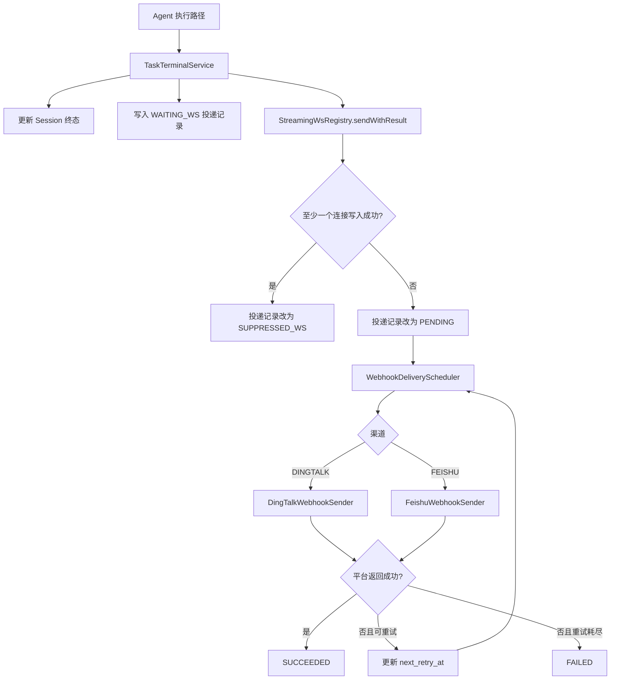

# Agent 任务完成 Webhook 通知技术方案

> 文档版本：v1.0  
> 文档状态：已实施（真实机器人联调需在个人设置中配置 Webhook）  
> 编写日期：2026-07-13  
> 适用项目：Mao Agent Workbench

## 1. 需求背景

当前 Agent 任务通过 WebSocket 向桌面客户端持续推送执行过程和任务状态。用户关闭客户端、网络中断或退出登录后，服务端仍可继续执行 CLOUD 模式任务，但任务进入 `COMPLETED` 或 `FAILED` 后，用户无法及时获知结果。

本需求增加用户级任务完成通知。当任务进入需要通知的终态时，服务端先尝试通过现有 WebSocket 推送 `session_status`。只要至少一个属于该用户的客户端连接实际写入成功，就认为用户仍可通过客户端获知结果，不发送额外通知；没有可用连接或全部连接写入失败时，通过用户配置的钉钉或飞书 Webhook 发送通知。

## 2. 需求描述

### 2.1 功能范围

| 模块 | 功能点 | 结论 |
|---|---|---|
| 任务终态 | `COMPLETED` 时触发通知判定 | 做 |
| 任务终态 | `FAILED` 时触发通知判定，包括执行异常、技能同步失败、超时终止和崩溃恢复失败 | 做 |
| 任务终态 | `CANCELLED` 时发送 Webhook | 不做 |
| 任务类型 | 用户直接创建的普通任务和 Side Task | 做 |
| 任务类型 | `DelegateTool` 创建的内部 `SUBAGENT` 子任务单独通知用户 | 不做，由其所属的用户任务最终状态统一通知 |
| 客户端在线判定 | 至少一个 WebSocket 连接完成 `sendMessage()` 写入即抑制 Webhook | 做 |
| 客户端确认 | 客户端收到消息后回传 ACK | 不做 |
| 通知渠道 | 钉钉自定义机器人 Webhook | 做 |
| 通知渠道 | 飞书自定义机器人 Webhook | 做 |
| 渠道数量 | 每个用户同时启用一个渠道 | 做 |
| 渠道数量 | 同时向钉钉和飞书各发送一次 | 不做 |
| 个人设置 | 开启/关闭通知、选择渠道、配置 Webhook 地址 | 做 |
| 个人设置 | 发送测试通知 | 做 |
| Webhook 安全 | HTTPS、域名和路径白名单校验，地址加密存储、接口脱敏返回 | 做 |
| 机器人安全 | 钉钉加签密钥、飞书签名校验密钥 | 不做，本期只支持完整 Webhook URL |
| 消息能力 | 发送固定格式的任务结果文本 | 做 |
| 消息能力 | 用户自定义通知模板、@指定成员、交互卡片 | 不做 |
| 站内通知 | 同步创建现有 `notification` 表记录 | 不做 |
| 移动端推送 | APNs、厂商推送、短信、邮件 | 不做 |

### 2.2 业务规则

1. 用户未开启通知时，不创建 Webhook 投递任务。
2. 用户开启通知后，必须选择 `DINGTALK` 或 `FEISHU`，并配置对应的有效 Webhook 地址。
3. 普通任务或 Side Task 进入 `COMPLETED`、`FAILED` 时执行通知判定。
4. WebSocket 终态事件至少向一个当前打开的用户连接写入成功时，本次 Webhook 投递标记为 `SUPPRESSED_WS`，不请求第三方平台。
5. 用户没有打开连接、连接已关闭、出站队列已满、事件序列化失败或所有连接写入失败时，进入 Webhook 投递流程。
6. 同一任务执行轮次、同一终态只允许生成一条投递记录，避免异常路径重复发送。
7. 会话存在待自动消费消息时，中间执行轮次结束不发送 Webhook；队列全部执行结束后的最终 `COMPLETED` 或 `FAILED` 才发送。
8. Webhook 发送失败按固定策略重试，重试耗尽后记录失败，不改变任务本身的终态。
9. 测试通知由用户主动触发，立即请求所选 Webhook，不写任务通知投递表、不重试。

### 2.3 用户流程

```text
用户进入 设置 > 消息通知
  -> 开启“任务完成通知”
  -> 单选钉钉或飞书
  -> 输入 Webhook 地址
  -> 点击“发送测试通知”并看到成功结果
  -> 保存设置

Agent 任务进入 COMPLETED 或 FAILED
  -> 服务端向当前用户的 WebSocket 连接发送 session_status
  -> 任一连接实际写入成功：结束，不发送 Webhook
  -> 没有写入成功：创建并执行 Webhook 投递任务
  -> 钉钉或飞书收到任务结果消息
```

## 3. 当前代码分析

### 3.1 可复用能力

| 能力 | 当前实现 | 复用方式 |
|---|---|---|
| 用户多连接管理 | `session/ws/StreamingWsRegistry.java` 使用 `userId -> WebSocketSession Set` 管理连接 | 扩展带投递结果的发送方法 |
| WebSocket 异步发送 | `StreamingWsRegistry` 使用有界队列和独立发送线程 | 保留现有非阻塞模型，为指定事件增加 `CompletableFuture` 回执 |
| 任务状态事件 | `WsEvent.of("session_status", sessionId, data)` | 继续使用现有事件协议 |
| 用户偏好模式 | `preference/` 下已有任务面板偏好实体、Mapper、Service 和 Controller | 新通知偏好沿用同样的用户级接口分层 |
| HTTP 客户端 | 后端已依赖 OkHttp | Webhook 请求不新增 HTTP 库 |
| 敏感信息加密 | Git Credential 已使用应用密钥加密存储 | 通知 Webhook 使用独立密钥和带认证加密算法 |
| 设置页面 | `desktop/src/views/settings/SettingsView.vue` 已提供设置侧边栏和嵌套路由 | 增加“消息通知”导航与页面 |

### 3.2 必须解决的现状问题

1. `StreamingWsRegistry.send()` 只表示事件成功进入内存队列，不代表存在客户端，也不代表 `WebSocketSession.sendMessage()` 成功，不能直接作为抑制 Webhook 的依据。
2. 任务终态处理分散在普通发送、编辑重发、Side Task、崩溃恢复、技能同步失败和超时清理等路径中，直接在每个分支追加 Webhook 调用容易遗漏和重复。
3. 第三方 Webhook 是外部网络调用，不能占用 `agentExecutor` 或 WebSocket 发送线程等待响应。
4. 仅依靠内存异步任务会在服务重启时丢失通知，需要数据库 Outbox 保存投递状态。
5. 现有 `notification` 表面向管理后台站内消息，字段和生命周期不包含 WebSocket 抑制、第三方响应、重试与幂等语义，因此本需求不复用该表。

## 4. 技术选型

| 决策点 | 选择 | 原因 |
|---|---|---|
| 终态处理 | 新增统一的 `TaskTerminalService` | 收敛所有终态更新、WebSocket 状态发送和通知判定，防止分支遗漏 |
| 在线判定 | WebSocket 实际写入结果 | 符合已确认语义；仅检查 `isOpen()` 或调用 `send()` 都不够准确 |
| 异步可靠投递 | MySQL Outbox + 定时投递 Worker | 不阻塞 Agent 线程，服务重启后可恢复，支持幂等和重试 |
| HTTP 客户端 | OkHttp | 项目已有依赖和使用经验，无需引入新组件 |
| 调度 | Spring `@Scheduled` 扫描到期记录 | 当前规模不引入 MQ，部署依赖最少 |
| 用户偏好存储 | 独立 `user_task_notification_preference` 表 | 一名用户一条配置，职责清晰，不混入系统设置 |
| Webhook 加密 | AES-256-GCM，密钥来自 `APP_NOTIFICATION_WEBHOOK_SECRET` | Webhook URL 含访问令牌，必须加密；GCM 同时提供机密性与完整性 |
| 渠道建模 | 字符串枚举 `DINGTALK`、`FEISHU` | 与 Java 枚举和前端联合类型直接对应，便于扩展和校验 |
| 消息格式 | 两个平台均发送纯文本消息 | 兼容性稳定，避免卡片协议差异；内容包含任务标题、结果和完成时间 |

本期不引入 Kafka、RabbitMQ、Redis Stream 等消息中间件。当前项目使用单体 Spring Boot 和 MySQL，数据库 Outbox 已满足通知量级与可靠性要求。

## 5. 总体架构



### 5.1 关键时序

1. Agent 执行结束后调用 `TaskTerminalService.finishExecution()`，不再由调用方分别更新终态和发送 `session_status`。
2. `TaskTerminalService` 更新会话终态，并判断任务类型、终态、消息队列和用户偏好。
3. 满足通知条件时，先创建状态为 `WAITING_WS` 的 Outbox 记录，再调用 `StreamingWsRegistry.sendWithResult()`。
4. WebSocket 发送线程处理事件后完成投递回执：成功连接数大于 0 时将记录更新为 `SUPPRESSED_WS`；否则更新为 `PENDING`。
5. 若进程在回执更新前退出，Worker 会将超过 10 秒的 `WAITING_WS` 记录视为未确认，转为 `PENDING`，保证通知不会永久丢失。
6. Worker 使用独立的 `notificationExecutor` 请求第三方 Webhook，并更新投递结果。

该方案提供“至少一次尝试”语义。极端情况下，第三方已接收消息但服务端在写入 `SUCCEEDED` 前崩溃，重试可能产生重复消息；钉钉和飞书自定义机器人接口不提供业务幂等键，无法做到严格的端到端恰好一次。

## 6. 数据库设计

新增 Flyway 迁移：`backend/src/main/resources/db/migration/V054__task_completion_webhook_notification.sql`。

### 6.1 用户通知偏好表

```sql
CREATE TABLE `user_task_notification_preference` (
    `user_id` BIGINT NOT NULL COMMENT '用户 ID，一名用户一条配置',
    `enabled` TINYINT(1) NOT NULL DEFAULT 0 COMMENT '0=关闭，1=开启',
    `channel` VARCHAR(16) NULL COMMENT 'DINGTALK 或 FEISHU',
    `webhook_ciphertext` VARCHAR(4096) NULL COMMENT 'AES-256-GCM 加密后的 Webhook URL',
    `created_at` DATETIME NOT NULL DEFAULT CURRENT_TIMESTAMP,
    `updated_at` DATETIME NOT NULL DEFAULT CURRENT_TIMESTAMP ON UPDATE CURRENT_TIMESTAMP,
    PRIMARY KEY (`user_id`)
) ENGINE=InnoDB DEFAULT CHARSET=utf8mb4 COMMENT='用户任务完成通知偏好';
```

约束由 Service 层强制执行：`enabled=1` 时 `channel` 和 `webhook_ciphertext` 均不能为空；关闭通知时保留已加密的渠道和地址，用户再次开启时无需重新录入。

### 6.2 通知投递 Outbox 表

```sql
CREATE TABLE `task_notification_delivery` (
    `id` BIGINT NOT NULL AUTO_INCREMENT,
    `event_key` VARCHAR(160) NOT NULL COMMENT '执行轮次与终态组成的幂等键',
    `user_id` BIGINT NOT NULL,
    `session_id` BIGINT NOT NULL,
    `execution_id` VARCHAR(64) NOT NULL,
    `terminal_phase` VARCHAR(16) NOT NULL COMMENT 'COMPLETED 或 FAILED',
    `channel` VARCHAR(16) NOT NULL,
    `webhook_ciphertext` VARCHAR(4096) NOT NULL COMMENT '事件创建时的目标快照',
    `title_snapshot` VARCHAR(255) NOT NULL,
    `status` VARCHAR(24) NOT NULL COMMENT 'WAITING_WS/PENDING/SENDING/SUCCEEDED/FAILED/SUPPRESSED_WS',
    `attempt_count` INT NOT NULL DEFAULT 0,
    `next_retry_at` DATETIME NULL,
    `last_http_status` INT NULL,
    `last_provider_code` VARCHAR(64) NULL,
    `last_error` VARCHAR(1000) NULL,
    `sent_at` DATETIME NULL,
    `created_at` DATETIME NOT NULL DEFAULT CURRENT_TIMESTAMP,
    `updated_at` DATETIME NOT NULL DEFAULT CURRENT_TIMESTAMP ON UPDATE CURRENT_TIMESTAMP,
    PRIMARY KEY (`id`),
    UNIQUE KEY `uk_task_notification_event` (`event_key`),
    KEY `idx_task_notification_pending` (`status`, `next_retry_at`),
    KEY `idx_task_notification_session` (`session_id`)
) ENGINE=InnoDB DEFAULT CHARSET=utf8mb4 COMMENT='任务完成 Webhook 投递记录';
```

`event_key` 格式固定为 `{sessionId}:{executionId}:{terminalPhase}`。普通消息执行沿用现有 `executionId`；Side Task 和恢复执行在启动时生成 UUID，保证每轮执行都有非空标识。

Outbox 保存渠道和加密 Webhook 快照。用户在投递重试期间修改设置不会改变已经产生的通知目标，也不会造成一次事件跨渠道重复发送。

## 7. 后端设计

### 7.1 包结构

在现有 `notification` 领域下增加 `task` 子包，避免与管理后台站内通知混淆：

```text
notification/task/
├── controller/TaskNotificationPreferenceController.java
├── entity/UserTaskNotificationPreference.java
├── entity/TaskNotificationDelivery.java
├── mapper/UserTaskNotificationPreferenceMapper.java
├── mapper/TaskNotificationDeliveryMapper.java
├── model/NotificationChannel.java
├── model/DeliveryStatus.java
├── service/TaskNotificationPreferenceService.java
├── service/TaskCompletionNotificationService.java
├── service/TaskNotificationDeliveryService.java
├── service/WebhookUrlValidator.java
├── service/WebhookSecretCipher.java
├── sender/WebhookSender.java
├── sender/DingTalkWebhookSender.java
├── sender/FeishuWebhookSender.java
└── scheduler/WebhookDeliveryScheduler.java
```

任务终态统一处理类放在 `session/service/TaskTerminalService.java`，由会话领域拥有状态迁移职责。

### 7.2 WebSocket 投递回执

为 `StreamingWsRegistry` 增加：

```java
public CompletableFuture<WsDeliveryResult> sendWithResult(Long userId, WsEvent event)
```

`WsDeliveryResult` 至少包含：

```java
public record WsDeliveryResult(int targetCount, int successCount, int failureCount) {
    public boolean delivered() {
        return successCount > 0;
    }
}
```

实现要求：

1. `OutboundItem` 增加可空的 `CompletableFuture<WsDeliveryResult>`。
2. 事件无法入队时立即以 `successCount=0` 完成回执。
3. 用户没有连接或没有打开的连接时，以 `successCount=0` 完成回执。
4. `deliver()` 对每个打开连接调用现有同步块内的 `session.sendMessage()`，分别统计成功和失败数。
5. 序列化失败或发送循环异常时必须完成回执，不能留下永久未完成的 Future。
6. 现有 `send()`、`sendRaw()` 和 `sendToLocalClients()` 行为保持不变，只有终态 `session_status` 使用新方法。
7. WebSocket 写入结果只表示服务端向连接写入成功，不新增客户端 ACK，也不等待 UI 消费事件。

### 7.3 统一任务终态处理

新增 `TaskTerminalService.finishExecution(sessionId, userId, phase, executionId, errorSummary)`，并替换以下路径中分散的终态代码：

- `StreamingWsHandler.handleSendMessage()` 的正常完成和异常分支；
- `StreamingWsHandler.handleEditAndResend()` 的正常完成和异常分支；
- `StreamingWsHandler.handleCreateSideSession()` 的 Side Task 完成和异常分支；
- LOCAL 技能同步失败分支；
- `CrashRecoveryRunner` 的恢复完成和恢复失败分支；
- `StreamingWsHandler.terminateStaleSession()` 的超时失败分支；
- 取消路径统一更新为 `CANCELLED`，但不创建通知投递记录。

`TaskTerminalService` 的处理顺序：

1. 校验 `phase` 只能是 `COMPLETED`、`FAILED` 或 `CANCELLED`。
2. 使用 `SessionService.updatePhase()` 更新状态，保留现有耗时和未读标记逻辑。
3. 发送 `session_list_update`，该事件的成功与否不参与通知抑制判定。
4. 对 `session_status` 调用 `sendWithResult()`。
5. `CANCELLED`、`SUBAGENT`、用户未开启通知、没有有效配置或消息队列仍有待处理消息时，只发送 WebSocket，不创建 Outbox。
6. 其余情况创建 `WAITING_WS` Outbox。唯一键冲突时读取已有记录，不再创建或发送第二条通知。
7. WebSocket 回执成功时更新为 `SUPPRESSED_WS`；失败时更新为 `PENDING` 并设置 `next_retry_at=NOW()`。

任务状态更新必须先于通知投递。Webhook 失败只记录日志和投递状态，不回滚会话终态，不向 Agent 执行线程抛出异常。

### 7.4 用户偏好 API

基础路径：`/api/v1/user-preferences/task-notification`。所有接口通过 `@AuthenticationPrincipal Long userId` 获取当前用户，禁止从请求体接收或信任 `userId`。

#### GET `/v1/user-preferences/task-notification`

无配置时返回关闭状态：

```json
{
  "code": 0,
  "data": {
    "enabled": false,
    "channel": null,
    "webhookConfigured": false,
    "maskedWebhook": null
  }
}
```

已配置时只返回脱敏信息，不返回密文或明文：

```json
{
  "code": 0,
  "data": {
    "enabled": true,
    "channel": "DINGTALK",
    "webhookConfigured": true,
    "maskedWebhook": "https://oapi.dingtalk.com/robot/send?access_token=****8f2a"
  }
}
```

#### PUT `/v1/user-preferences/task-notification`

请求体：

```json
{
  "enabled": true,
  "channel": "FEISHU",
  "webhookUrl": "https://open.feishu.cn/open-apis/bot/v2/hook/xxx"
}
```

更新规则：

- 首次开启必须提交 `channel` 和 `webhookUrl`。
- 切换渠道必须提交新渠道对应的 `webhookUrl`。
- 渠道不变且 `webhookUrl` 为空时保留原地址。
- `enabled=false` 时关闭通知并保留原配置。
- 请求中的渠道、地址不匹配时返回参数错误。

#### POST `/v1/user-preferences/task-notification/test`

请求体与更新接口一致，但 `enabled` 不参与测试：

```json
{
  "channel": "FEISHU",
  "webhookUrl": "https://open.feishu.cn/open-apis/bot/v2/hook/xxx"
}
```

当 `webhookUrl` 为空时使用当前用户已保存且渠道一致的地址。接口同步等待第三方响应，超时 5 秒；成功返回 `{ "success": true }`，失败返回明确但不包含完整 Webhook 的错误信息。测试请求不进入重试队列。

### 7.5 Webhook 地址校验

服务端执行最终校验，前端校验只用于即时反馈：

| 渠道 | 允许的地址 |
|---|---|
| 钉钉 | `https://oapi.dingtalk.com/robot/send?access_token=...` |
| 飞书 | `https://open.feishu.cn/open-apis/bot/v2/hook/{token}` |

校验规则：

1. 只允许 `https`，不允许 HTTP。
2. Host 必须完全匹配白名单，不接受子域名、IP、localhost 或用户信息段。
3. Path 必须匹配对应平台固定路径。
4. 钉钉必须存在非空 `access_token`；飞书必须存在非空 hook token。
5. OkHttp 禁止自动跟随重定向，防止白名单地址将请求重定向到内网。
6. 日志、异常、审计记录和 API 响应不得输出完整 Webhook URL。

### 7.6 平台请求协议

#### 钉钉

请求：

```json
{
  "msgtype": "text",
  "text": {
    "content": "Mao Agent 任务通知\n任务：整理月度报表\n结果：已完成\n时间：2026-07-13 18:30:00"
  }
}
```

成功条件：HTTP 2xx 且响应 JSON 的 `errcode` 为 `0`。

#### 飞书

请求：

```json
{
  "msg_type": "text",
  "content": {
    "text": "Mao Agent 任务通知\n任务：整理月度报表\n结果：已完成\n时间：2026-07-13 18:30:00"
  }
}
```

成功条件：HTTP 2xx，且响应 JSON 的 `code` 为 `0`；兼容飞书旧响应字段时同时接受 `StatusCode=0`。

正式通知固定包含产品名、任务标题、结果和服务端完成时间。失败通知不包含异常堆栈、用户输入、Agent 最终回答或工具输出，避免敏感内容进入外部群聊。结果文案为“已完成”或“执行失败”。

### 7.7 重试与并发

- Worker 每 30 秒扫描一次到期的 `PENDING` 记录和超过 10 秒的 `WAITING_WS` 记录。
- 单次扫描最多领取 100 条，使用条件更新将状态从 `PENDING` 改为 `SENDING`，避免同一实例重复领取。
- 多实例部署时使用 MySQL `SELECT ... FOR UPDATE SKIP LOCKED` 或等价的原子状态更新，确保一条记录同时只被一个实例处理。
- HTTP 连接超时 3 秒，读取/调用总超时 5 秒。
- 最多发送 4 次：首次立即发送，失败后分别在 1 分钟、5 分钟、15 分钟重试。
- 网络异常、HTTP 429 和 HTTP 5xx 可重试。
- 地址错误、HTTP 4xx（429 除外）以及平台明确返回参数/鉴权错误不重试，直接标记 `FAILED`。
- 服务启动时将超过 5 分钟仍为 `SENDING` 的记录恢复为 `PENDING`。
- `last_error` 只保存脱敏后的错误摘要，最长 1000 字符。

### 7.8 配置项

在各环境配置和部署文档中增加：

```yaml
app:
  task-notification:
    secret-key: ${APP_NOTIFICATION_WEBHOOK_SECRET:}
    worker-delay-ms: ${TASK_NOTIFICATION_WORKER_DELAY_MS:30000}
    batch-size: ${TASK_NOTIFICATION_BATCH_SIZE:100}
    max-attempts: ${TASK_NOTIFICATION_MAX_ATTEMPTS:4}
```

`APP_NOTIFICATION_WEBHOOK_SECRET` 必须是部署环境注入的随机密钥。生产及 Docker 部署脚本必须增加该变量；后端启动时若为空则拒绝启动，避免 Webhook 被明文或不可恢复地保存。密钥轮换需要先用旧密钥解密，再用新密钥重新加密偏好表和未完成的投递记录。

## 8. 桌面端设计

### 8.1 路由和导航

修改：

- `desktop/src/router/index.ts`：新增 `/settings/notifications` 路由，组件为 `NotificationSettingsView.vue`；
- `desktop/src/views/settings/SettingsView.vue`：在“Git 凭证”下增加“消息通知”导航；
- 保持现有 `/settings` 默认跳转到 Git 凭证，不改变用户原有入口。

该改动只涉及 Vue 渲染层，不修改 `desktop/electron/` 壳代码，因此不因本需求调整 Electron `package.json` 版本。

### 8.2 页面结构

新增 `desktop/src/views/settings/NotificationSettingsView.vue`，页面包含：

1. “任务完成通知”开关；
2. 渠道单选控件：钉钉、飞书；
3. Webhook 地址密码输入框和显示/隐藏按钮；
4. “发送测试通知”按钮；
5. “保存”按钮；
6. 保存中、测试中、测试成功和测试失败状态。

交互规则：

- 关闭开关时隐藏渠道和地址编辑区，保存后服务端保留原配置。
- 开启开关时必须选择渠道并存在有效地址才能保存。
- 接口仅返回脱敏地址；用户不修改地址时输入框保持空白并显示“已配置”。
- 切换渠道后清除本地输入，要求录入新渠道地址。
- 测试按钮使用当前输入地址；输入为空时测试已保存的同渠道地址。
- 测试成功不自动保存，用户仍需点击“保存”。
- Webhook 明文不写入 localStorage、Pinia 持久化状态或日志。

### 8.3 前端类型

```typescript
type NotificationChannel = 'DINGTALK' | 'FEISHU'

interface TaskNotificationPreference {
  enabled: boolean
  channel: NotificationChannel | null
  webhookConfigured: boolean
  maskedWebhook: string | null
}
```

API 调用沿用 `desktop/src/api/index.ts` 的 Axios 实例、JWT 注入和统一错误处理。

## 9. 实现步骤

### 第一阶段：数据库与安全基础

1. 新增 `V054__task_completion_webhook_notification.sql`。
2. 新增通知偏好和投递记录实体、Mapper、枚举。
3. 新增 `TaskNotificationProperties`、AES-256-GCM 加解密服务和启动密钥校验。
4. 新增严格的 Webhook URL 校验器及单元测试。
5. 更新 `application-*.yml`、`docker-compose.yml`、`.env` 示例和 `DEPLOY.md`。

### 第二阶段：用户配置与测试通知

1. 实现偏好查询和保存 Service。
2. 实现 GET、PUT、test 三个用户 API，确保只操作当前登录用户的数据。
3. 实现钉钉、飞书 Sender 和统一 `WebhookSender` 路由。
4. 使用 MockWebServer 覆盖两个平台成功、业务失败、HTTP 失败和超时。

### 第三阶段：任务终态与可靠投递

1. 为 `StreamingWsRegistry` 增加 `sendWithResult()` 和投递统计。
2. 实现 Outbox 创建、状态机、幂等键和 Worker 重试。
3. 新增 `TaskTerminalService`，统一普通任务、编辑重发、Side Task、恢复任务、技能同步失败和超时终止路径。
4. 排除 `CANCELLED` 和 `SUBAGENT`，并在消息队列未清空时抑制中间轮次通知。
5. 增加结构化日志和投递状态指标。

### 第四阶段：桌面端设置页面

1. 新增消息通知路由和设置导航。
2. 实现开关、渠道单选、Webhook 输入、测试和保存交互。
3. 完成地址脱敏展示、切换渠道清空和错误反馈。
4. 增加桌面端 Playwright 用例。

### 第五阶段：联调与发布

1. 使用真实钉钉和飞书测试机器人分别完成测试通知和后台任务通知验证。
2. 验证客户端在线成功收到终态事件时不发送 Webhook。
3. 验证客户端断开、服务重启、平台 5xx 和重试恢复场景。
4. 执行后端单测、编译、桌面端 build 和相关 E2E。
5. 配置生产密钥后执行 Flyway 迁移并发布。

## 10. 测试方案

### 10.1 后端单元测试

| 测试类 | 重点用例 |
|---|---|
| `WebhookUrlValidatorTest` | 两个平台合法 URL；HTTP、伪造子域、错误路径、localhost、IP 和重定向拒绝 |
| `WebhookSecretCipherTest` | 加解密一致、随机 nonce、篡改密文解密失败、错误密钥失败 |
| `TaskNotificationPreferenceServiceTest` | 默认关闭、首次开启、关闭保留、切换渠道要求新地址、响应不泄露明文 |
| `StreamingWsRegistryTest` | 无连接、单连接成功、多连接部分失败、队列满、序列化失败均正确完成回执 |
| `TaskTerminalServiceTest` | COMPLETED/FAILED 创建记录；CANCELLED/SUBAGENT/队列未空不创建；WS 成功抑制；幂等键去重 |
| `DingTalkWebhookSenderTest` | HTTP 与 `errcode` 双重成功判定、429/5xx 可重试、4xx 不重试 |
| `FeishuWebhookSenderTest` | `code=0`、`StatusCode=0`、业务错误和超时 |
| `WebhookDeliverySchedulerTest` | 重试时间、最大次数、僵死 SENDING 恢复、WAITING_WS 超时恢复 |

### 10.2 集成与 E2E 场景

1. 通知关闭，后台任务完成：不产生投递记录、不发送 Webhook。
2. 通知开启且客户端在线：`session_status` 写入成功，投递记录为 `SUPPRESSED_WS`。
3. 通知开启且客户端断开：任务完成后钉钉收到一条消息。
4. 通知开启且所有连接写入失败：飞书收到一条消息。
5. 同一用户多端在线，任一连接写入成功：不发送 Webhook。
6. 任务失败：消息结果为“执行失败”，不包含异常堆栈。
7. 用户主动取消：不发送 Webhook。
8. Side Task 完成：按相同规则通知；内部 SUBAGENT 完成不单独通知。
9. 消息队列包含三条消息：前两轮结束不通知，队列清空后的最终终态只通知一次。
10. 平台首次返回 500、第二次成功：记录最终为 `SUCCEEDED`，`attempt_count=2`。
11. 后端在记录进入 `WAITING_WS` 后重启：记录恢复并完成投递。
12. 设置页面读取配置时不出现完整 Webhook，切换渠道后必须输入新地址。
13. 测试通知成功和失败均有明确反馈，失败不修改已保存配置。

### 10.3 验证命令

```bash
cd backend && mvn test
cd backend && mvn compile
cd desktop && npm run build
npm run test:desktop
```

## 11. 可观测性与运维

日志统一使用 `deliveryId`、`sessionId`、`userId`、`channel`、`status` 和 `attemptCount`，严禁记录 Webhook 明文及请求体中的目标 URL。

需要提供以下 Micrometer 指标；若当前部署尚未采集指标，仍在应用内注册，供后续监控直接接入：

- `task_notification_created_total{channel,phase}`；
- `task_notification_suppressed_total{reason=ws_delivered}`；
- `task_notification_send_total{channel,result}`；
- `task_notification_retry_total{channel}`；
- `task_notification_pending`；
- `task_notification_delivery_seconds`。

运维告警条件：连续 10 分钟失败率超过 20%，或 `PENDING + SENDING` 数量超过 500。投递记录保留 90 天，新增每日清理任务删除 90 天前的 `SUCCEEDED`、`FAILED` 和 `SUPPRESSED_WS` 记录；未完成记录不删除。

## 12. 风险与处理

| 风险 | 处理方式 |
|---|---|
| WebSocket 入队成功但实际发送失败 | 以 `sendMessage()` 实际结果为准，不以入队结果为准 |
| Agent 线程被第三方接口拖慢 | HTTP 投递由独立 Worker 和线程池执行 |
| 服务重启丢失通知 | 先创建 Outbox，`WAITING_WS` 超时后恢复投递 |
| 第三方短暂不可用 | 对网络错误、429 和 5xx 执行分级重试 |
| 重试产生重复消息 | 事件入库使用唯一幂等键；第三方已收但本地未落成功状态的极端重复在文案和运维记录中可识别 |
| Webhook 泄露 | AES-GCM 加密、API 脱敏、日志脱敏、前端不持久化明文 |
| Webhook 被用于 SSRF | HTTPS + 固定 Host/Path 白名单 + 禁止重定向 |
| 多实例重复领取 | 数据库行锁或原子状态更新领取投递记录 |
| 队列连续执行造成通知轰炸 | 只在消息队列清空后的最终轮次通知 |
| 内部子代理产生大量通知 | 排除 `sessionType=SUBAGENT` |

## 13. 落地清单

### 数据库

- [ ] 新增用户通知偏好表。
- [ ] 新增任务通知投递 Outbox 表及索引。
- [ ] 验证 Flyway 从当前 V053 升级成功。

### 后端

- [ ] 增加通知配置、密钥校验和 AES-GCM 加密服务。
- [ ] 增加 Webhook 地址白名单校验与脱敏工具。
- [ ] 增加用户偏好查询、保存和测试通知 API。
- [ ] 实现钉钉和飞书文本消息 Sender。
- [ ] 扩展 WebSocket Registry 返回实际写入结果。
- [ ] 实现统一任务终态服务并替换全部终态分支。
- [ ] 实现 Outbox 状态机、领取、重试、恢复和清理任务。
- [ ] 增加结构化日志和指标。
- [ ] 补齐单元测试与集成测试。

### 桌面端

- [ ] 增加“消息通知”设置路由和导航。
- [ ] 实现通知开关和单渠道选择。
- [ ] 实现 Webhook 地址输入、脱敏状态和渠道切换规则。
- [ ] 实现发送测试通知和保存反馈。
- [ ] 增加设置页面 E2E 用例。

### 配置与发布

- [ ] 所有部署环境配置 `APP_NOTIFICATION_WEBHOOK_SECRET`。
- [ ] 更新示例配置、Docker Compose 和 `DEPLOY.md`。
- [ ] 使用真实钉钉与飞书机器人完成验收。
- [ ] 发布后检查失败率、积压量和日志脱敏。

## 14. 验收标准

1. 用户能在桌面端个人设置中开启或关闭任务完成通知，并且只能选择钉钉或飞书中的一个渠道。
2. 用户能发送测试通知；合法且可用的 Webhook 收到测试消息，错误地址得到明确提示。
3. 普通任务和 Side Task 进入 `COMPLETED` 或 `FAILED`，且没有任何 WebSocket 连接成功写入终态事件时，配置渠道收到且只收到一条任务通知。
4. 至少一个 WebSocket 连接成功写入终态事件时，不请求第三方 Webhook。
5. `CANCELLED` 和内部 `SUBAGENT` 终态不发送 Webhook。
6. Webhook 请求失败不会改变任务终态，并能按规定重试；服务重启后未完成投递可继续执行。
7. 数据库、API、日志和前端持久化数据中均不出现 Webhook 明文；API 只能返回脱敏地址。
8. 非钉钉、非飞书或不符合固定路径的 URL 无法保存和测试。
9. 后端测试与编译、桌面端构建和相关 E2E 全部通过。
