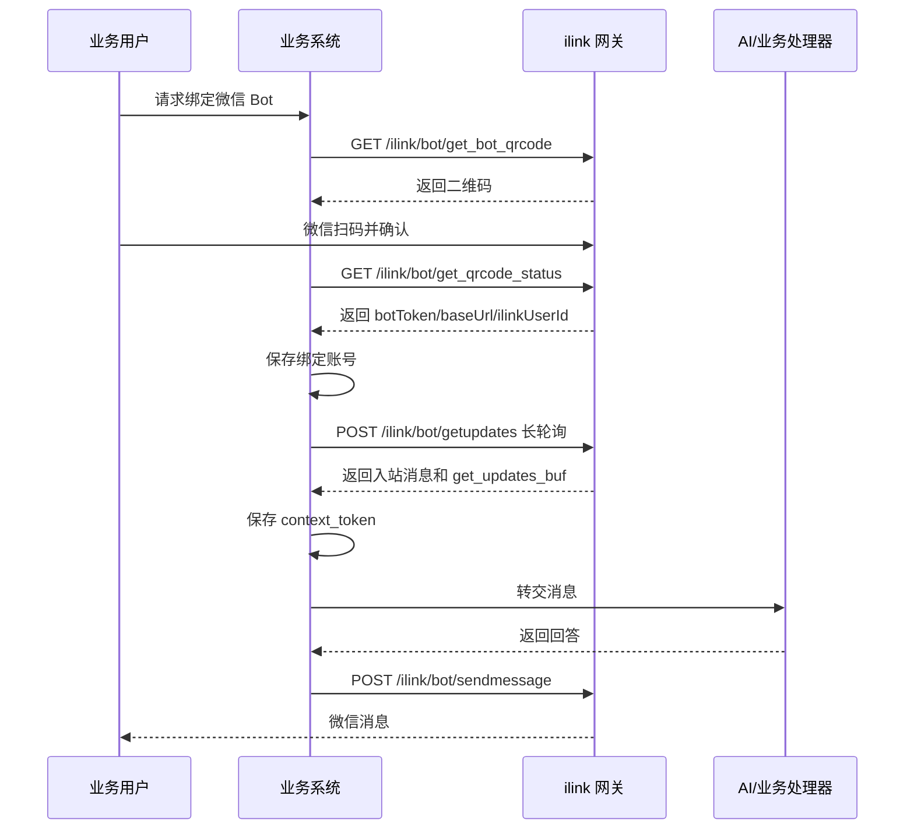

# 微信 Bot 通道集成指南

本文档用于指导其他项目集成“微信 Bot 通道”能力。目标项目无需依赖本项目源码，但需要按本文约定实现账号绑定、消息监听、入站处理、消息发送和状态存储。

## 1. 能力概览

微信 Bot 通道提供三类核心能力：

1. 扫码绑定：业务用户通过二维码登录微信 Bot，系统保存该账号的 `botToken`、`baseUrl`、微信侧用户 ID 等凭据。
2. 消息监听：服务端按绑定账号启动 `getupdates` 长轮询，持续拉取微信消息。
3. 消息发送：服务端使用入站消息中的 `context_token` 调用 `sendmessage`，向微信用户发送文本或媒体消息。

整体链路：



## 2. 外部依赖

需要访问 ilink 网关，默认地址：

```text
https://ilinkai.weixin.qq.com
```

涉及的 ilink API：

| 场景 | 方法 | 路径 |
| --- | --- | --- |
| 获取登录二维码 | `GET` | `/ilink/bot/get_bot_qrcode?bot_type=3` |
| 查询扫码状态 | `GET` | `/ilink/bot/get_qrcode_status?qrcode={qrcode}` |
| 拉取消息 | `POST` | `/ilink/bot/getupdates` |
| 发送消息 | `POST` | `/ilink/bot/sendmessage` |
| 获取用户配置/typing ticket | `POST` | `/ilink/bot/getconfig` |
| 发送 typing 状态 | `POST` | `/ilink/bot/sendtyping` |
| 获取媒体上传地址 | `POST` | `/ilink/bot/getuploadurl` |

其中 `getupdates`、`sendmessage`、`getconfig`、`sendtyping`、`getuploadurl` 都需要带 bot token。

HTTP Header 建议：

```http
Content-Type: application/json
AuthorizationType: ilink_bot_token
Authorization: Bearer {botToken}
X-WECHAT-UIN: {base64(random_uint32_decimal_string)}
```

## 3. 配置项

建议目标项目提供以下配置：

```yaml
weixin:
  bot:
    enabled: true
    ilink-base-url: https://ilinkai.weixin.qq.com
    cdn-base-url: https://novac2c.cdn.weixin.qq.com/c2c
    monitor:
      enabled: true
      reconcile-interval-ms: 5000
      long-poll-timeout-ms: 35000
      max-consecutive-failures: 3
    lease:
      enabled: true
      ttl-ms: 15000
```

关键说明：

- `ilink-base-url`：二维码、扫码状态、消息收发 API 的根地址。
- `cdn-base-url`：媒体下载/上传使用的 CDN 根地址。
- `monitor.enabled`：是否自动监听已绑定账号。
- `lease.ttl-ms`：多实例部署时的监听租约时长，避免同一账号被多个实例重复拉取。

## 4. 数据模型

目标项目至少需要两张表：账号表和上下文 token 表。

### 4.1 账号表

建议表名：`weixin_channel_account`

```sql
CREATE TABLE weixin_channel_account (
  id BIGINT PRIMARY KEY AUTO_INCREMENT,
  app_code VARCHAR(128) NOT NULL COMMENT '业务应用编码',
  account_id VARCHAR(128) NOT NULL COMMENT '业务侧绑定账号ID，建议使用业务userId规范化后结果',
  payload_json TEXT NOT NULL COMMENT '账号凭据JSON',
  get_updates_buf TEXT NULL COMMENT 'getupdates游标',
  enabled TINYINT NOT NULL DEFAULT 1 COMMENT '是否启用',
  deleted TINYINT NOT NULL DEFAULT 0 COMMENT '是否删除',
  created_at DATETIME NOT NULL DEFAULT CURRENT_TIMESTAMP,
  updated_at DATETIME NOT NULL DEFAULT CURRENT_TIMESTAMP ON UPDATE CURRENT_TIMESTAMP,
  KEY idx_account_id (account_id),
  KEY idx_enabled (enabled)
);
```

`payload_json` 推荐结构：

```json
{
  "token": "ilink bot token",
  "baseUrl": "https://...",
  "userId": "ilink_user_id",
  "savedAt": "2026-07-15T10:00:00Z"
}
```

字段含义：

- `token`：扫码确认后返回的 `botToken`，用于后续 ilink API 鉴权。
- `baseUrl`：扫码确认后返回的 API base URL；优先使用返回值，而不是固定配置。
- `userId`：扫码确认后返回的微信侧 `ilink_user_id`，发送消息时作为默认收件人。
- `savedAt`：保存时间，便于排查凭据刷新问题。

### 4.2 Context Token 表

建议表名：`weixin_channel_context_token`

```sql
CREATE TABLE weixin_channel_context_token (
  id BIGINT PRIMARY KEY AUTO_INCREMENT,
  account_id VARCHAR(128) NOT NULL COMMENT '绑定账号ID',
  wx_user_id VARCHAR(128) NOT NULL COMMENT '微信侧用户ID',
  token TEXT NOT NULL COMMENT 'context_token',
  deleted TINYINT NOT NULL DEFAULT 0,
  created_at DATETIME NOT NULL DEFAULT CURRENT_TIMESTAMP,
  updated_at DATETIME NOT NULL DEFAULT CURRENT_TIMESTAMP ON UPDATE CURRENT_TIMESTAMP,
  KEY idx_account_id (account_id),
  KEY idx_wx_user_id (wx_user_id),
  UNIQUE KEY uk_account_wx_user (account_id, wx_user_id)
);
```

`context_token` 非常关键：主动发消息通常需要最近一次入站消息携带的 `context_token`。如果没有收到过该用户消息，系统可能无法主动下行。

## 5. 绑定流程

### 5.1 对外接口

目标项目可提供接口：

```http
GET /weixin/oauth/qrcode?userId={userId}&appCode={appCode}
POST /weixin/oauth/qrcode?userId={userId}&appCode={appCode}
```

返回：

```json
{
  "success": true,
  "data": {
    "sessionKey": "normalized-user-id",
    "qrDataUrl": "data:image/png;base64,...",
    "message": "使用微信扫描以下二维码，以完成连接。"
  }
}
```

### 5.2 实现步骤

1. 校验 `userId` 和 `appCode`。
2. 将 `userId` 规范化为 `accountId`，建议只保留字母、数字、下划线、短横线等安全字符。
3. 请求二维码：

```http
GET {ilinkBaseUrl}/ilink/bot/get_bot_qrcode?bot_type=3
```

返回中需要保存：

```json
{
  "qrcode": "qrcode-id",
  "qrcode_img_content": "data:image/png;base64,..."
}
```

4. 启动异步等待任务，轮询扫码状态：

```http
GET {ilinkBaseUrl}/ilink/bot/get_qrcode_status?qrcode={qrcode}
```

状态处理建议：

| status | 含义 | 处理 |
| --- | --- | --- |
| `wait` | 待扫码 | 继续轮询 |
| `scaned` | 已扫码未确认 | 继续轮询 |
| `expired` | 二维码过期 | 重新生成二维码或提示用户重试 |
| `confirmed` | 已确认 | 保存账号凭据 |

确认后响应通常包含：

```json
{
  "status": "confirmed",
  "bot_token": "...",
  "ilink_bot_id": "...",
  "baseurl": "https://...",
  "ilink_user_id": "..."
}
```

5. 保存或更新 `weixin_channel_account`。
6. 清空该账号的 `get_updates_buf`。
7. 清除账号的本地 pause 状态。
8. 立即触发一次监听协调，启动该账号的消息监听。

## 6. 消息监听

监听不是 webhook，而是服务端长轮询。

### 6.1 监听协调器

建议实现一个 `MonitorScheduler`：

1. 周期扫描 `enabled = 1` 且 `deleted = 0` 的账号。
2. 对每个账号尝试获取监听租约。
3. 获取成功则确保本实例有 monitor 线程。
4. 获取失败则停止本实例对应 monitor。
5. 账号被禁用或删除时释放租约并停止 monitor。

单机部署可以用内存租约；多实例部署建议使用 Redis、数据库或分布式锁。

### 6.2 长轮询请求

请求：

```http
POST {baseUrl}/ilink/bot/getupdates
AuthorizationType: ilink_bot_token
Authorization: Bearer {botToken}
Content-Type: application/json
```

Body：

```json
{
  "get_updates_buf": "previous buf or empty string",
  "base_info": {
    "channel_version": "your-service-version"
  }
}
```

响应示例：

```json
{
  "ret": 0,
  "errcode": 0,
  "get_updates_buf": "next-buf",
  "longpolling_timeout_ms": 35000,
  "msgs": [
    {
      "from_user_id": "wx-user-id",
      "to_user_id": "bot-id",
      "create_time_ms": 1760000000000,
      "message_type": 1,
      "message_state": 1,
      "context_token": "context-token",
      "item_list": []
    }
  ]
}
```

处理规则：

- `ret = 0` 且 `errcode = 0`：正常处理。
- 响应里有新的 `get_updates_buf`：立即更新账号表游标。
- `msgs` 为空：继续下一轮长轮询。
- 连续失败：短暂重试，超过阈值后退避。
- 如果错误码表示 session 过期，例如 `-14`：暂停该账号、禁用账号、停止监听，等待重新扫码绑定。

## 7. 入站消息处理

入站消息建议统一转换为内部上下文对象：

```json
{
  "accountId": "business-user-id",
  "appCode": "agent_abm",
  "fromUserId": "wx-user-id",
  "body": "用户消息文本",
  "contextToken": "context-token",
  "mediaPath": "/tmp/weixin/media/xxx.png",
  "mediaType": "image/png",
  "rawMessage": {}
}
```

建议处理顺序：

1. 提取文本内容。
2. 处理内置 slash 命令，例如 `/echo`。
3. 识别图片、视频、文件、语音等媒体。
4. 下载并解密媒体文件，保存到本地临时目录。
5. 标准化消息体，支持引用消息格式。
6. 鉴权，判断是否允许该 `fromUserId` 给该 bot 发消息。
7. 保存 `context_token` 到 `weixin_channel_context_token`。
8. 可选：调用 `getconfig` 获取 typing ticket，并周期发送 typing 状态。
9. 调用业务处理器，例如 AI Agent、客服系统、工作流引擎。
10. 将业务处理结果通过发送服务下行。

### 7.1 文本提取建议

优先从 `item_list` 中找 `type = TEXT` 的 item：

```json
{
  "type": 1,
  "text_item": {
    "text": "hello"
  }
}
```

如果是语音消息且有识别文本，可使用语音 item 的 `text`。

### 7.2 引用消息

如果文本 item 带引用消息，可以将引用内容拼进正文：

```text
[引用: 原消息标题 | 原消息内容]
用户输入内容
```

### 7.3 媒体处理

媒体类型建议支持：

| 类型 | 内部 mediaType |
| --- | --- |
| 图片 | `image/*` |
| 视频 | `video/mp4` 或实际 MIME |
| PDF | `application/pdf` |
| 普通文件 | 文件实际 MIME |
| 语音 | 语音实际 MIME 或转码后 MIME |

业务处理器可以只接收已下载的本地路径，不直接处理 ilink/CDN 加密参数。

## 8. 业务处理器接口

建议定义一个项目无关的接口：

```java
public interface WeixinInboundHandler {
    boolean authorizeDirectMessage(String accountId, String fromUserId, String text);

    CompletionStage<WeixinReply> onMessage(WeixinInboundMessageContext context);
}
```

`WeixinReply` 可设计为：

```java
public class WeixinReply {
    private String text;
    private String mediaUrlOrLocalPath;
}
```

如果目标项目接入 AI Agent，可以在 `onMessage` 中：

1. 根据 `accountId/appCode/fromUserId` 生成会话 ID。
2. 初始化或加载会话。
3. 将文本和附件转换为 Agent 的请求对象。
4. 执行业务逻辑。
5. 将最终回答发送回微信。

推荐会话 ID 格式：

```text
weixin_{appCode}_{accountId}
```

## 9. 消息发送

### 9.1 主动发送接口

目标项目可提供：

```http
POST /weixin/messaging/send-text
Content-Type: application/json

{
  "userId": "business-user-id",
  "text": "要发送的内容"
}
```

内部流程：

1. 根据 `userId` 查询绑定账号。
2. 从账号 `payload_json` 获取 `baseUrl`、`botToken`、默认 `ilink_user_id`。
3. 查询最近保存的 `context_token`。
4. 组装 `WeixinMessage`。
5. 调用 `sendmessage`。

注意：如果没有可用 `context_token`，应返回明确错误，例如“用户尚未向 Bot 发送过消息，无法主动下行”。

### 9.2 sendmessage 请求

请求：

```http
POST {baseUrl}/ilink/bot/sendmessage
AuthorizationType: ilink_bot_token
Authorization: Bearer {botToken}
Content-Type: application/json
```

文本消息 Body：

```json
{
  "msg": {
    "from_user_id": "",
    "to_user_id": "wx-user-id",
    "client_id": "openclaw-weixin-unique-id",
    "message_type": 2,
    "message_state": 1,
    "context_token": "context-token",
    "item_list": [
      {
        "type": 1,
        "text_item": {
          "text": "hello"
        }
      }
    ]
  },
  "base_info": {
    "channel_version": "your-service-version"
  }
}
```

建议约定：

- `client_id` 每条消息唯一。
- `from_user_id` 可为空。
- `to_user_id` 使用微信侧用户 ID。
- `message_type` 使用 Bot 消息类型。
- `message_state` 使用完成态。
- `context_token` 必填。

### 9.3 媒体发送

媒体发送建议分两步：

1. 上传媒体到 ilink/CDN，得到加密下载参数、AES key、文件大小等信息。
2. 调用 `sendmessage` 发送图片、视频或文件 item。

如果文本和媒体一起发送，建议拆成多条消息：

1. 先发文本 item。
2. 再发媒体 item。

这样更容易兼容微信侧展示和失败重试。

## 10. Typing 状态

可选能力，用于在 AI 生成期间展示“正在输入”。

流程：

1. 收到入站消息后调用：

```http
POST {baseUrl}/ilink/bot/getconfig
```

Body：

```json
{
  "ilink_user_id": "wx-user-id",
  "context_token": "context-token",
  "base_info": {
    "channel_version": "your-service-version"
  }
}
```

2. 如果返回 `typing_ticket`，生成期间每 5 秒调用 `sendtyping`。
3. 业务处理结束后发送取消状态。

建议给 typing ticket 做缓存，避免每条消息都强依赖 `getconfig` 成功。

## 11. 异常与恢复

### 11.1 Session 过期

当 `getupdates` 或发送接口返回 session 过期错误，例如 `-14`：

1. 本地暂停账号一段时间，避免持续失败刷日志。
2. 将账号 `enabled` 置为 `0`。
3. 停止 monitor。
4. 提示用户重新扫码绑定。

### 11.2 长轮询失败

建议策略：

- 第 1 到第 2 次失败：等待 2 秒重试。
- 连续 3 次失败：等待 30 秒退避。
- 成功后清零失败计数。

### 11.3 消息发送失败

常见原因：

- 缺少 `context_token`。
- bot token 失效。
- 请求体序列化格式不符合 ilink 要求。
- 短时间连续发送过多消息。
- 媒体上传失败或 CDN 下载失败。

应记录：

- `accountId`
- `toUserId`
- `clientId`
- ilink 原始响应
- 发送文本长度或媒体路径

## 12. 安全建议

1. `botToken` 必须加密存储或至少限制数据库访问权限。
2. 不要在日志中完整打印 `botToken`、`context_token`。
3. 对绑定接口做登录态校验，避免任意人绑定或覆盖账号。
4. 对主动发送接口做权限校验和频控。
5. 对媒体下载路径做目录限制，避免任意文件读取。
6. 对入站用户做 allowlist 或业务授权校验。

## 13. 推荐模块划分

目标项目可按以下模块落地：

| 模块 | 职责 |
| --- | --- |
| `QrLoginService` | 获取二维码、轮询扫码状态 |
| `WeixinAccountRepository` | 账号凭据和游标存储 |
| `ContextTokenRepository` | 保存和查询 `context_token` |
| `MonitorScheduler` | 周期扫描账号并协调监听租约 |
| `MonitorManager` | 管理本 JVM 内 monitor 线程 |
| `WeixinMonitor` | 单账号 `getupdates` 长轮询 |
| `InboundProcessor` | 入站消息标准化、媒体处理、typing、转交业务 |
| `WeixinInboundHandler` | 业务扩展点 |
| `WeixinSendService` | 文本和媒体下行 |
| `SessionGuard` | session 过期暂停与恢复 |

## 14. 最小落地步骤

1. 建表：`weixin_channel_account`、`weixin_channel_context_token`。
2. 实现二维码接口，并保存扫码成功后的账号凭据。
3. 实现账号监听调度和单账号长轮询。
4. 处理 `getupdates` 响应，保存新游标和 `context_token`。
5. 定义 `WeixinInboundHandler`，把入站消息交给业务系统。
6. 实现 `sendText`，使用最近的 `context_token` 调用 `sendmessage`。
7. 加入 session 过期、失败退避、账号禁用和重新绑定逻辑。
8. 多实例部署时接入 Redis/DB 租约，保证一个账号只有一个实例监听。

## 15. 集成检查清单

- [ ] 扫码绑定成功后是否保存了 `appCode/accountId/token/baseUrl/ilinkUserId`
- [ ] `appCode` 是否必填并落库，避免后续会话找不到业务应用
- [ ] `get_updates_buf` 是否每次更新后持久化
- [ ] `context_token` 是否按 `accountId + wxUserId` 保存
- [ ] 主动发送时是否能拿到最近的 `context_token`
- [ ] 长轮询是否有失败退避
- [ ] session 过期是否会停用账号并提示重新绑定
- [ ] 多实例是否有监听租约
- [ ] 日志是否避免打印敏感 token
- [ ] 媒体下载和上传是否限制路径和大小

