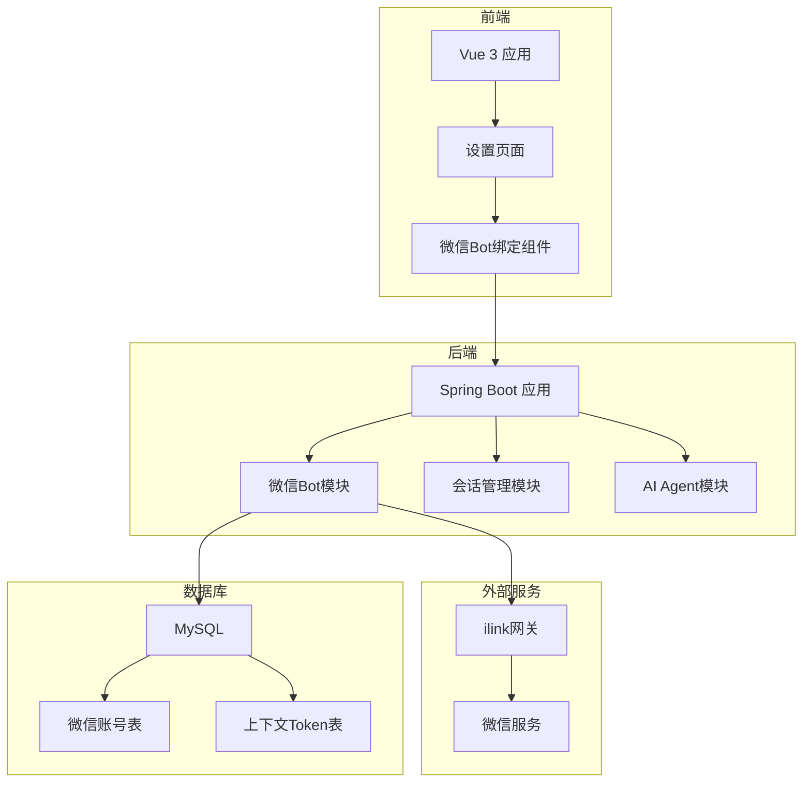

# 微信Bot通道集成技术方案

## 1. 需求背景

当前项目（Mao）是一个AI Agent工作平台，支持用户通过Web界面与AI Agent进行交互。为了扩展用户交互渠道，需要集成微信Bot通道，使用户能够通过微信直接与AI Agent进行对话。

### 1.1 现状分析

1. **现有架构**：项目采用前后端分离架构，后端为Spring Boot应用，前端为Vue 3 + Electron桌面端
2. **交互模式**：目前仅支持Web端交互，用户需要在桌面客户端或管理后台操作
3. **会话管理**：已有完善的会话管理系统，支持云端和本地两种执行模式
4. **用户需求**：用户希望通过微信这一高频使用渠道与AI Agent交互，降低使用门槛

### 1.2 集成目标

1. **扩展交互渠道**：为用户提供微信这一新的交互入口
2. **降低使用门槛**：用户无需打开桌面客户端即可使用AI Agent
3. **保持一致性**：微信端的交互体验应与Web端保持一致
4. **无缝集成**：与现有会话管理系统无缝对接，避免重复建设

## 2. 需求描述

### 2.1 核心功能需求

#### 2.1.1 微信Bot绑定
- **功能描述**：用户在客户端设置页面完成微信Bot绑定操作
- **操作流程**：
  1. 用户进入设置页面，点击"微信Bot绑定"选项
  2. 系统生成微信扫码二维码
  3. 用户使用微信扫码并确认授权
  4. 系统保存绑定凭据，完成绑定
- **绑定信息**：保存botToken、baseUrl、微信用户ID等凭据

#### 2.1.2 自动工作区创建
- **功能描述**：当用户完成微信Bot绑定，自动创建云端模式的特殊工作区
- **工作区名称**："微信Bot"
- **工作区类型**：云端模式（CLOUD）
- **创建时机**：绑定成功后立即创建
- **工作区用途**：专门处理微信端的AI Agent交互

#### 2.1.3 消息处理机制
- **消息接收**：服务端通过长轮询方式接收微信消息
- **会话管理**：
  - 如果工作区下无会话，则自动创建新会话
  - 如果已存在会话，则基于已存在的会话处理消息
  - 一个用户只会有一个微信Bot的会话
- **消息处理**：调用现有的AI Agent处理流程
- **消息发送**：将最终结论（不包含过程）通过Bot发送给用户微信

### 2.2 非功能性需求

#### 2.2.1 性能需求
- **响应时间**：消息处理完成后，应在3秒内发送到微信
- **并发处理**：支持多个用户同时使用微信Bot
- **资源占用**：长轮询机制不应显著增加服务器负载

#### 2.2.2 可靠性需求
- **消息可靠性**：确保消息不丢失、不重复
- **会话一致性**：微信端与Web端会话状态保持一致
- **异常处理**：网络异常、接口超时等应有完善的重试机制

#### 2.2.3 安全性需求
- **凭据安全**：botToken等敏感信息加密存储
- **接口安全**：绑定接口需登录态校验
- **权限控制**：仅授权用户可使用微信Bot功能

## 3. 技术选型

### 3.1 后端技术选型

| 技术组件 | 选型方案 | 选型理由 |
|---------|---------|---------|
| **框架** | Spring Boot 2.7+ | 与现有项目保持一致，降低维护成本 |
| **ORM** | MyBatis-Plus | 与现有数据访问层保持一致 |
| **数据库** | MySQL 8.0 | 与现有数据库保持一致 |
| **任务调度** | Spring Task | 用于消息监听的长轮询调度 |
| **HTTP客户端** | OkHttp | 与现有LLM调用保持一致 |
| **JSON处理** | Jackson | 与现有JSON处理保持一致 |
| **配置管理** | application.yml | 与现有配置管理保持一致 |

### 3.2 前端技术选型

| 技术组件 | 选型方案 | 选型理由 |
|---------|---------|---------|
| **框架** | Vue 3 + Composition API | 与现有前端保持一致 |
| **UI组件** | Element Plus | 与现有UI组件保持一致 |
| **状态管理** | Pinia | 与现有状态管理保持一致 |
| **路由** | Vue Router | 与现有路由管理保持一致 |
| **构建工具** | Vite | 与现有构建工具保持一致 |

### 3.3 第三方服务

| 服务类型 | 选型方案 | 说明 |
|---------|---------|------|
| **微信接口** | ilink网关 | 提供微信Bot绑定、消息收发能力 |
| **二维码生成** | ilink网关 | 提供微信扫码二维码 |
| **消息队列** | 内存队列 | 用于消息处理的异步解耦 |

### 3.4 包结构设计

```
cn.etarch.mao.weixin/
├── config/
│   └── WeixinBotConfig.java              # 微信Bot配置类
├── controller/
│   └── WeixinBotController.java          # 微信Bot REST API控制器
├── entity/
│   ├── WeixinChannelAccount.java         # 微信账号实体
│   └── WeixinChannelContextToken.java    # 上下文Token实体
├── mapper/
│   ├── WeixinChannelAccountMapper.java   # 微信账号Mapper
│   └── WeixinChannelContextTokenMapper.java # 上下文TokenMapper
├── service/
│   ├── QrLoginService.java              # 二维码登录服务
│   ├── WeixinAccountRepository.java     # 账号仓储服务
│   ├── ContextTokenRepository.java      # Token仓储服务
│   ├── MonitorScheduler.java            # 监控调度器
│   ├── MonitorManager.java              # 监控管理器
│   ├── WeixinMonitor.java               # 单账号监控
│   ├── InboundProcessor.java            # 入站消息处理器
│   ├── WeixinSendService.java           # 消息发送服务
│   └── WeixinInboundHandler.java        # 入站消息处理器接口
├── handler/
│   └── AgentWeixinInboundHandler.java   # AI Agent消息处理器
├── model/
│   ├── WeixinInboundMessageContext.java  # 入站消息上下文
│   ├── WeixinReply.java                 # 回复消息模型
│   └── WeixinMessage.java               # 消息模型
└── util/
    └── WeixinUtils.java                 # 工具类
```

### 3.5 技术架构图



## 4. 实现步骤

### 4.1 阶段一：数据库设计与基础模块搭建

#### 4.1.1 数据库表设计
1. **微信账号表** (`weixin_channel_account`)
   ```sql
   CREATE TABLE weixin_channel_account (
     id BIGINT PRIMARY KEY AUTO_INCREMENT,
     user_id BIGINT NOT NULL COMMENT '系统用户ID',
     account_id VARCHAR(128) NOT NULL COMMENT '业务侧绑定账号ID',
     payload_json TEXT NOT NULL COMMENT '账号凭据JSON',
     get_updates_buf TEXT NULL COMMENT 'getupdates游标',
     enabled TINYINT NOT NULL DEFAULT 1 COMMENT '是否启用',
     deleted TINYINT NOT NULL DEFAULT 0 COMMENT '是否删除',
     created_at DATETIME NOT NULL DEFAULT CURRENT_TIMESTAMP,
     updated_at DATETIME NOT NULL DEFAULT CURRENT_TIMESTAMP ON UPDATE CURRENT_TIMESTAMP,
     KEY idx_user_id (user_id),
     KEY idx_account_id (account_id),
     KEY idx_enabled (enabled)
   );
   ```

2. **上下文Token表** (`weixin_channel_context_token`)
   ```sql
   CREATE TABLE weixin_channel_context_token (
     id BIGINT PRIMARY KEY AUTO_INCREMENT,
     account_id VARCHAR(128) NOT NULL COMMENT '绑定账号ID',
     wx_user_id VARCHAR(128) NOT NULL COMMENT '微信侧用户ID',
     token TEXT NOT NULL COMMENT 'context_token',
     deleted TINYINT NOT NULL DEFAULT 0,
     created_at DATETIME NOT NULL DEFAULT CURRENT_TIMESTAMP,
     updated_at DATETIME NOT NULL DEFAULT CURRENT_TIMESTAMP ON UPDATE CURRENT_TIMESTAMP,
     KEY idx_account_id (account_id),
     KEY idx_wx_user_id (wx_user_id),
     UNIQUE KEY uk_account_wx_user (account_id, wx_user_id)
   );
   ```

3. **Flyway迁移脚本** (`V018__weixin_bot_channel.sql`)
   ```sql
   -- 微信Bot通道集成相关表
   
   -- 微信账号表
   CREATE TABLE IF NOT EXISTS weixin_channel_account (
     id BIGINT PRIMARY KEY AUTO_INCREMENT,
     user_id BIGINT NOT NULL COMMENT '系统用户ID',
     account_id VARCHAR(128) NOT NULL COMMENT '业务侧绑定账号ID',
     payload_json TEXT NOT NULL COMMENT '账号凭据JSON',
     get_updates_buf TEXT NULL COMMENT 'getupdates游标',
     enabled TINYINT NOT NULL DEFAULT 1 COMMENT '是否启用',
     deleted TINYINT NOT NULL DEFAULT 0 COMMENT '是否删除',
     created_at DATETIME NOT NULL DEFAULT CURRENT_TIMESTAMP,
     updated_at DATETIME NOT NULL DEFAULT CURRENT_TIMESTAMP ON UPDATE CURRENT_TIMESTAMP,
     KEY idx_user_id (user_id),
     KEY idx_account_id (account_id),
     KEY idx_enabled (enabled)
   ) ENGINE=InnoDB DEFAULT CHARSET=utf8mb4 COLLATE=utf8mb4_unicode_ci COMMENT='微信Bot账号表';
   
   -- 上下文Token表
   CREATE TABLE IF NOT EXISTS weixin_channel_context_token (
     id BIGINT PRIMARY KEY AUTO_INCREMENT,
     account_id VARCHAR(128) NOT NULL COMMENT '绑定账号ID',
     wx_user_id VARCHAR(128) NOT NULL COMMENT '微信侧用户ID',
     token TEXT NOT NULL COMMENT 'context_token',
     deleted TINYINT NOT NULL DEFAULT 0,
     created_at DATETIME NOT NULL DEFAULT CURRENT_TIMESTAMP,
     updated_at DATETIME NOT NULL DEFAULT CURRENT_TIMESTAMP ON UPDATE CURRENT_TIMESTAMP,
     KEY idx_account_id (account_id),
     KEY idx_wx_user_id (wx_user_id),
     UNIQUE KEY uk_account_wx_user (account_id, wx_user_id)
   ) ENGINE=InnoDB DEFAULT CHARSET=utf8mb4 COLLATE=utf8mb4_unicode_ci COMMENT='微信Bot上下文Token表';
   ```

#### 4.1.2 实体类与Mapper
1. **WeixinChannelAccount实体**
   - 对应`weixin_channel_account`表
   - 包含用户ID、账号ID、凭据JSON等字段

   ```java
   package cn.etarch.mao.weixin.entity;
   
   import com.baomidou.mybatisplus.annotation.*;
   import lombok.Data;
   import java.time.LocalDateTime;
   
   @Data
   @TableName("weixin_channel_account")
   public class WeixinChannelAccount {
       
       @TableId(type = IdType.AUTO)
       private Long id;
       
       private Long userId;
       
       private String accountId;
       
       private String payloadJson;
       
       private String getUpdatesBuf;
       
       private Integer enabled;
       
       @TableLogic
       private Integer deleted;
       
       @TableField(fill = FieldFill.INSERT)
       private LocalDateTime createdAt;
       
       @TableField(fill = FieldFill.INSERT_UPDATE)
       private LocalDateTime updatedAt;
   }
   ```

2. **WeixinChannelContextToken实体**
   - 对应`weixin_channel_context_token`表
   - 包含账号ID、微信用户ID、context_token等字段

   ```java
   package cn.etarch.mao.weixin.entity;
   
   import com.baomidou.mybatisplus.annotation.*;
   import lombok.Data;
   import java.time.LocalDateTime;
   
   @Data
   @TableName("weixin_channel_context_token")
   public class WeixinChannelContextToken {
       
       @TableId(type = IdType.AUTO)
       private Long id;
       
       private String accountId;
       
       private String wxUserId;
       
       private String token;
       
       @TableLogic
       private Integer deleted;
       
       @TableField(fill = FieldFill.INSERT)
       private LocalDateTime createdAt;
       
       @TableField(fill = FieldFill.INSERT_UPDATE)
       private LocalDateTime updatedAt;
   }
   ```

3. **Mapper接口**
   - `WeixinChannelAccountMapper`
   - `WeixinChannelContextTokenMapper`

   ```java
   package cn.etarch.mao.weixin.mapper;
   
   import cn.etarch.mao.weixin.entity.WeixinChannelAccount;
   import com.baomidou.mybatisplus.core.mapper.BaseMapper;
   import org.apache.ibatis.annotations.Mapper;
   
   @Mapper
   public interface WeixinChannelAccountMapper extends BaseMapper<WeixinChannelAccount> {
   }
   ```

   ```java
   package cn.etarch.mao.weixin.mapper;
   
   import cn.etarch.mao.weixin.entity.WeixinChannelContextToken;
   import com.baomidou.mybatisplus.core.mapper.BaseMapper;
   import org.apache.ibatis.annotations.Mapper;
   
   @Mapper
   public interface WeixinChannelContextTokenMapper extends BaseMapper<WeixinChannelContextToken> {
   }
   ```

### 4.2 阶段二：后端服务实现

#### 4.2.1 配置模块
1. **微信Bot配置类** (`WeixinBotConfig`)
   - 读取`application.yml`中的微信Bot配置
   - 包含ilink网关地址、长轮询配置等

2. **配置示例**
   ```yaml
   # 在 application-example.yml 中添加以下配置
   weixin:
     bot:
       enabled: ${WEIXIN_BOT_ENABLED:false}
       ilink-base-url: ${WEIXIN_BOT_ILINK_BASE_URL:https://ilinkai.weixin.qq.com}
       cdn-base-url: ${WEIXIN_BOT_CDN_BASE_URL:https://novac2c.cdn.weixin.qq.com/c2c}
       monitor:
         enabled: ${WEIXIN_BOT_MONITOR_ENABLED:true}
         reconcile-interval-ms: ${WEIXIN_BOT_MONITOR_RECONCILE_INTERVAL_MS:5000}
         long-poll-timeout-ms: ${WEIXIN_BOT_MONITOR_LONG_POLL_TIMEOUT_MS:35000}
         max-consecutive-failures: ${WEIXIN_BOT_MONITOR_MAX_CONSECUTIVE_FAILURES:3}
       lease:
         enabled: ${WEIXIN_BOT_LEASE_ENABLED:true}
         ttl-ms: ${WEIXIN_BOT_LEASE_TTL_MS:15000}
   ```

#### 4.2.2 核心服务实现
1. **QrLoginService**
   - 获取微信扫码二维码
   - 轮询扫码状态
   - 保存绑定凭据

2. **WeixinAccountRepository**
   - 账号凭据的CRUD操作
   - 游标的更新和查询

3. **ContextTokenRepository**
   - 上下文Token的保存和查询
   - Token的更新和删除

4. **MonitorScheduler**
   - 周期扫描启用的账号
   - 协调监听租约
   - 管理监控线程的生命周期

5. **WeixinMonitor**
   - 单账号的长轮询实现
   - 消息拉取和处理
   - 异常处理和重试机制

6. **InboundProcessor**
   - 入站消息标准化
   - 媒体文件处理
   - 消息转交业务处理

7. **WeixinSendService**
   - 文本消息发送
   - 媒体消息发送
   - 发送失败处理

#### 4.2.3 业务处理器实现
1. **WeixinInboundHandler接口**
   ```java
   package cn.etarch.mao.weixin.service;
   
   import cn.etarch.mao.weixin.model.WeixinInboundMessageContext;
   import cn.etarch.mao.weixin.model.WeixinReply;
   import java.util.concurrent.CompletionStage;
   
   public interface WeixinInboundHandler {
       boolean authorizeDirectMessage(String accountId, String fromUserId, String text);
       CompletionStage<WeixinReply> onMessage(WeixinInboundMessageContext context);
   }
   ```

2. **AgentWeixinInboundHandler实现**
   - 集成现有的AI Agent处理流程
   - 自动创建或复用微信Bot会话
   - 处理完成后发送回复

3. **WeixinBotController实现**
   ```java
   package cn.etarch.mao.weixin.controller;
   
   import cn.etarch.mao.common.result.Result;
   import cn.etarch.mao.weixin.service.QrLoginService;
   import cn.etarch.mao.weixin.service.WeixinAccountRepository;
   import lombok.RequiredArgsConstructor;
   import org.springframework.web.bind.annotation.*;
   
   import javax.servlet.http.HttpServletRequest;
   
   @RestController
   @RequestMapping("/v1/weixin")
   @RequiredArgsConstructor
   public class WeixinBotController {
       
       private final QrLoginService qrLoginService;
       private final WeixinAccountRepository accountRepository;
       
       /**
        * 获取微信Bot绑定二维码
        */
       @GetMapping("/qrcode")
       public Result<?> getQrcode(HttpServletRequest request) {
           Long userId = (Long) request.getAttribute("userId");
           return Result.success(qrLoginService.getQrcode(userId));
       }
       
       /**
        * 查询扫码状态
        */
       @GetMapping("/qrcode/status")
       public Result<?> getQrcodeStatus(@RequestParam String sessionKey) {
           return Result.success(qrLoginService.getQrcodeStatus(sessionKey));
       }
       
       /**
        * 获取绑定状态
        */
       @GetMapping("/binding/status")
       public Result<?> getBindingStatus(HttpServletRequest request) {
           Long userId = (Long) request.getAttribute("userId");
           return Result.success(accountRepository.getBindingStatus(userId));
       }
       
       /**
        * 解绑微信Bot
        */
       @DeleteMapping("/binding")
       public Result<?> unbind(HttpServletRequest request) {
           Long userId = (Long) request.getAttribute("userId");
           accountRepository.unbind(userId);
           return Result.success();
       }
   }
   ```

### 4.3 阶段三：前端界面实现

#### 4.3.1 设置页面扩展
1. **路由配置**
   - 在`SettingsView.vue`中添加"微信Bot"导航项
   - 配置对应的路由路径

2. **微信Bot绑定页面** (`WeixinBotView.vue`)
   - 显示绑定状态
   - 提供绑定/解绑操作
   - 显示二维码扫描界面

#### 4.3.2 组件实现
1. **二维码显示组件**
   - 显示微信扫码二维码
   - 支持二维码刷新
   - 显示扫码状态提示

2. **绑定状态组件**
   - 显示当前绑定状态
   - 提供解绑操作
   - 显示绑定时间等信息

3. **前端代码示例**

   **SettingsView.vue 路由配置**
   ```vue
   <template>
     <div class="settings-layout">
       <aside class="settings-sidebar">
         <button class="settings-back" @click="goBack">
           <el-icon :size="14"><ArrowLeft /></el-icon>
           返回工作台
         </button>
         <h2 class="settings-title">设置</h2>
         <nav class="settings-nav">
           <router-link to="/settings/git-credentials" class="settings-nav-item" active-class="active">
             Git 凭证
           </router-link>
           <router-link to="/settings/notifications" class="settings-nav-item" active-class="active">
             消息通知
           </router-link>
           <router-link to="/settings/weixin-bot" class="settings-nav-item" active-class="active">
             微信Bot
           </router-link>
         </nav>
       </aside>
       <section class="settings-content">
         <router-view />
       </section>
     </div>
   </template>
   ```

   **WeixinBotView.vue 页面组件**
   ```vue
   <template>
     <div class="weixin-bot-page">
       <div class="page-header">
         <h1 class="page-title">微信Bot绑定</h1>
         <p class="page-desc">
           绑定微信Bot后，您可以通过微信与AI Agent进行对话，无需打开桌面客户端。
         </p>
       </div>
       
       <div v-if="loading" class="empty-state">加载中...</div>
       <div v-else-if="bindingStatus.bound" class="binding-info">
         <div class="binding-card">
           <div class="binding-header">
             <div class="binding-title">已绑定微信Bot</div>
             <div class="binding-actions">
               <button class="action-btn action-btn-danger" @click="handleUnbind">
                 解绑
               </button>
             </div>
           </div>
           <div class="binding-meta">
             <span class="binding-time">绑定时间：{{ formatTime(bindingStatus.boundAt) }}</span>
             <span class="binding-account">账号：{{ bindingStatus.accountId }}</span>
           </div>
         </div>
       </div>
       <div v-else class="binding-action">
         <button class="bind-btn" @click="handleBind">
           <el-icon><Plus /></el-icon>
           绑定微信Bot
         </button>
         
         <el-dialog
           v-model="dialogVisible"
           title="绑定微信Bot"
           width="480px"
           class="weixin-bot-dialog"
           append-to-body
           @closed="resetQrcode"
         >
           <div class="qrcode-container">
             <div v-if="qrcodeLoading" class="qrcode-loading">加载中...</div>
             <div v-else-if="qrcodeError" class="qrcode-error">
               <p>{{ qrcodeError }}</p>
               <button class="retry-btn" @click="fetchQrcode">重试</button>
             </div>
             <div v-else class="qrcode-content">
               
               <p class="qrcode-tip">{{ qrcodeData.message }}</p>
               <div v-if="scanStatus" class="scan-status">
                 <p v-if="scanStatus === 'wait'">等待扫码...</p>
                 <p v-else-if="scanStatus === 'scaned'">已扫码，请确认登录</p>
                 <p v-else-if="scanStatus === 'confirmed'">绑定成功！</p>
                 <p v-else-if="scanStatus === 'expired'">二维码已过期，请重新获取</p>
               </div>
             </div>
           </div>
           <template #footer>
             <button class="dialog-btn dialog-btn-cancel" @click="dialogVisible = false">取消</button>
             <button 
               v-if="scanStatus === 'expired'" 
               class="dialog-btn dialog-btn-confirm" 
               @click="fetchQrcode"
             >
               重新获取
             </button>
           </template>
         </el-dialog>
       </div>
     </div>
   </template>
   
   <script setup lang="ts">
   import { ref, onMounted, onUnmounted } from 'vue'
   import { Plus } from '@element-plus/icons-vue'
   import { ElMessage, ElMessageBox } from 'element-plus'
   import { api } from '../../api'
   
   interface BindingStatus {
     bound: boolean
     accountId?: string
     boundAt?: string
   }
   
   interface QrcodeData {
     sessionKey: string
     qrDataUrl: string
     message: string
   }
   
   const loading = ref(false)
   const bindingStatus = ref<BindingStatus>({ bound: false })
   const dialogVisible = ref(false)
   const qrcodeLoading = ref(false)
   const qrcodeError = ref('')
   const qrcodeData = ref<QrcodeData>({ sessionKey: '', qrDataUrl: '', message: '' })
   const scanStatus = ref('')
   let statusPollingTimer: number | null = null
   
   function formatTime(value?: string) {
     if (!value) return '-'
     return value.replace('T', ' ').slice(0, 16)
   }
   
   async function fetchBindingStatus() {
     loading.value = true
     try {
       const { data } = await api.get('/weixin/binding/status')
       bindingStatus.value = data || { bound: false }
     } finally {
       loading.value = false
     }
   }
   
   async function fetchQrcode() {
     qrcodeLoading.value = true
     qrcodeError.value = ''
     scanStatus.value = ''
     try {
       const { data } = await api.get('/weixin/qrcode')
       qrcodeData.value = data
       startStatusPolling()
     } catch (error: any) {
       qrcodeError.value = error.message || '获取二维码失败'
     } finally {
       qrcodeLoading.value = false
     }
   }
   
   function startStatusPolling() {
     stopStatusPolling()
     statusPollingTimer = window.setInterval(async () => {
       try {
         const { data } = await api.get('/weixin/qrcode/status', {
           params: { sessionKey: qrcodeData.value.sessionKey }
         })
         scanStatus.value = data.status
         
         if (data.status === 'confirmed') {
           stopStatusPolling()
           ElMessage.success('微信Bot绑定成功！')
           dialogVisible.value = false
           await fetchBindingStatus()
         } else if (data.status === 'expired') {
           stopStatusPolling()
         }
       } catch (error) {
         console.error('查询扫码状态失败:', error)
       }
     }, 2000)
   }
   
   function stopStatusPolling() {
     if (statusPollingTimer) {
       clearInterval(statusPollingTimer)
       statusPollingTimer = null
     }
   }
   
   function resetQrcode() {
     stopStatusPolling()
     qrcodeData.value = { sessionKey: '', qrDataUrl: '', message: '' }
     scanStatus.value = ''
     qrcodeError.value = ''
   }
   
   function handleBind() {
     dialogVisible.value = true
     fetchQrcode()
   }
   
   async function handleUnbind() {
     try {
       await ElMessageBox.confirm(
         '确定要解绑微信Bot吗？解绑后将无法通过微信与AI Agent对话。',
         '确认解绑',
         { confirmButtonText: '确定解绑', cancelButtonText: '取消', type: 'warning' }
       )
       
       await api.delete('/weixin/binding')
       ElMessage.success('已成功解绑微信Bot')
       await fetchBindingStatus()
     } catch (error: any) {
       if (error !== 'cancel') {
         ElMessage.error(error.message || '解绑失败')
       }
     }
   }
   
   onMounted(() => {
     fetchBindingStatus()
   })
   
   onUnmounted(() => {
     stopStatusPolling()
   })
   </script>
   ```

### 4.4 阶段四：会话集成与消息处理

#### 4.4.1 会话管理集成
1. **特殊工作区创建**
   - 绑定成功后自动创建"微信Bot"工作区
   - 工作区类型为云端模式（CLOUD）
   - 工作区路径：`{userId}/projects/weixin-bot`

2. **会话创建逻辑**
   - 微信消息到达时，检查是否存在微信Bot会话
   - 如果不存在，创建新会话并关联到微信Bot工作区
   - 如果存在，复用现有会话

3. **会话创建示例代码**
   ```java
   @Service
   @RequiredArgsConstructor
   public class WeixinSessionService {
       
       private final SessionService sessionService;
       private final AgentMapper agentMapper;
       
       /**
        * 获取或创建微信Bot会话
        */
       public Session getOrCreateWeixinSession(Long userId) {
           // 1. 查找现有的微信Bot会话
           Session existingSession = findExistingWeixinSession(userId);
           if (existingSession != null) {
               return existingSession;
           }
           
           // 2. 获取默认Agent
           Agent defaultAgent = getDefaultAgent();
           
           // 3. 创建新的微信Bot会话
           return sessionService.createSession(
               userId,
               defaultAgent.getId(),
               "微信Bot会话",
               "CLOUD",  // 云端模式
               null,     // 工作区路径，由SessionService自动创建
               "READ_ONLY",  // 权限级别
               false,    // 是否Git
               "linux",  // 平台
               "/bin/bash",  // Shell路径
               "Linux",  // 操作系统版本
               null,     // 模型ID
               "weixin-bot",  // 项目Key
               "existing",  // 工作区模式
               null,     // Git克隆URL
               null      // Git分支
           );
       }
       
       /**
        * 查找现有的微信Bot会话
        */
       private Session findExistingWeixinSession(Long userId) {
           // 查询用户下是否有微信Bot类型的会话
           QueryWrapper<Session> queryWrapper = new QueryWrapper<>();
           queryWrapper.eq("user_id", userId)
                      .eq("project_key", "weixin-bot")
                      .eq("status", "ACTIVE")
                      .last("LIMIT 1");
           return sessionService.getOne(queryWrapper);
       }
       
       /**
        * 获取默认Agent
        */
       private Agent getDefaultAgent() {
           // 获取默认的Agent，如果没有则创建
           QueryWrapper<Agent> queryWrapper = new QueryWrapper<>();
           queryWrapper.eq("deleted", 0)
                      .last("LIMIT 1");
           Agent agent = agentMapper.selectOne(queryWrapper);
           
           if (agent == null) {
               // 创建默认Agent
               agent = new Agent();
               agent.setName("微信Bot Agent");
               agent.setDescription("微信Bot专用Agent");
               agent.setSystemPrompt("你是一个AI助手，通过微信与用户交流。请提供简洁、有用的回答。");
               agent.setCreatorId(1L);  // 系统用户ID
               agentMapper.insert(agent);
           }
           
           return agent;
       }
   }
   ```

#### 4.4.2 消息处理流程
1. **消息接收**
   - 长轮询接收微信消息
   - 解析消息内容和媒体文件
   - 保存上下文Token

2. **消息处理**
   - 调用AI Agent处理消息
   - 支持文本和媒体消息
   - 处理完成后提取最终结论

3. **消息发送**
   - 使用上下文Token发送回复
   - 支持文本和媒体消息
   - 处理发送失败情况

4. **消息处理示例代码**
   ```java
   @Service
   @RequiredArgsConstructor
   public class AgentWeixinInboundHandler implements WeixinInboundHandler {
       
       private final WeixinSessionService weixinSessionService;
       private final HarnessService harnessService;
       private final SessionService sessionService;
       private final WeixinSendService weixinSendService;
       
       @Override
       public boolean authorizeDirectMessage(String accountId, String fromUserId, String text) {
           // 检查用户是否有权限使用微信Bot
           // 这里可以添加权限检查逻辑
           return true;
       }
       
       @Override
       public CompletionStage<WeixinReply> onMessage(WeixinInboundMessageContext context) {
           return CompletableFuture.supplyAsync(() -> {
               try {
                   // 1. 获取或创建会话
                   Long userId = getUserIdFromAccountId(context.getAccountId());
                   Session session = weixinSessionService.getOrCreateWeixinSession(userId);
                   
                   // 2. 保存用户消息
                   sessionService.saveMessage(
                       session.getId(),
                       "USER",
                       context.getBody(),
                       null, null, null, 0, null
                   );
                   
                   // 3. 执行AI Agent处理
                   AtomicBoolean cancelFlag = new AtomicBoolean(false);
                   AgentEventListener listener = new AgentEventListener() {
                       @Override
                       public void onContentDelta(String delta) {
                           // 处理内容增量
                       }
                       
                       @Override
                       public void onToolCallStart(String toolCallId, String toolName, String arguments) {
                           // 处理工具调用开始
                       }
                       
                       @Override
                       public void onToolCallResult(String toolCallId, String result) {
                           // 处理工具调用结果
                       }
                       
                       @Override
                       public void onComplete(String fullContent) {
                           // 处理完成
                       }
                       
                       @Override
                       public void onError(Throwable error) {
                           // 处理错误
                       }
                   };
                   
                   harnessService.execute(session.getId(), context.getBody(), listener, cancelFlag);
                   
                   // 4. 获取最新的助手回复
                   List<Message> messages = sessionService.getMessages(session.getId());
                   String assistantReply = getLatestAssistantReply(messages);
                   
                   // 5. 构建回复
                   WeixinReply reply = new WeixinReply();
                   reply.setText(assistantReply);
                   
                   return reply;
               } catch (Exception e) {
                   log.error("处理微信消息失败", e);
                   WeixinReply errorReply = new WeixinReply();
                   errorReply.setText("抱歉，处理您的消息时出现了错误，请稍后再试。");
                   return errorReply;
               }
           });
       }
       
       /**
        * 从账号ID获取用户ID
        */
       private Long getUserIdFromAccountId(String accountId) {
           // 这里需要根据业务逻辑实现
           // 可能需要查询微信账号表获取对应的用户ID
           return 1L;  // 临时实现
       }
       
       /**
        * 获取最新的助手回复
        */
       private String getLatestAssistantReply(List<Message> messages) {
           for (int i = messages.size() - 1; i >= 0; i--) {
               Message message = messages.get(i);
               if ("ASSISTANT".equals(message.getRole())) {
                   return message.getContent();
               }
           }
           return "抱歉，暂时无法生成回复。";
       }
   }
   ```

### 4.5 阶段五：异常处理与监控

#### 4.5.1 异常处理机制
1. **网络异常处理**
   - 长轮询失败重试机制
   - 接口超时处理
   - 网络中断恢复

2. **会话异常处理**
   - Session过期处理
   - Token失效处理
   - 会话状态不一致修复

3. **业务异常处理**
   - 消息处理失败
   - 媒体文件处理失败
   - 发送失败重试

#### 4.5.2 监控与日志
1. **关键指标监控**
   - 消息接收成功率
   - 消息处理延迟
   - 发送成功率

2. **日志记录**
   - 关键操作日志
   - 异常错误日志
   - 性能监控日志

## 5. 落地清单

### 5.1 数据库相关

| 序号 | 任务项 | 负责人 | 预计工时 | 优先级 | 状态 |
|------|--------|--------|----------|--------|------|
| 1 | 创建微信账号表`weixin_channel_account` | 后端 | 2h | P0 | 待完成 |
| 2 | 创建上下文Token表`weixin_channel_context_token` | 后端 | 2h | P0 | 待完成 |
| 3 | 编写Flyway迁移脚本 (V018__weixin_bot_channel.sql) | 后端 | 1h | P0 | 待完成 |
| 4 | 创建WeixinChannelAccount实体类 | 后端 | 1h | P0 | 待完成 |
| 5 | 创建WeixinChannelContextToken实体类 | 后端 | 1h | P0 | 待完成 |
| 6 | 创建WeixinChannelAccountMapper接口 | 后端 | 1h | P0 | 待完成 |
| 7 | 创建WeixinChannelContextTokenMapper接口 | 后端 | 1h | P0 | 待完成 |

### 5.2 后端服务相关

| 序号 | 任务项 | 负责人 | 预计工时 | 优先级 | 状态 |
|------|--------|--------|----------|--------|------|
| 8 | 创建WeixinBotConfig配置类 | 后端 | 2h | P0 | 待完成 |
| 9 | 在application-example.yml中添加微信Bot配置 | 后端 | 1h | P0 | 待完成 |
| 10 | 实现QrLoginService (获取二维码、轮询状态) | 后端 | 4h | P0 | 待完成 |
| 11 | 实现WeixinAccountRepository (账号CRUD) | 后端 | 3h | P0 | 待完成 |
| 12 | 实现ContextTokenRepository (Token管理) | 后端 | 3h | P0 | 待完成 |
| 13 | 实现MonitorScheduler (监控调度) | 后端 | 6h | P0 | 待完成 |
| 14 | 实现MonitorManager (监控管理) | 后端 | 4h | P0 | 待完成 |
| 15 | 实现WeixinMonitor (单账号长轮询) | 后端 | 6h | P0 | 待完成 |
| 16 | 实现InboundProcessor (消息标准化) | 后端 | 5h | P0 | 待完成 |
| 17 | 实现WeixinSendService (消息发送) | 后端 | 4h | P0 | 待完成 |
| 18 | 定义WeixinInboundHandler接口 | 后端 | 2h | P0 | 待完成 |
| 19 | 实现AgentWeixinInboundHandler (AI Agent处理) | 后端 | 6h | P0 | 待完成 |
| 20 | 实现WeixinSessionService (会话管理) | 后端 | 4h | P0 | 待完成 |
| 21 | 创建WeixinBotController (REST API) | 后端 | 4h | P0 | 待完成 |
| 22 | 实现SessionGuard (Session过期处理) | 后端 | 3h | P1 | 待完成 |

### 5.3 前端界面相关

| 序号 | 任务项 | 负责人 | 预计工时 | 优先级 | 状态 |
|------|--------|--------|----------|--------|------|
| 23 | 在SettingsView.vue中添加"微信Bot"导航项 | 前端 | 1h | P0 | 待完成 |
| 24 | 配置微信Bot路由 (/settings/weixin-bot) | 前端 | 1h | P0 | 待完成 |
| 25 | 创建WeixinBotView.vue页面组件 | 前端 | 4h | P0 | 待完成 |
| 26 | 实现QrcodeDisplay.vue二维码显示组件 | 前端 | 3h | P0 | 待完成 |
| 27 | 实现BindingStatus.vue绑定状态组件 | 前端 | 2h | P0 | 待完成 |
| 28 | 实现绑定/解绑操作API调用 | 前端 | 3h | P0 | 待完成 |
| 29 | 添加微信Bot相关的TypeScript类型定义 | 前端 | 2h | P0 | 待完成 |
| 30 | 实现绑定状态轮询和实时更新 | 前端 | 3h | P1 | 待完成 |

### 5.4 会话集成相关

| 序号 | 任务项 | 负责人 | 预计工时 | 优先级 | 状态 |
|------|--------|--------|----------|--------|------|
| 31 | 实现WeixinSessionService (会话创建和复用) | 后端 | 4h | P0 | 待完成 |
| 32 | 实现特殊工作区创建逻辑 (weixin-bot) | 后端 | 3h | P0 | 待完成 |
| 33 | 实现消息处理流程集成 (AgentWeixinInboundHandler) | 后端 | 5h | P0 | 待完成 |
| 34 | 实现消息发送流程集成 (WeixinSendService) | 后端 | 4h | P0 | 待完成 |
| 35 | 实现上下文Token管理 (ContextTokenRepository) | 后端 | 3h | P0 | 待完成 |
| 36 | 实现消息格式转换 (文本、媒体) | 后端 | 4h | P1 | 待完成 |
| 37 | 实现会话状态同步 (微信端与Web端) | 后端 | 3h | P1 | 待完成 |

### 5.5 异常处理与监控相关

| 序号 | 任务项 | 负责人 | 预计工时 | 优先级 | 状态 |
|------|--------|--------|----------|--------|------|
| 38 | 实现网络异常处理 (重试、退避机制) | 后端 | 4h | P1 | 待完成 |
| 39 | 实现会话异常处理 (Session过期、Token失效) | 后端 | 4h | P1 | 待完成 |
| 40 | 实现业务异常处理 (消息处理失败、发送失败) | 后端 | 3h | P1 | 待完成 |
| 41 | 实现监控指标收集 (消息成功率、延迟等) | 后端 | 4h | P1 | 待完成 |
| 42 | 实现日志记录优化 (结构化日志、敏感信息脱敏) | 后端 | 3h | P1 | 待完成 |
| 43 | 实现账号状态管理 (启用、禁用、暂停) | 后端 | 3h | P1 | 待完成 |
| 44 | 实现长轮询失败退避策略 | 后端 | 2h | P1 | 待完成 |

### 5.6 测试相关

| 序号 | 任务项 | 负责人 | 预计工时 | 优先级 | 状态 |
|------|--------|--------|----------|--------|------|
| 45 | 编写WeixinChannelAccountMapper单元测试 | 后端 | 2h | P1 | 待完成 |
| 46 | 编写WeixinChannelContextTokenMapper单元测试 | 后端 | 2h | P1 | 待完成 |
| 47 | 编写QrLoginService单元测试 | 后端 | 3h | P1 | 待完成 |
| 48 | 编写WeixinSessionService单元测试 | 后端 | 3h | P1 | 待完成 |
| 49 | 编写AgentWeixinInboundHandler单元测试 | 后端 | 4h | P1 | 待完成 |
| 50 | 编写WeixinBotController集成测试 | 后端 | 4h | P1 | 待完成 |
| 51 | 编写WeixinBotView.vue组件测试 | 前端 | 3h | P1 | 待完成 |
| 52 | 进行微信Bot绑定功能测试 | 测试 | 2h | P1 | 待完成 |
| 53 | 进行消息收发功能测试 | 测试 | 3h | P1 | 待完成 |
| 54 | 进行异常场景测试 | 测试 | 3h | P1 | 待完成 |
| 55 | 进行性能压力测试 | 测试 | 4h | P2 | 待完成 |

### 5.7 文档相关

| 序号 | 任务项 | 负责人 | 预计工时 | 优先级 | 状态 |
|------|--------|--------|----------|--------|------|
| 56 | 编写WeixinBotController API接口文档 | 后端 | 3h | P2 | 待完成 |
| 57 | 编写微信Bot绑定用户使用文档 | 产品 | 2h | P2 | 待完成 |
| 58 | 编写微信Bot部署运维文档 | 运维 | 2h | P2 | 待完成 |
| 59 | 编写微信Bot故障排查手册 | 运维 | 2h | P2 | 待完成 |
| 60 | 更新项目README.md，添加微信Bot相关说明 | 后端 | 1h | P2 | 待完成 |

## 6. 风险评估与应对

### 6.1 技术风险

| 风险项 | 风险等级 | 影响描述 | 应对措施 |
|--------|----------|----------|----------|
| ilink网关接口变更 | 中 | 可能导致绑定和消息收发功能失效 | 1. 接口版本管理<br>2. 接口变更监控<br>3. 快速响应机制 |
| 长轮询性能问题 | 中 | 可能影响服务器性能 | 1. 合理的轮询间隔<br>2. 连接池管理<br>3. 资源监控告警 |
| 消息丢失风险 | 低 | 可能导致用户消息丢失 | 1. 消息确认机制<br>2. 重试机制<br>3. 消息持久化 |

### 6.2 业务风险

| 风险项 | 风险等级 | 影响描述 | 应对措施 |
|--------|----------|----------|----------|
| 用户绑定失败 | 中 | 影响用户体验 | 1. 友好的错误提示<br>2. 重试机制<br>3. 人工客服支持 |
| 消息处理延迟 | 中 | 影响用户满意度 | 1. 性能优化<br>2. 资源扩容<br>3. 优先级队列 |
| 会话状态不一致 | 低 | 可能导致用户体验混乱 | 1. 状态同步机制<br>2. 冲突解决策略<br>3. 用户提示 |

## 7. 项目计划

### 7.1 开发周期

- **阶段一**：数据库设计与基础模块搭建（1周）
  - 创建数据库表和Flyway迁移脚本
  - 创建实体类和Mapper接口
  - 创建配置类和基础工具类
  - 搭建微信Bot模块包结构

- **阶段二**：后端服务实现（2周）
  - 实现二维码登录服务 (QrLoginService)
  - 实现账号仓储服务 (WeixinAccountRepository)
  - 实现Token仓储服务 (ContextTokenRepository)
  - 实现监控调度器 (MonitorScheduler, MonitorManager)
  - 实现单账号监控 (WeixinMonitor)
  - 实现消息处理器 (InboundProcessor)
  - 实现消息发送服务 (WeixinSendService)
  - 实现业务处理器 (AgentWeixinInboundHandler)
  - 实现会话管理服务 (WeixinSessionService)
  - 创建REST API控制器 (WeixinBotController)

- **阶段三**：前端界面实现（1周）
  - 扩展设置页面路由配置
  - 创建微信Bot绑定页面组件
  - 实现二维码显示组件
  - 实现绑定状态显示组件
  - 实现绑定/解绑操作逻辑

- **阶段四**：会话集成与消息处理（1周）
  - 实现特殊工作区创建逻辑
  - 实现会话创建和复用逻辑
  - 实现消息处理流程集成
  - 实现消息发送流程集成
  - 实现上下文Token管理

- **阶段五**：异常处理与监控（1周）
  - 实现网络异常处理机制
  - 实现会话异常处理机制
  - 实现业务异常处理机制
  - 实现监控指标收集
  - 实现日志记录优化
  - 实现账号状态管理

- **阶段六**：测试与优化（1周）
  - 编写单元测试
  - 编写集成测试
  - 编写前端组件测试
  - 进行功能测试
  - 进行性能压力测试
  - 编写相关文档

### 7.2 里程碑

1. **M1**：数据库设计完成，基础模块搭建完成（第1周结束）
   - 数据库表创建完成
   - 实体类和Mapper接口创建完成
   - 配置类和基础工具类创建完成
   - 微信Bot模块包结构搭建完成

2. **M2**：后端核心服务实现完成（第3周结束）
   - 二维码登录服务实现完成
   - 账号仓储服务实现完成
   - Token仓储服务实现完成
   - 监控调度器实现完成
   - 消息处理器实现完成
   - 消息发送服务实现完成

3. **M3**：前端界面实现完成（第4周结束）
   - 设置页面路由配置完成
   - 微信Bot绑定页面组件创建完成
   - 二维码显示组件实现完成
   - 绑定状态显示组件实现完成
   - 绑定/解绑操作逻辑实现完成

4. **M4**：会话集成完成，消息处理流程打通（第5周结束）
   - 特殊工作区创建逻辑实现完成
   - 会话创建和复用逻辑实现完成
   - 消息处理流程集成完成
   - 消息发送流程集成完成
   - 上下文Token管理实现完成

5. **M5**：异常处理与监控完成（第6周结束）
   - 网络异常处理机制实现完成
   - 会话异常处理机制实现完成
   - 业务异常处理机制实现完成
   - 监控指标收集实现完成
   - 日志记录优化完成

6. **M6**：测试完成，准备上线（第7周结束）
   - 单元测试编写完成
   - 集成测试编写完成
   - 前端组件测试编写完成
   - 功能测试完成
   - 性能压力测试完成
   - 相关文档编写完成

### 7.3 资源需求

- **后端开发**：2人，投入6周
  - 1人负责核心服务实现（二维码登录、账号管理、监控调度、消息处理）
  - 1人负责会话集成、异常处理、监控和测试

- **前端开发**：1人，投入2周
  - 负责微信Bot绑定页面组件开发
  - 负责前端测试和优化

- **测试工程师**：1人，投入2周
  - 负责功能测试、集成测试、性能测试
  - 负责测试用例编写和执行

- **产品经理**：1人，投入1周
  - 负责需求分析和产品设计
  - 负责用户使用文档编写

- **运维工程师**：1人，投入1周
  - 负责部署运维文档编写
  - 负责监控告警配置
  - 负责故障排查手册编写

## 8. 验收标准

### 8.1 功能验收

1. **微信Bot绑定功能**
   - 用户能够成功绑定微信Bot
   - 绑定信息正确保存到数据库
   - 能够解绑微信Bot
   - 绑定状态正确显示
   - 二维码扫描流程顺畅

2. **自动工作区创建**
   - 绑定成功后自动创建"微信Bot"工作区
   - 工作区类型为云端模式
   - 工作区配置正确
   - 工作区路径符合预期

3. **消息处理功能**
   - 能够接收微信消息
   - 自动创建或复用会话
   - 消息处理正确
   - 回复消息发送成功
   - 支持文本消息处理
   - 消息处理延迟在可接受范围内

4. **会话管理功能**
   - 一个用户只有一个微信Bot会话
   - 会话状态与Web端保持一致
   - 会话历史记录完整
   - 会话能够正确复用

### 8.2 性能验收

1. **响应时间**
   - 消息处理延迟 ≤ 3秒（从接收到发送回复）
   - 界面响应时间 ≤ 1秒（页面加载、操作响应）
   - 二维码生成时间 ≤ 2秒
   - 扫码状态查询响应时间 ≤ 500ms

2. **并发能力**
   - 支持100个用户同时使用微信Bot
   - 支持10个用户同时进行绑定操作
   - 长轮询连接数支持 ≥ 50个
   - 系统CPU占用率 ≤ 70%
   - 系统内存占用率 ≤ 80%

3. **可靠性**
   - 消息发送成功率 ≥ 99.5%
   - 消息接收成功率 ≥ 99.9%
   - 系统可用性 ≥ 99.9%
   - 平均故障恢复时间 ≤ 5分钟

### 8.3 稳定性验收

1. **异常处理**
   - 网络异常能够自动恢复（重试机制）
   - 接口超时有重试机制（最多重试3次）
   - 错误信息提示友好（用户可理解的错误信息）
   - 异常日志记录完整（包含异常堆栈和上下文信息）

2. **数据一致性**
   - 微信端与Web端会话状态一致
   - 消息不丢失、不重复
   - 凭据安全存储（敏感信息加密）
   - 数据库事务一致性保证

3. **资源管理**
   - 长轮询连接正确释放
   - 内存泄漏检测通过
   - 数据库连接池管理正常
   - 线程池资源管理正常

4. **监控告警**
   - 关键指标监控正常（消息成功率、延迟等）
   - 异常告警及时触发
   - 日志记录完整且可查询
   - 性能指标可追溯

## 9. 后续规划

### 9.1 功能扩展

1. **媒体消息支持**（预计2周）
   - 支持图片消息的接收和发送
   - 支持视频消息的接收和发送
   - 支持文件消息的接收和发送
   - 媒体文件的上传和下载
   - 媒体文件的格式转换和压缩

2. **群聊支持**（预计2周）
   - 支持微信群聊中的Bot交互
   - 群聊消息的处理和回复
   - 群聊权限管理
   - 群聊会话管理

3. **多账号支持**（预计1周）
   - 支持一个用户绑定多个微信账号
   - 不同账号的独立管理
   - 账号切换功能
   - 账号优先级设置

4. **高级消息处理**（预计2周）
   - 支持消息引用和回复
   - 支持消息撤回和编辑
   - 支持消息表情和表情包
   - 支持消息翻译功能

### 9.2 性能优化

1. **消息处理优化**（预计2周）
   - 消息队列引入（RabbitMQ/Kafka）
   - 异步处理机制
   - 批量处理优化
   - 消息压缩和去重

2. **资源管理优化**（预计1周）
   - 连接池优化
   - 内存管理优化
   - CPU使用优化
   - 数据库查询优化

3. **缓存优化**（预计1周）
   - 用户绑定信息缓存
   - 会话状态缓存
   - 消息历史缓存
   - 热点数据预加载

### 9.3 运维增强

1. **监控告警**（预计2周）
   - 详细的监控指标（消息成功率、延迟、错误率等）
   - 实时告警机制（邮件、短信、钉钉等）
   - 性能分析工具（APM集成）
   - 业务指标看板

2. **日志优化**（预计1周）
   - 结构化日志（JSON格式）
   - 日志分析工具（ELK集成）
   - 问题排查工具
   - 日志归档和清理策略

3. **部署优化**（预计1周）
   - 容器化部署（Docker）
   - 编排管理（Kubernetes）
   - 自动化部署（CI/CD）
   - 蓝绿部署和灰度发布

### 9.4 安全增强

1. **数据安全**（预计1周）
   - 敏感数据加密存储
   - 数据传输加密
   - 数据备份和恢复
   - 数据访问审计

2. **接口安全**（预计1周）
   - 接口限流和熔断
   - 接口签名验证
   - 接口权限控制
   - 接口攻击防护

3. **合规性**（预计1周）
   - 用户隐私保护
   - 数据合规性检查
   - 安全合规性审计
   - 合规性文档编写

---

**文档版本**：v1.0  
**创建日期**：2026年7月15日  
**最后更新**：2026年7月15日  
**编写人**：技术团队  
**审核人**：待审核