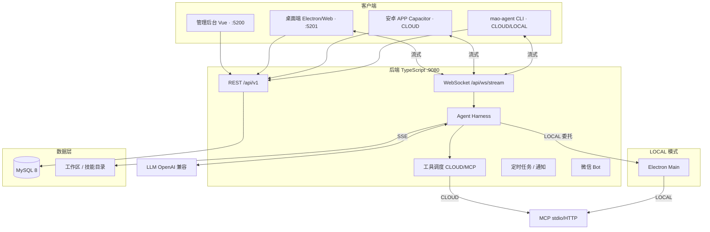

# 项目说明

## 定位

Mao 是个人与企业都适用的**可私有化部署 AI Agent 管理与协作平台**。集中管理 Agent、模型、用户与审计；内置 Think-Act-Observe 运行引擎，支持流式对话、工具调用、MCP、技能扩展、上下文压缩、定时任务与子任务协作。

- **开源**：MIT，仅提供源码与自部署文档，无官方 SaaS
- **Git**：https://github.com/DC-ET/mao
- **界面语言**：中文
- **风险提示**：尚未经企业级生产充分验证，部署前请自行评估

Logo 与客户端预览图见 GitHub 仓库 `docs/logo.png`、`docs/client.png`。

## 为什么选择 Mao

| 能力 | Mao |
|------|-----|
| 部署 | 完全自托管，数据与 API Key 留在本地或内网 |
| 权限与审计 | RBAC + 管理类 API 操作审计 |
| 工具执行 | **CLOUD**（服务端）与 **LOCAL**（Electron）双模式，LOCAL 支持工具审批 |
| Agent 引擎 | 内置 Harness 运行时，非仅 LLM 网关 |
| 客户端 | 管理后台 + Web/Electron 桌面 + 安卓 APP（CLOUD）+ `mao-agent` 终端 CLI |
| 协作 | Side Task、子代理委派、定时任务与完成通知 |
| 扩展 | Skill + MCP + 内置工具（Shell/文件/搜索/文生图等） |
| 认证 | 本地账号 / LDAP / 飞书 SSO（可选） |

若需要低代码工作流或开箱 SaaS，可考虑 Dify、n8n 等；若需要私有化、自选模型、服务端与本地工具边界可切换，选 Mao。

## 与 OpenAI Codex 对比

| 维度 | OpenAI Codex | Mao |
|------|--------------|-----|
| 形态 | 商业 SaaS | 开源 MIT，自托管 |
| 数据与密钥 | OpenAI 云端 | 留在本地/内网 |
| 入口 | App/CLI/IDE/Web | 管理后台 + 桌面 + 安卓 + 终端 CLI |
| 模型 | OpenAI 体系 | 任意 OpenAI 兼容 API |
| 权限 | 个人/小团队 | RBAC、审计、LDAP/飞书 |
| 工具执行 | 云端 Sandbox | CLOUD + LOCAL 可切换 |
| Agent | 单一助手为主 | 多 Agent、Skill 绑定、用量统计 |
| 上手 | 注册即用 | 需自行部署 |

## 架构

## 核心特性

- **统一管理** — Agent、模型、用户、技能等
- **权限与治理** — RBAC；管理 REST 操作审计
- **双执行模式** — CLOUD / LOCAL；LOCAL 支持权限档位与工具审批
- **MCP** — 管理后台全局 MCP；桌面端用户级私有 MCP；按 Agent 注入 `mcp__{server}__{tool}`
- **多模态** — 模型类型分类；文生图；微信语音/图片/文件
- **协作** — Side Task、Delegate 子代理、文件系统 Skill
- **任务自动化** — 定时任务；钉钉/飞书 Webhook 或微信通知
- **工作区** — 云端新建/复用/Git HTTPS 初始化；Git 只读诊断
- **WebSocket** — 流式对话、Token 追踪、上下文压缩提示
- **微信通道**（可选）— 扫码绑定后在微信中与 Agent 对话
- **mao-cli** — 本 Skill：产品文档 + REST CLI
- **mao-agent** — 终端对话客户端（见 [mao-agent.md](mao-agent.md)）

## 技术栈摘要

| 层 | 技术 |
|----|------|
| 后端 | TypeScript Node 22+、NestJS 11 + Fastify、MySQL 8 + Flyway、JWT |
| 前端 | Vue 3 + Vite + Element Plus + Pinia |
| 桌面 | Electron 28 |
| 安卓 | Capacitor 7，远程加载生产 Web |
| API | `/api/v1/`，Swagger `/api/swagger-ui.html` |
| 流式 | WebSocket `/api/ws/stream` |

## 五端分工

| 端 | 目录/产物 | 用途 |
|----|-----------|------|
| 后端 | 编译产物 `dist/` | API、Harness、调度、微信 |
| 管理后台 | `admin/dist` | 平台治理与配置 |
| 桌面 Web | `desktop/dist` | 用户任务与对话（CLOUD） |
| Electron | 自行 `npm run dist` | LOCAL 工具执行 |
| 安卓 | `build-apk.sh` | Capacitor 壳 + OTA |
| mao-agent | 安装脚本 / npm | 终端对话 |
| mao-cli | 本目录 | 文档 + REST CLI |
